# NAGA & PIOWIND 2014 APP应用攻防竞赛第二阶段第一题题解

**Author：wnagzihxa1n
Mail：tudouboom@163.com**

Java层用于传字符串，输入用户名和密码到Native层校验
```
protected void onCreate(Bundle arg3) {
    super.onCreate(arg3);
    this.setContentView(2130903040);
    this.txt_name = this.findViewById(2131165184);
    this.txt_passwd = this.findViewById(2131165185);
    this.btn_login = this.findViewById(2131165186);
    this.btn_reset = this.findViewById(2131165187);
    this.txt_result = this.findViewById(2131165188);
    this.btn_login.setOnClickListener(new View$OnClickListener() {
        public void onClick(View arg7) {
            String v0 = MainActivity.this.txt_name.getText().toString();
            String v1 = MainActivity.this.txt_passwd.getText().toString();
            if("".equals(v0)) {
                System.out.println("name is null or \'\'");
                MainActivity.this.txt_result.setText("账户为空");
            }
            else if("".equals(v1)) {
                System.out.println("passwd is null or \'\'");
                MainActivity.this.txt_result.setText("密码为空");
            }
            else {
                System.out.println("name:" + v0);
                System.out.println("passwd:" + v1);
                System.out.println("Please treat me gently, you have to go a long way.");
                MainActivity.this.txt_result.setText(MainActivity.this.crackme(v0, v1));
            }
        }
    });
    this.btn_reset.setOnClickListener(new View$OnClickListener() {
        public void onClick(View arg3) {
            MainActivity.this.txt_name.setText("");
            MainActivity.this.txt_passwd.setText("");
            MainActivity.this.txt_result.setText("");
        }
    });
}
```

使用IDA查看so，发现加密了

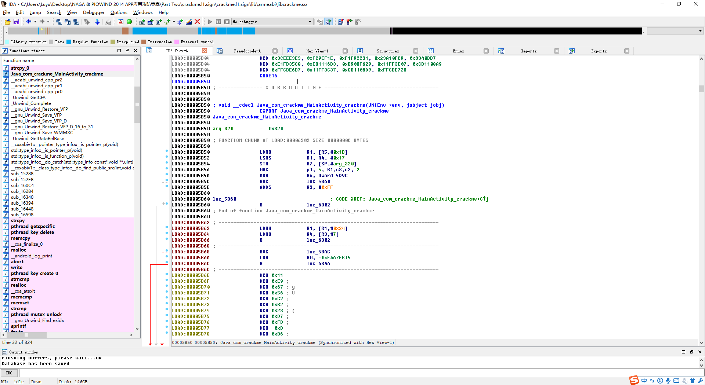

动态调试把解密后的so文件dump出来

先查看加载的内存基址

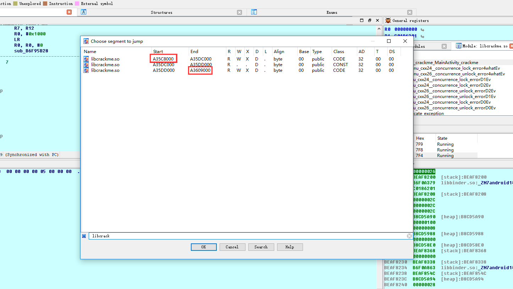

dump脚本如下，地址需要根据自己的调试环境确定
```
auto fp, dex_addr, end_addr;  
fp = fopen("E:\\libcrackme.so", "wb");  
for(dex_addr = 0xA35C8000; dex_addr < 0xA3609000; dex_addr++)  
    fputc(Byte(dex_addr), fp);  
```

然后再打开，可以看到代码已经还原了

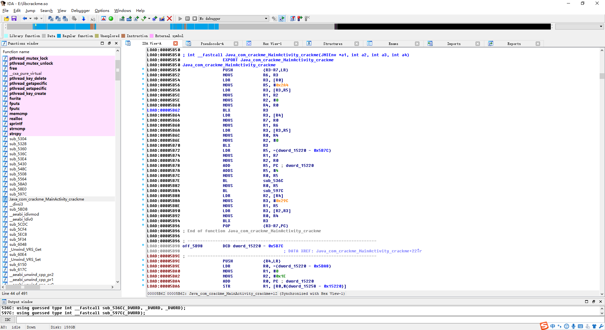

先传入用户名和密码，然后转为`char *`类型的字符串，，接着调用两个函数`sub_536C()`和`sub_597C()`
```
LOAD:00005B50             ; jstring __fastcall Java_com_crackme_MainActivity_crackme(JNIEnv *env, int a2, jstring a3, jstring a4)
LOAD:00005B50             EXPORT Java_com_crackme_MainActivity_crackme
LOAD:00005B50             Java_com_crackme_MainActivity_crackme
LOAD:00005B50 F8 B5       PUSH            {R3-R7,LR}
LOAD:00005B52             ; 7:   v4 = a4;
LOAD:00005B52 1E 1C       MOVS            R6, R3  ; R6 = R3 = password
LOAD:00005B54             ; 9:   v6 = (*env)->GetStringUTFChars(env, a3, 0);
LOAD:00005B54 03 68       LDR             R3, [R0] ; R3 = [R0] = *env
LOAD:00005B56 A9 25 AD 00 MOVS            R5, #0x2A4 ; R5 = 0x2A4
LOAD:00005B5A 5B 59       LDR             R3, [R3,R5] ; R3 = GetStringUTFChars()
LOAD:00005B5C 11 1C       MOVS            R1, R2  ; R1 = R2 = username
LOAD:00005B5E             ; 8:   vEnv = env;
LOAD:00005B5E 00 22       MOVS            R2, #0  ; R2 = 0
LOAD:00005B60 04 1C       MOVS            R4, R0  ; R4 = R0 = env
LOAD:00005B62 98 47       BLX             R3      ; R0 = (*env)->GetStringUTFChars(env, username, 0)
LOAD:00005B64 23 68       LDR             R3, [R4] ; R3 = [R4] = *env
LOAD:00005B66 07 1C       MOVS            R7, R0  ; R7 = R0 = szUserName
LOAD:00005B68             ; 10:   v7 = (*vEnv)->GetStringUTFChars(vEnv, v4, 0);
LOAD:00005B68 31 1C       MOVS            R1, R6  ; R1 = R6 = Password
LOAD:00005B6A 5B 59       LDR             R3, [R3,R5] ; R3 = GetStringUTFChars()
LOAD:00005B6C 20 1C       MOVS            R0, R4  ; R0 = R4 = env
LOAD:00005B6E 00 22       MOVS            R2, #0  ; R2 = 0
LOAD:00005B70 98 47       BLX             R3      ; R0 = (*env)->GetStringUTFChars(env, password, 0)
LOAD:00005B72             ; 11:   sub_536C("Failure", v6, v7);
LOAD:00005B72 09 4D       LDR             R5, =(dword_15220 - 0x5B7C) ; R5 = pFailure - 0x5B7C
LOAD:00005B74 39 1C       MOVS            R1, R7  ; R1 = szUserName
LOAD:00005B76 02 1C       MOVS            R2, R0  ; R2 = R0 = szPassword
LOAD:00005B78 7D 44       ADD             R5, PC ; dword_15220
LOAD:00005B7A 04 35       ADDS            R5, #4  ; R5 = pFailure
LOAD:00005B7C 28 1C       MOVS            R0, R5  ; R0 = R5 = pFailure
LOAD:00005B7E FF F7 F5 FB BL              sub_536C ; R0 = sub_536C("Failure", szUserName, szPassword)
LOAD:00005B82             ; 12:   sub_597C((int)"Failure");
LOAD:00005B82 28 1C       MOVS            R0, R5  ; R0 = R5 = pFailure
LOAD:00005B84 FF F7 FA FE BL              sub_597C ; R0 = sub_597C(pFailure)
LOAD:00005B88             ; 13:   return (*vEnv)->NewStringUTF(vEnv, "Failure");
LOAD:00005B88 22 68       LDR             R2, [R4] ; R2 = [R4] = *env
LOAD:00005B8A A7 23 9B 00 MOVS            R3, #0x29C ; R3 = 0x29C
LOAD:00005B8E 29 1C       MOVS            R1, R5  ; R1 = R5 = pFailure
LOAD:00005B90 D3 58       LDR             R3, [R2,R3] ; R3 = NewStringUTF()
LOAD:00005B92 20 1C       MOVS            R0, R4  ; R0 = R4 = env
LOAD:00005B94 98 47       BLX             R3      ; R0 = (*env)->NewStringUTF(env, "Failure")
LOAD:00005B96 F8 BD       POP             {R3-R7,PC}
LOAD:00005B96             ; End of function Java_com_crackme_MainActivity_crackm
```

跟入`sub_536C("Failure", szUserName, szPassword)`

这个函数比较简单

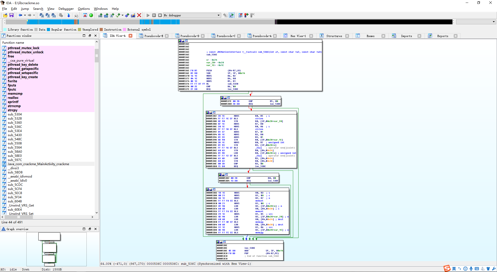

先传进来一个字符串指针，这个指针非常重要，后续的栈变量要使用这个字符串指针作为基址来寻找
```
LOAD:0000536C             ; const JNINativeInterface *__fastcall malloc_Heap(int a1, const char *a2, const char *a3)
LOAD:0000536C             malloc_Heap
LOAD:0000536C
LOAD:0000536C             n= -0x24
LOAD:0000536C             len_UserName= -0x20
LOAD:0000536C             len_Password= -0x1C
LOAD:0000536C
LOAD:0000536C F0 B5       PUSH            {R4-R7,LR}
LOAD:0000536E 85 B0       SUB             SP, SP, #0x14 ; 抬高栈顶
LOAD:00005370             ; 15:   v3 = a3;
LOAD:00005370 16 1C       MOVS            R6, R2  ; R6 = R2 = szPassword
LOAD:00005372             ; 16:   v4 = a1;
LOAD:00005372 04 1C       MOVS            R4, R0  ; R4 = R0 = "Failure"
LOAD:00005374             ; 17:   v5 = a2;
LOAD:00005374 0D 1C       MOVS            R5, R1  ; R5 = R1 = szUserName
LOAD:00005376             ; 18:   result = (const JNINativeInterface *)sub_5328(a1);
LOAD:00005376 FF F7 D7 FF BL              sub_5328 ; R0 = sub_5328(pFailure)
```

函数`sub_5328()`用于初始化某些栈空间


然后有两处判断，判断传入的两个字符串是否为空

判断密码是否为空
```
LOAD:0000537A             ; 19:   if ( v3 )
LOAD:0000537A 00 2E       CMP             R6, #0  ; if(szPassword == 0)
LOAD:0000537C 2F D0       BEQ             loc_53DE
```

判断用户名是否为空
```
LOAD:0000537E             ; 21:     if ( v5 )
LOAD:0000537E 00 2D       CMP             R5, #0  ; if(szUserName == 0)
LOAD:00005380 2D D0       BEQ             loc_53DE
```

申请空间
```
LOAD:00005382             ; 23:       v7 = strlen(v5);
LOAD:00005382 28 1C       MOVS            R0, R5  ; s
LOAD:00005384 FF F7 1C EF BLX             strlen  ; R0 = strlen(szUserName)
LOAD:00005388             ; 24:       len_UserName = v7;
LOAD:00005388 02 90       STR             R0, [SP,#0x28+len_UserName] ; len_UserName = strlen(szUserName)
LOAD:0000538A             ; 25:       v8 = v7;
LOAD:0000538A 07 1C       MOVS            R7, R0  ; R7 = R0 = len_UserName
LOAD:0000538C             ; 26:       v9 = strlen(v3);
LOAD:0000538C 30 1C       MOVS            R0, R6  ; s
LOAD:0000538E FF F7 18 EF BLX             strlen  ; R0 = strlen(szPassword)
LOAD:00005392             ; 27:       v10 = v8 + 1;
LOAD:00005392 01 37       ADDS            R7, #1  ; R7 = len_UserName + 1
LOAD:00005394             ; 28:       v14 = v9;
LOAD:00005394 03 1C       MOVS            R3, R0  ; R3 = R0 = len_Password
LOAD:00005396 01 33       ADDS            R3, #1  ; R3 = len_Password + 1
LOAD:00005398 03 90       STR             R0, [SP,#0x28+len_Password] ; len_Password = R0
LOAD:00005398                                     ; R0 = len_UserName + 1
LOAD:0000539A             ; 30:       *(_DWORD *)(v4 + 52) = operator new[](v10);
LOAD:0000539A 38 1C       MOVS            R0, R7  ; unsigned int
LOAD:0000539C             ; 29:       n = v9 + 1;
LOAD:0000539C 01 93       STR             R3, [SP,#0x28+n] ; n = len_Password + 1
LOAD:0000539E FF F7 16 EF BLX             _Znaj   ; operator new[](len_UserName + 1) // 申请空间
LOAD:000053A2 60 63       STR             R0, [R4,#0x34] ; R0为新UserName存储堆地址
LOAD:000053A4             ; 31:       result = (const JNINativeInterface *)operator new[](n);
LOAD:000053A4 01 98       LDR             R0, [SP,#0x28+n] ; unsigned int
LOAD:000053A6 FF F7 12 EF BLX             _Znaj   ; operator new[](uint)
LOAD:000053AA             ; 32:       v11 = *(void **)(v4 + 52);
LOAD:000053AA 63 6B       LDR             R3, [R4,#0x34] ; R3 = pUserName
LOAD:000053AC             ; 33:       *(_DWORD *)(v4 + 56) = result;
LOAD:000053AC A0 63       STR             R0, [R4,#0x38] ; R0为新Password存储堆地址
```

通过返回的内存分配地址来判断是否申请成功
```
LOAD:000053AE             ; 34:       if ( v11 )
LOAD:000053AE 00 2B       CMP             R3, #0  ; 判断UserName内存空间是否申请成功
LOAD:000053B0 15 D0       BEQ             loc_53DE
```

第二处判断
```
LOAD:000053B2             ; 36:         if ( result )
LOAD:000053B2 00 28       CMP             R0, #0  ; 判断Password内存空间是否申请成功
LOAD:000053B4 13 D0       BEQ             loc_53DE
```

接下来进行拷贝操作，存储用户名和密码，需要注意到新申请的两个变量的寻址方式为`[pFailure + offset]`
```
LOAD:000053B6             ; 38:           memset(v11, 0, v10);
LOAD:000053B6 18 1C       MOVS            R0, R3  ; s
LOAD:000053B8 00 21       MOVS            R1, #0  ; c
LOAD:000053BA 3A 1C       MOVS            R2, R7  ; n
LOAD:000053BC FF F7 FA EE BLX             memset  ; memset(pUserName, 0, len_UserName + 1) //初始化UserName内存空间
LOAD:000053C0             ; 39:           memset(*(void **)(v4 + 56), 0, n);
LOAD:000053C0 00 21       MOVS            R1, #0  ; c
LOAD:000053C2 01 9A       LDR             R2, [SP,#0x28+n] ; n
LOAD:000053C4 A0 6B       LDR             R0, [R4,#0x38] ; s
LOAD:000053C6 FF F7 F6 EE BLX             memset  ; memset(pPassword, 0, len_Password + 1) //初始化Password内存空间
LOAD:000053CA             ; 40:           memcpy(*(void **)(v4 + 52), v5, len_UserName);
LOAD:000053CA 29 1C       MOVS            R1, R5  ; src
LOAD:000053CC 02 9A       LDR             R2, [SP,#0x28+len_UserName] ; n
LOAD:000053CE 60 6B       LDR             R0, [R4,#0x34] ; dest
LOAD:000053D0 FF F7 02 EF BLX             memcpy  ; memcpy(pUserName, szUserName, len_UserName) //拷贝数据到内存空间
LOAD:000053D4             ; 41:           result = (const JNINativeInterface *)memcpy(*(void **)(v4 + 56), v3, v14);
LOAD:000053D4 A0 6B       LDR             R0, [R4,#0x38] ; dest
LOAD:000053D6 31 1C       MOVS            R1, R6  ; src
LOAD:000053D8 03 9A       LDR             R2, [SP,#0x28+len_Password] ; n
LOAD:000053DA FF F7 FE EE BLX             memcpy  ; memcpy(pPassword, szPassword, len_Password) //拷贝数据到内存空间
```

此时两个关键的变量在栈中的位置
```
pUserName = [pFailure + 0x34]
pPassword = [pFailure + 0x38]
```

初始化完栈空间以及相应的内存空间后，进入校验逻辑
```
LOAD:00005B82 28 1C       MOVS            R0, R5  ; R0 = R5 = pFailure
LOAD:00005B84 FF F7 FA FE BL              sub_597C ; sub_597C(pFailure)
```

传入`"Failure"`字符串的指针，该函数稍微有点长

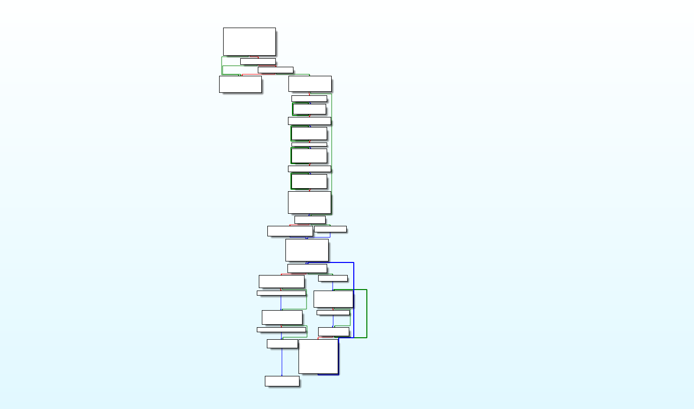

存储`"pFailure"`后调用函数`sub_53E4()`
```
LOAD:0000597C             sub_597C
LOAD:0000597C
LOAD:0000597C             var_34= -0x34
LOAD:0000597C             var_30= -0x30
LOAD:0000597C             var_28= -0x28
LOAD:0000597C             var_24= -0x24
LOAD:0000597C             var_1C= -0x1C
LOAD:0000597C
LOAD:0000597C F0 B5       PUSH            {R4-R7,LR}
LOAD:0000597E 89 B0       SUB             SP, SP, #0x24
LOAD:00005980 05 1C       MOVS            R5, R0  ; R5 = R0 = pFailure = "Failure"
LOAD:00005982 FF F7 2F FD BL              sub_53E4
```

`sub_53E4()`主要是校验用户名和密码的长度合法性

从中我们得出用户名和密码的长度范围
```
用户名：[6, 20]
密码：[12, 30]
```


校验密码的合法性，格式为`xxx-xxx-xxx-xxx`

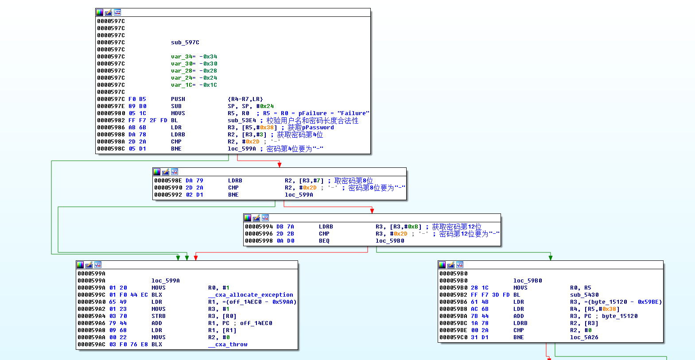

调用`sub_5430()`
```
LOAD:000059B0             loc_59B0
LOAD:000059B0 28 1C       MOVS            R0, R5
LOAD:000059B2 FF F7 3D FD BL              sub_5430
```

这个函数的作用是将密码中的`-`去掉

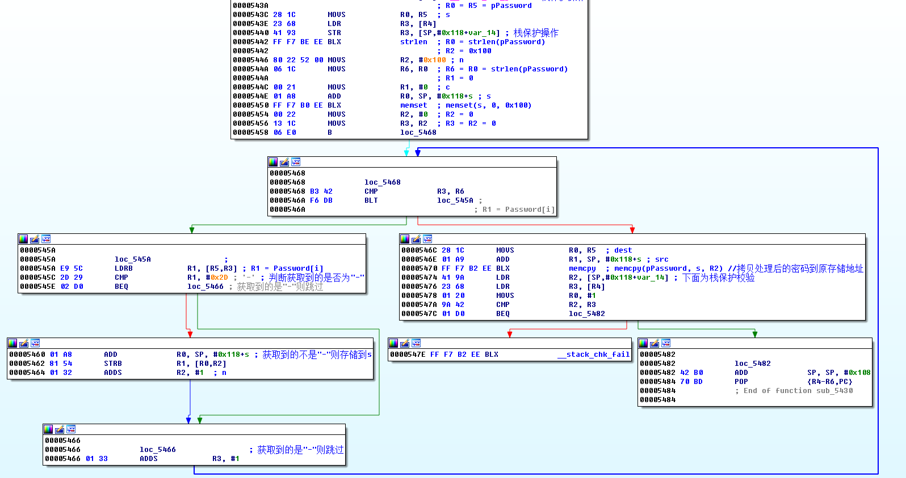

获取一个Table，此Table一开始是空的
```
LOAD:000059BA 7B 44       ADD             R3, PC ; Base64Table
LOAD:000059BC 1A 78       LDRB            R2, [R3]
LOAD:000059BE 00 2A       CMP             R2, #0
LOAD:000059C0 31 D1       BNE             loc_5A26
```

全部都是`00`

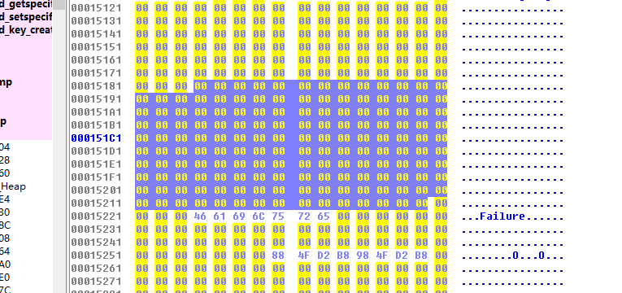

动态运行时会填充数据，第一次运行时会进行Table的生成，通过对这个Table第一个字节的判断，如果是`00`，表示未生成，如果是`01`，表示Table已生成，则跳过初始化Table的代码段

动态运行时进行初始化

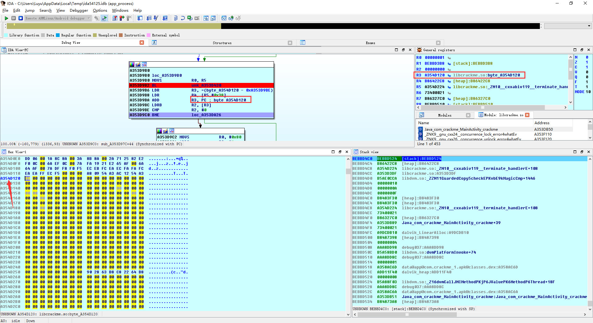

接下来逐步进行计算，将Table的[2, 256]字节赋值为`0x80`
```
LOAD:000059C2 80 20       MOVS            R0, #0x80 ; '€' ; R0 = 0x80
LOAD:000059C4 01 33       ADDS            R3, #1  ; 从Table的第二位开始赋值
LOAD:000059C6 41 00       LSLS            R1, R0, #1 ; R1 = 0x80 * 2 = 256
```

开始循环赋值
```
LOAD:000059C8             ; 41:       byte_15121[v4++] = -128;
LOAD:000059C8
LOAD:000059C8             loc_59C8                ; Table[i] = 0x80
LOAD:000059C8 D0 54       STRB            R0, [R2,R3]
LOAD:000059CA             ; 42:     while ( v4 != 256 );
LOAD:000059CA 01 32       ADDS            R2, #1  ; R2++
LOAD:000059CC 8A 42       CMP             R2, R1
LOAD:000059CE FB D1       BNE             loc_59C8 ; Table[i] = 0x80
```

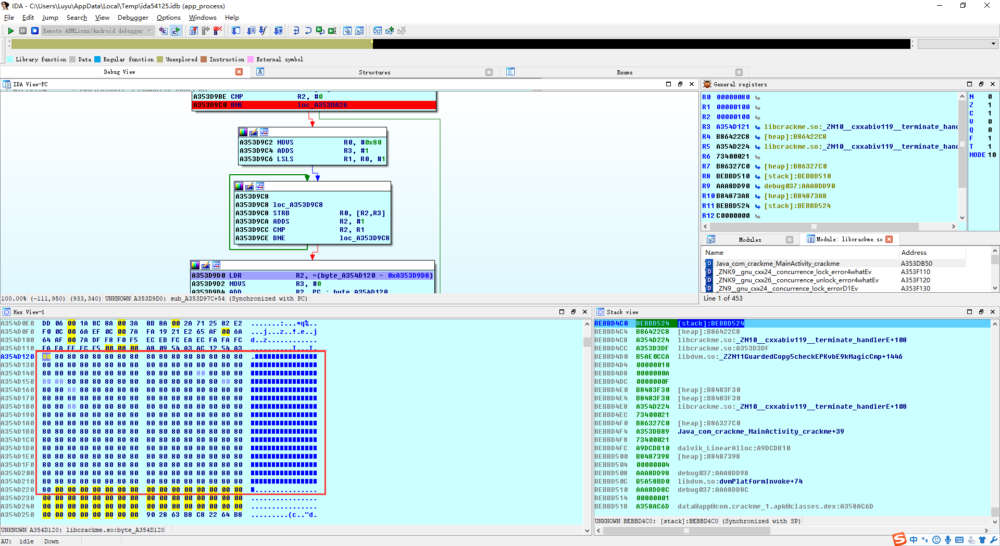

赋值完成后开始处理Table，初始化一些值
```
LOAD:000059D0             ; 43:     v5 = 0;
LOAD:000059D0 5B 4A       LDR             R2, =(Base64Table - 0x59D8)
LOAD:000059D2 00 23       MOVS            R3, #0  ; R3 = 0
LOAD:000059D4 7A 44       ADD             R2, PC ; Base64Table
LOAD:000059D6 51 1C       ADDS            R1, R2, #1 ; R1 = Base64Tabl + 1
```

从Table偏移`65`的位置开始赋值`0`，长度为`26`，整个表应该是偏移第`67`位，因为第一个字节跳过，下标从`0`开始
```
LOAD:000059D8             ; 46:       byte_15121[v5 + 65] = v5;
LOAD:000059D8
LOAD:000059D8             loc_59D8                ;
LOAD:000059D8 C8 18       ADDS            R0, R1, R3 ; R0 = Base64Table + i
LOAD:000059DA 41 30       ADDS            R0, #65 ; R0 = Base64Table + i + 65
LOAD:000059DC 03 70       STRB            R3, [R0] ; Base64Table[i + 65] = R3
LOAD:000059DE             ; 47:       ++v5;
LOAD:000059DE 01 33       ADDS            R3, #1  ; R3++
LOAD:000059E0             ; 49:     while ( v5 != 26 );
LOAD:000059E0 1A 2B       CMP             R3, #26
LOAD:000059E2 F9 D1       BNE             loc_59D8 ;
LOAD:000059E2                                     ; R0 = Base64Table + i
```

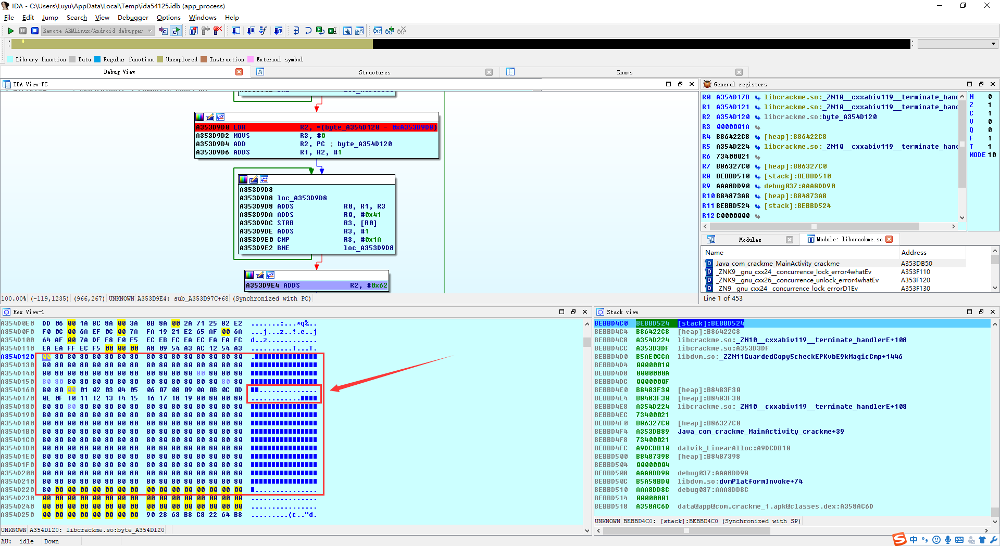

取第`98`位
```
LOAD:000059E4             ; 50:     v6 = &byte_15182;
LOAD:000059E4 62 32       ADDS            R2, #98 ; R2 = Base64Table[98]
```

开始赋值，赋值的数据跟着上面的`R3`后面继续，上面赋值到`0x19`，这里从`0x1A`开始
```
LOAD:000059E6             ; 53:       *v6 = v5;
LOAD:000059E6
LOAD:000059E6             loc_59E6
LOAD:000059E6 13 70       STRB            R3, [R2]
LOAD:000059E8             ; 54:       v5 = (v5 + 1) & 0xFF;
LOAD:000059E8 01 33       ADDS            R3, #1  ; R3++
LOAD:000059EA 1B 06       LSLS            R3, R3, #0x18
LOAD:000059EC 1B 0E       LSRS            R3, R3, #0x18 ; R3 = R3 & 0xFF
LOAD:000059EE             ; 55:       ++v6;
LOAD:000059EE 01 32       ADDS            R2, #1  ; R2 = Base64Table + i
LOAD:000059F0             ; 57:     while ( v5 != 52 );
LOAD:000059F0 34 2B       CMP             R3, #52
LOAD:000059F2 F8 D1       BNE             loc_59E6
```

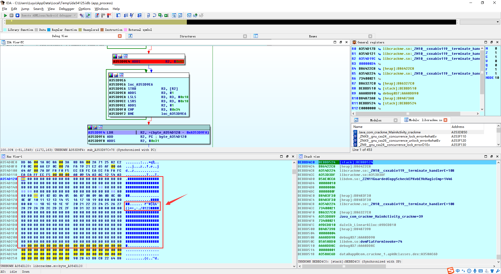

再次定位到`49`的位置
```
LOAD:000059F4             ; 58:     v7 = &byte_15151;
LOAD:000059F4 53 4A       LDR             R2, =(Base64Table - 0x59FA)
LOAD:000059F6 7A 44       ADD             R2, PC ; Base64Table
LOAD:000059F8 31 32       ADDS            R2, #49
```

再次赋值
```
LOAD:000059FA             ; 61:       *v7 = v5;
LOAD:000059FA
LOAD:000059FA             loc_59FA
LOAD:000059FA 13 70       STRB            R3, [R2]
LOAD:000059FC             ; 62:       v5 = (v5 + 1) & 0xFF;
LOAD:000059FC 01 33       ADDS            R3, #1
LOAD:000059FE 1B 06       LSLS            R3, R3, #0x18
LOAD:00005A00 1B 0E       LSRS            R3, R3, #0x18
LOAD:00005A02             ; 63:       ++v7;
LOAD:00005A02 01 32       ADDS            R2, #1
LOAD:00005A04             ; 65:     while ( v5 != 62 );
LOAD:00005A04 3E 2B       CMP             R3, #62
LOAD:00005A06 F8 D1       BNE             loc_59FA
```

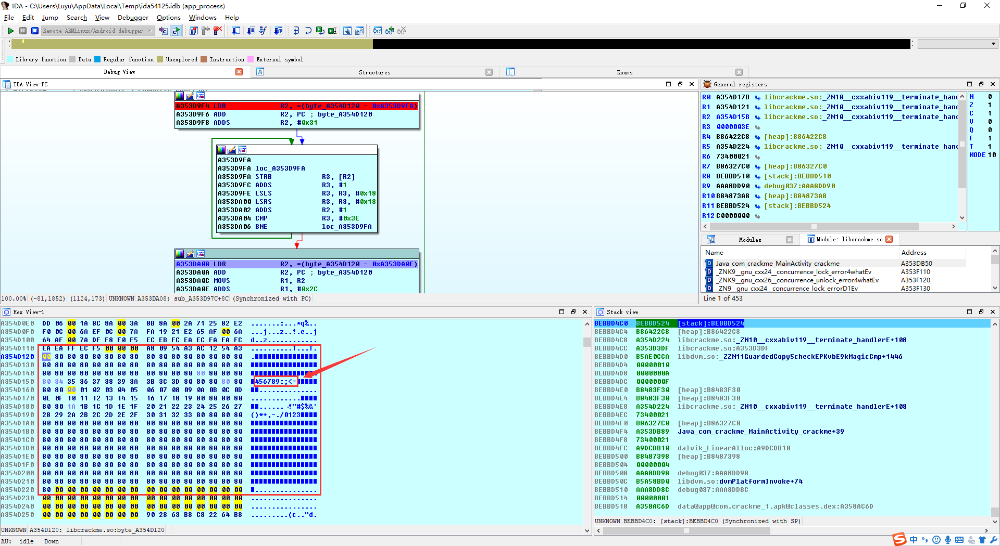

最后处理几个单个的位置
```
LOAD:00005A08             ; 66:     byte_1514C = 62;
LOAD:00005A08 4F 4A       LDR             R2, =(Base64Table - 0x5A0E)
LOAD:00005A0A 7A 44       ADD             R2, PC ; Base64Table
LOAD:00005A0C 11 1C       MOVS            R1, R2  ; R1 = R2 = Base64Table
LOAD:00005A0E 2C 31       ADDS            R1, #44 ; R1 = R1 + 44
LOAD:00005A10 0B 70       STRB            R3, [R1] ; Base64Table[44] = 0x3E
LOAD:00005A12             ; 67:     byte_15150 = 63;
LOAD:00005A12 13 1C       MOVS            R3, R2  ; R3 = R2 = Base64Table
LOAD:00005A14 30 33       ADDS            R3, #48 ; R3 = R3 + 48
LOAD:00005A16 3F 21       MOVS            R1, #63 ; R1 = 63
LOAD:00005A18 19 70       STRB            R1, [R3] ; Base64Table[48] = 63
LOAD:00005A1A             ; 68:     byte_1515E = 0;
LOAD:00005A1A 13 1C       MOVS            R3, R2  ; R3 = R2 = Base64Table
LOAD:00005A1C 3E 33       ADDS            R3, #62 ; R3 = R3 + 62
LOAD:00005A1E 00 21       MOVS            R1, #0  ; R1 = 0
LOAD:00005A20 19 70       STRB            R1, [R3] ; Base64Table[62] = 0
LOAD:00005A22             ; 69:     Base64Table = 1;
LOAD:00005A22 01 23       MOVS            R3, #1  ; R3 = 1
LOAD:00005A24 13 70       STRB            R3, [R2] ; Base64Table[0] = 1 //设置已初始化Table标志
```

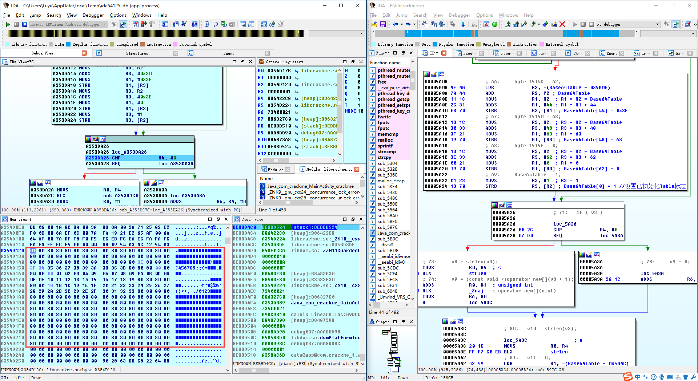

整个表处理完是下面这样的，因为最开始是判断是否初始化的标志，所以整个表长度为257，由于多次调试，所以下面的内存地址和上面图中可能不一样
```
A35DD120  01 80 80 80 80 80 80 80  80 80 80 80 80 80 80 80  .€€€€€€€€€€€€€€€
A35DD130  80 80 80 80 80 80 80 80  80 80 80 80 80 80 80 80  €€€€€€€€€€€€€€€€
A35DD140  80 80 80 80 80 80 80 80  80 80 80 80 3E 80 80 80  €€€€€€€€€€€€>€€€
A35DD150  3F 34 35 36 37 38 39 3A  3B 3C 3D 80 80 80 00 80  ?456789:;<=€€€.€
A35DD160  80 80 00 01 02 03 04 05  06 07 08 09 0A 0B 0C 0D  €€..............
A35DD170  0E 0F 10 11 12 13 14 15  16 17 18 19 80 80 80 80  ............€€€€
A35DD180  80 80 1A 1B 1C 1D 1E 1F  20 21 22 23 24 25 26 27  €€...... !"#$%&'
A35DD190  28 29 2A 2B 2C 2D 2E 2F  30 31 32 33 80 80 80 80  ()*+,-./0123€€€€
A35DD1A0  80 80 80 80 80 80 80 80  80 80 80 80 80 80 80 80  €€€€€€€€€€€€€€€€
A35DD1B0  80 80 80 80 80 80 80 80  80 80 80 80 80 80 80 80  €€€€€€€€€€€€€€€€
A35DD1C0  80 80 80 80 80 80 80 80  80 80 80 80 80 80 80 80  €€€€€€€€€€€€€€€€
A35DD1D0  80 80 80 80 80 80 80 80  80 80 80 80 80 80 80 80  €€€€€€€€€€€€€€€€
A35DD1E0  80 80 80 80 80 80 80 80  80 80 80 80 80 80 80 80  €€€€€€€€€€€€€€€€
A35DD1F0  80 80 80 80 80 80 80 80  80 80 80 80 80 80 80 80  €€€€€€€€€€€€€€€€
A35DD200  80 80 80 80 80 80 80 80  80 80 80 80 80 80 80 80  €€€€€€€€€€€€€€€€
A35DD210  80 80 80 80 80 80 80 80  80 80 80 80 80 80 80 80  €€€€€€€€€€€€€€€€
A35DD220  80                                                €
```

判断处理后的密码是否为空，前面去除了密码中的`-`
```
LOAD:00005A26             ; 71:   if ( v3 )
LOAD:00005A26
LOAD:00005A26             loc_5A26                ; R4为密码寄存器，判断是否为0
LOAD:00005A26 00 2C       CMP             R4, #0
LOAD:00005A28 07 D0       BEQ             loc_5A3A
```

再申请一个存储密码的内存空间
```
LOAD:00005A2A             ; 73:     v8 = strlen(v3);
LOAD:00005A2A 20 1C       MOVS            R0, R4  ; s
LOAD:00005A2C FF F7 C8 EB BLX             strlen  ; R0 = strlen(pPassword)
LOAD:00005A30             ; 74:     v9 = (const void *)operator new[](v8 + 1);
LOAD:00005A30 01 30       ADDS            R0, #1  ; unsigned int
LOAD:00005A32 FF F7 CC EB BLX             _Znaj   ; R0 = operator new[](len_Password + 1)
LOAD:00005A36 06 1C       MOVS            R6, R0  ; R6 = R0 = new_pPassword
LOAD:00005A38 00 E0       B               loc_5A3C
```

这里其实可以猜出来是Base64，因为判断3位长度，这个比较看经验了
```
LOAD:00005A3C             ; 80:   v10 = strlen(v3);
LOAD:00005A3C
LOAD:00005A3C             loc_5A3C                ; s
LOAD:00005A3C 20 1C       MOVS            R0, R4
LOAD:00005A3E FF F7 C0 EB BLX             strlen  ; R0 = R4 = pPassword
LOAD:00005A3E                                     ; R0 = strlen(pPassword)
LOAD:00005A42             ; 81:   v11 = 0;
LOAD:00005A42 42 49       LDR             R1, =(Base64Table - 0x5A4C)
LOAD:00005A44 03 38       SUBS            R0, #3  ; R0 = R0 - 3
LOAD:00005A46 00 23       MOVS            R3, #0  ; R3 = 0
LOAD:00005A48             ; 85:   while ( v11 < (signed int)(v10 - 3) )
LOAD:00005A48 79 44       ADD             R1, PC ; Base64Table
LOAD:00005A4A 01 31       ADDS            R1, #1  ; R1 = Base64Table + 1
LOAD:00005A4C 04 90       STR             R0, [SP,#0x38+var_28] ; len_Password - 3
LOAD:00005A4E             ; 82:   v12 = v9;
LOAD:00005A4E 32 1C       MOVS            R2, R6  ; R2 = R6 = new_pPassword
LOAD:00005A50             ; 83:   v13 = 0;
LOAD:00005A50 1F 1C       MOVS            R7, R3  ; R7 = R3 = 0
LOAD:00005A52             ; 84:   v14 = v3;
LOAD:00005A52 05 91       STR             R1, [SP,#0x38+Base64Tableoff1] ; Base64Table + 1
LOAD:00005A54 A4 46       MOV             R12, R4 ; R12 = R4 = pPassword
LOAD:00005A56 26 E0       B               loc_5AA6 ;
```

如果没看出来，我们可以手动分析，前提是清楚Base64的计算过程，编码过程是3位转4位，还原过程是4位转3位

比如`ABCD`，以3个字符为一组，计算每个的ASCII十六进制
```
01000001 01000010 01000011
01000100
```

连起来
```
010000010100001001000011
01000100
```

以三字节为单位切开，这样3个字符就变成了4个字符每组
```
010000 010100 001001 000011
010001 00
```

前面补`00`，最后除了补零，最后的两个不做处理
```
00010000 00010100 00001001 00000011
00010001 00000000
```

转为十进制数字
```
16 20 09 03
17 00
```

然后到Base64编码Table里寻找对应的下标
```
ABCDEFGHIJKLMNOPQRSTUVWXYZabcdefghijklmnopqrstuvwxyz0123456789+/
```

计算出来，最后没有数据的补上`=`，以4字节为一组补
```
QUJD
RA==
```

我为什么又要写一遍。。。。。。

第一题的理解程度对于后续的解题很重要，所以我们多写点，反正都是我写。。。。。。

入口判断了长度跟3的关系，长度如果不够说明已经计算到结尾，所以进入特殊处理的分支

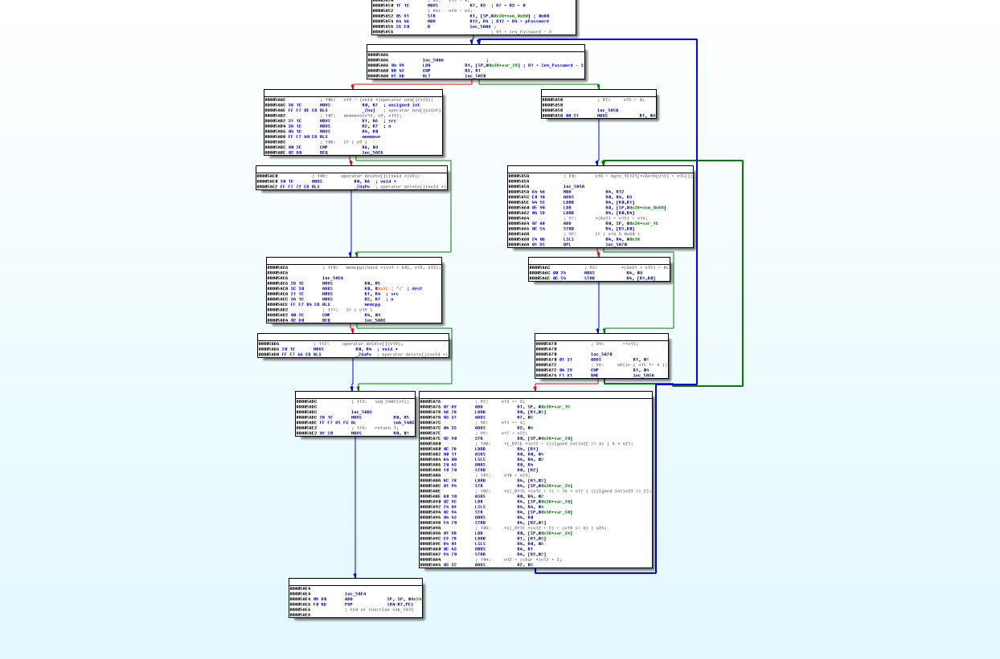

接下来手动分析，进入解码前先进行长度的判断
```
LOAD:00005AA6             loc_5AA6                ;
LOAD:00005AA6 04 99       LDR             R1, [SP,#0x38+var_28] ; R1 = len_Password - 3
LOAD:00005AA8 8B 42       CMP             R3, R1
LOAD:00005AAA D5 DB       BLT             loc_5A58 ;
```

初始化一个下标
```
LOAD:00005A58             loc_5A58                ;
LOAD:00005A58 00 21       MOVS            R1, #0  ; R
```

然后进入计算的循环，以4字节为一组进行循环获取，获取到的4字节每字节进行查表，这个表就是前面初始化的Table
```
LOAD:00005A5A             loc_5A5A                ;
LOAD:00005A5A 64 46       MOV             R4, R12 ; R4 = R12 = pPassword
LOAD:00005A5C E0 18       ADDS            R0, R4, R3 ; R0 = R4 + R3 = pPassword + i
LOAD:00005A5E 44 5C       LDRB            R4, [R0,R1] ; R4 = Password[i + j]，这里以四字节为单位进行循环遍历
LOAD:00005A60 05 98       LDR             R0, [SP,#0x38+Base64Tableoff1] ; R0 = Base64Table + 1
LOAD:00005A62 04 5D       LDRB            R4, [R0,R4] ; R4 = Base64Table[Password[i + j] + 1]
LOAD:00005A64             ; 91:       *(&v21 + v15) = v16;
LOAD:00005A64 07 A8       ADD             R0, SP, #0x38+buffer ; 4字节临时存储
LOAD:00005A66 0C 54       STRB            R4, [R1,R0] ; 循环取字节进行存储
LOAD:00005A68             ; 92:       if ( v16 & 0x80 )
LOAD:00005A68 24 06       LSLS            R4, R4, #0x18
LOAD:00005A6A 01 D5       BPL             loc_5A70
```

通过一个变量进行判断4字节每组内部取表操作是否完成
```
LOAD:00005A70             loc_5A70                ;
LOAD:00005A70 01 31       ADDS            R1, #1  ; R1++，4字节每组内部循环
LOAD:00005A72             ; 96:     while ( v15 != 4 );
LOAD:00005A72 04 29       CMP             R1, #4  ; 判断是否读取完成4字节
LOAD:00005A74 F1 D1       BNE             loc_5A5A ;
```

4字节取表完成后，进行计算
```
LOAD:00005A76             ; 97:     v13 += 3;
LOAD:00005A76 07 A9       ADD             R1, SP, #0x38+buffer ; R1 = buffer //获取每组4字节数组基址
LOAD:00005A78 48 78       LDRB            R0, [R1,#1] ; R0 = buffer[1]
LOAD:00005A7A 03 37       ADDS            R7, #3  ; R7 = 0 + 3 = 3
LOAD:00005A7C             ; 98:     v11 += 4;
LOAD:00005A7C 04 33       ADDS            R3, #4  ; R3 = pPassword + 4 //定位下一组起始地址，跳4字节
LOAD:00005A7E             ; 99:     v17 = v22;
LOAD:00005A7E 02 90       STR             R0, [SP,#0x38+var_30] ; R0(buffer[1])存储到var_30
LOAD:00005A80             ; 100:     *(_BYTE *)v12 = ((signed int)v22 >> 4) | 4 * v21;
LOAD:00005A80 0C 78       LDRB            R4, [R1] ; R4 = buffer[0]
LOAD:00005A82 00 11       ASRS            R0, R0, #4 ; R0 = buffer[1] >> 4
LOAD:00005A84 A4 00       LSLS            R4, R4, #2 ; R4 = buffer[0] << 2
LOAD:00005A86 20 43       ORRS            R0, R4  ; R0 = R0 | R4 = (buffer[0] << 2) | (buffer[1] >> 4)
LOAD:00005A88 10 70       STRB            R0, [R2] ; new_Password[0] = (buffer[0] << 2) | (buffer[1] >> 4)
LOAD:00005A8A             ; 101:     v18 = v23;
LOAD:00005A8A 8C 78       LDRB            R4, [R1,#2] ; R4 = buffer[2]
LOAD:00005A8C 01 94       STR             R4, [SP,#0x38+var_34] ; 将R4(buffer[2])存储到var_34
LOAD:00005A8E             ; 102:     *((_BYTE *)v12 + 1) = 16 * v17 | ((signed int)v23 >> 2);
LOAD:00005A8E A0 10       ASRS            R0, R4, #2 ; R0 = R4 >> 2
LOAD:00005A90 02 9C       LDR             R4, [SP,#0x38+var_30] ; R4 = buffer[1]
LOAD:00005A92 24 01       LSLS            R4, R4, #4 ; R4 = buffer[1] << 4
LOAD:00005A94 02 94       STR             R4, [SP,#0x38+var_30] ; buffer[1] << 4的结果存储到var_30
LOAD:00005A96 04 43       ORRS            R4, R0  ; R4 = R0 | R4 = (buffer[1] << 4) | (buffer[2] >> 2)
LOAD:00005A98 54 70       STRB            R4, [R2,#1] ; new_Password[1] = (buffer[1] << 4) | (buffer[2] >> 2)
LOAD:00005A9A             ; 103:     *((_BYTE *)v12 + 2) = (v18 << 6) | v24;
LOAD:00005A9A 01 98       LDR             R0, [SP,#0x38+var_34] ; R0 = buffer[2]
LOAD:00005A9C C9 78       LDRB            R1, [R1,#3] ; R1 = buffer[3]
LOAD:00005A9E 84 01       LSLS            R4, R0, #6 ; R4 = buffer[2] << 6
LOAD:00005AA0 0C 43       ORRS            R4, R1  ; R4 = R1 | R4 = (buffer[1] << 6) | buffer[3]
LOAD:00005AA2 94 70       STRB            R4, [R2,#2] ; new_Password[2] = (buffer[1] << 6) | buffer[3]
LOAD:00005AA4             ; 104:     v12 = (char *)v12 + 3;
LOAD:00005AA4 03 32       ADDS            R2, #3  ; 解码后的数据存储偏移加3，结合上面就是每4位计算出来变成3位
```

关键的三句，这已经是很明显的Base64解码操作了
```
new_Password[0] = (buffer[0] << 2) | (buffer[1] >> 4)
new_Password[1] = (buffer[1] << 4) | (buffer[2] >> 2)
new_Password[2] = (buffer[1] << 6) | buffer[3]
```

接着又进行循环操作，解码完成退出循环，进入数据的存储
```
LOAD:00005AAC             ; 106:   v19 = (void *)operator new[](v13);
LOAD:00005AAC 38 1C       MOVS            R0, R7  ; R0 = R7 = 解码后的密码长度
LOAD:00005AAE FF F7 8E EB BLX             _Znaj   ; R0 = operator new[](strlen(new_pPassword))
LOAD:00005AB2             ; 107:   memmove(v19, v9, v13);
LOAD:00005AB2 31 1C       MOVS            R1, R6  ; src
LOAD:00005AB4 3A 1C       MOVS            R2, R7  ; n
LOAD:00005AB6 04 1C       MOVS            R4, R0  ; R4为新解码后的内存地址
LOAD:00005AB8 FF F7 A0 EB BLX             memmove ; memmove(R0, new_pPassword, R7)
LOAD:00005ABC             ; 108:   if ( v9 )
LOAD:00005ABC 00 2E       CMP             R6, #0
LOAD:00005ABE 02 D0       BEQ             loc_5AC6 ; memmove函数虽然是移动的意思，但是并不是真正的移动
LOAD:00005ABE                                     ; 所以原来的内存还是存在着数据的
```

清理一下临时空间
```
LOAD:00005AC0             ; 109:     operator delete[]((void *)v9);
LOAD:00005AC0 30 1C       MOVS            R0, R6  ; 这里进行内存的删除操作
LOAD:00005AC2 FF F7 72 EB BLX             _ZdaPv  ; operator delete[](new_pPassword)
```

再次存储数据
```
LOAD:00005AC6             ; 110:   memcpy((void *)(v1 + 60), v19, v13);
LOAD:00005AC6
LOAD:00005AC6             loc_5AC6                ;
LOAD:00005AC6 28 1C       MOVS            R0, R5  ; R5是一个偏移基址的作用
LOAD:00005AC8 3C 30       ADDS            R0, #0x3C ; '<' ; R5+0x3C为最终解码数据的内存地址
LOAD:00005ACA 21 1C       MOVS            R1, R4  ; src
LOAD:00005ACC 3A 1C       MOVS            R2, R7  ; n
LOAD:00005ACE FF F7 84 EB BLX             memcpy  ; 再拷贝解码后的密码到一个结构体里
LOAD:00005AD2             ; 111:   if ( v19 )
LOAD:00005AD2 00 2C       CMP             R4, #0
LOAD:00005AD4 02 D0       BEQ             loc_5ADC
```

再清理内存
```
LOAD:00005AD6             ; 112:     operator delete[](v19);
LOAD:00005AD6 20 1C       MOVS            R0, R4  ; void *
LOAD:00005AD8 FF F7 66 EB BLX             _ZdaPv  ; 再次进行内存的清理操作，删除解码后的密码
```

最后进入一个对比函数
```
LOAD:00005ADC             ; 113:   sub_548C(v1);
LOAD:00005ADC
LOAD:00005ADC             loc_5ADC
LOAD:00005ADC 28 1C       MOVS            R0, R5
LOAD:00005ADE FF F7 D5 FC BL              sub_548C
LOAD:00005AE2             ; 114:   return 1;
LOAD:00005AE2 01 20       MOVS            R0, #1
```

`sub_548C()`将用户名和解码后的数据进行对比
```
LOAD:0000548C             sub_548C
LOAD:0000548C
LOAD:0000548C             var_1C= -0x1C
LOAD:0000548C
LOAD:0000548C F7 B5       PUSH            {R0-R2,R4-R7,LR}
LOAD:0000548E 41 6B       LDR             R1, [R0,#0x34] ; R1 = pUserName
LOAD:00005490 06 1C       MOVS            R6, R0  ; R6 = R0 = 结构体基址
LOAD:00005492 1A 4D       LDR             R5, =(_GLOBAL_OFFSET_TABLE_ - 0x54AA)
LOAD:00005494 08 1C       MOVS            R0, R1  ; R0 = R1 = pUserName
LOAD:00005496 01 91       STR             R1, [SP,#0x20+var_1C] ; 将pUserName存储到var_1C
LOAD:00005498 FF F7 92 EE BLX             strlen  ; R0 = strlen(pUserName)
LOAD:0000549C 07 1C       MOVS            R7, R0  ; R7 = R0 = 用户名长度
LOAD:0000549E 30 1C       MOVS            R0, R6  ; R0 = R6 = 结构体基址
LOAD:000054A0 3C 30       ADDS            R0, #0x3C ; '<' ; R0 = 解码后的数据，此处命名为pPassDecoded
LOAD:000054A2 FF F7 8E EE BLX             strlen  ; R0 = strlen(pPassDecoded)
LOAD:000054A6 7D 44       ADD             R5, PC ; _GLOBAL_OFFSET_TABLE_ ; R5 = 全局偏移表
LOAD:000054A8 00 24       MOVS            R4, #0  ; R4 = 0
LOAD:000054AA 87 42       CMP             R7, R0  ; R7 = 用户名长度，此处在判断用户名长度是否为0
LOAD:000054AC 1A D0       BEQ             loc_54E4
```

循环对比
```
LOAD:000054C0             loc_54C0                ;
LOAD:000054C0 01 99       LDR             R1, [SP,#0x20+var_1C] ; R1 = pUserName
LOAD:000054C2 33 19       ADDS            R3, R6, R4
LOAD:000054C4 3C 33       ADDS            R3, #0x3C ; '<' ; R3 = PassDecoded + i
LOAD:000054C6 0A 5D       LDRB            R2, [R1,R4] ; R2 = UserName[i]
LOAD:000054C8 1B 78       LDRB            R3, [R3] ; R3 = PassDecoded[i]
LOAD:000054CA 9A 42       CMP             R2, R3  ; 对比用户名和解码后的数据
LOAD:000054CC 09 D0       BEQ             loc_54E2 ;
LOAD:000054CC                                     ; 相等继续对比，i++
```

不相等则异常退出

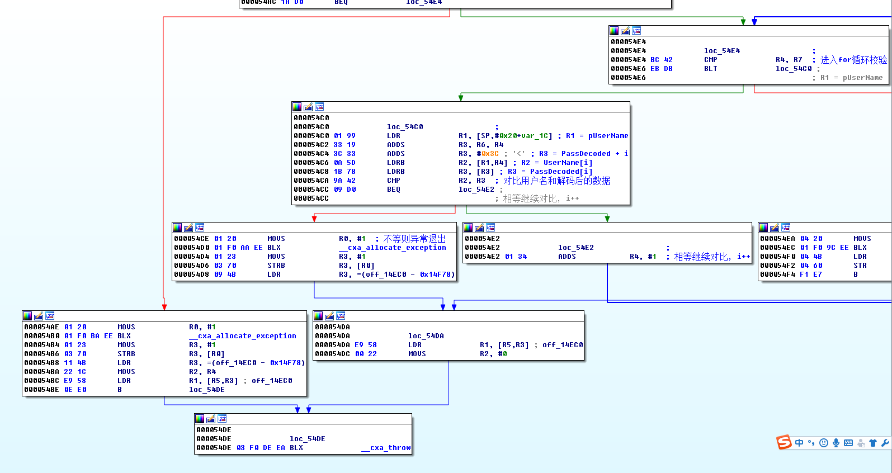

所以整个校验逻辑就是，输入用户名以及用户名的Base64编码作为密码即可，编码后的数据需要每3位插入一个`-`

长度也需要注意范围的校验，所以简单写个Java程序来计算即可，代码写的挫，不贴了

大概就是这样

