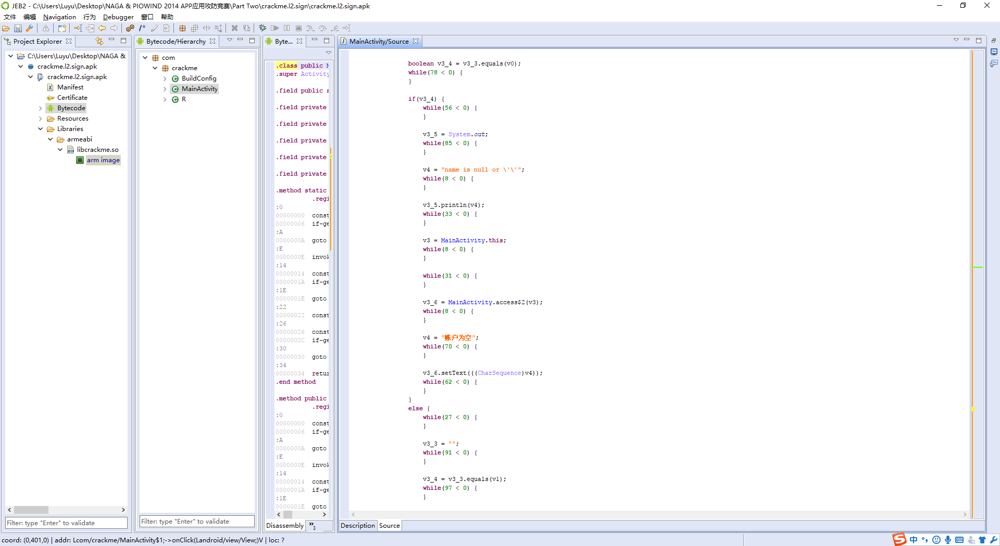
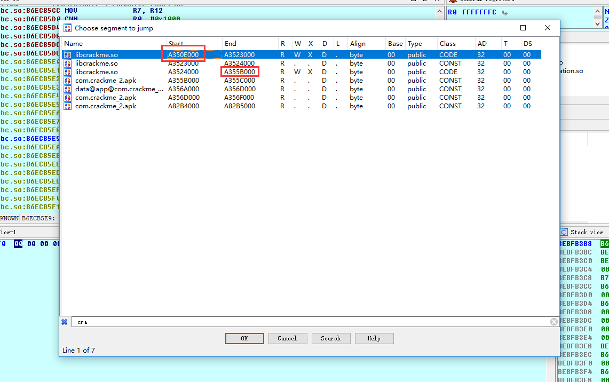
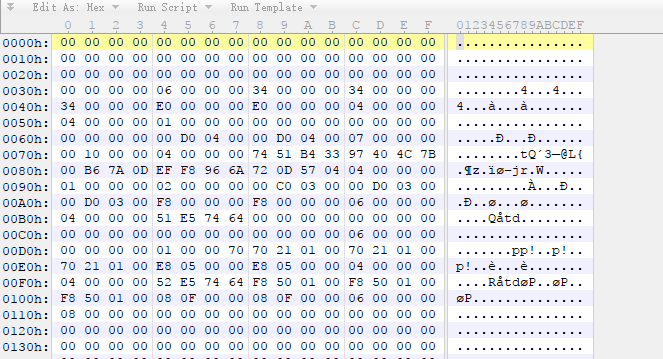
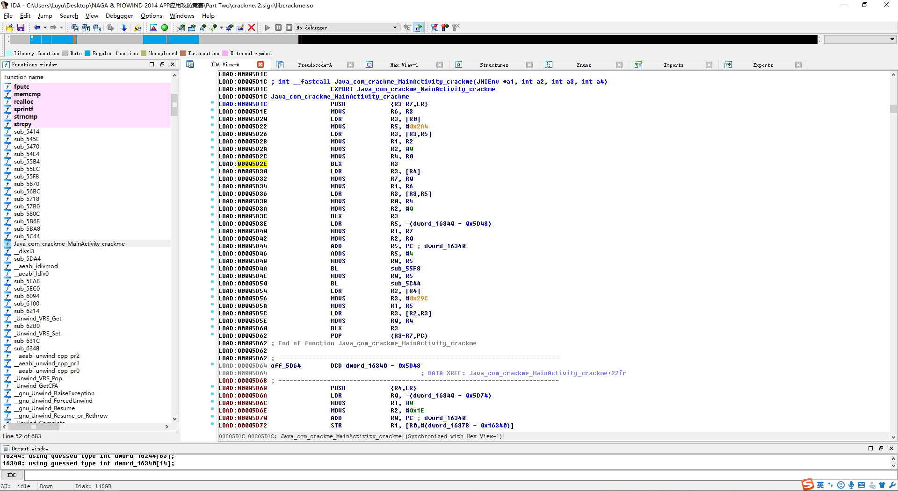
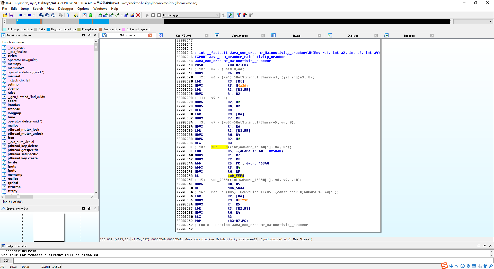
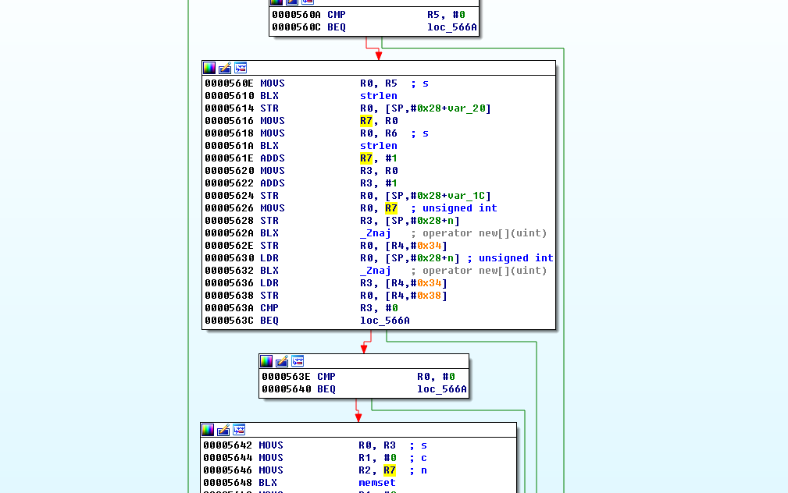
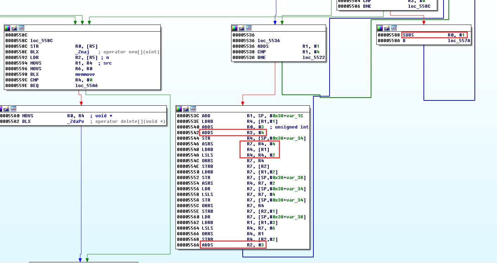
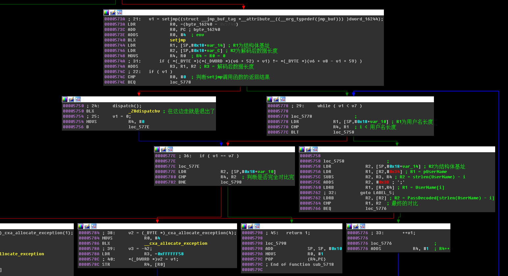

# NAGA & PIOWIND 2014 APP应用攻防竞赛第二阶段第二题题解

**Author：wnagzihxa1n
Mail：wnagzihxa1n@gmail.com**

Java层加了不知道是什么的花指令



其实认真看一下大概还是能看出来的，我闲着无聊给处理了一下
```
package com.crackme;

import android.app.Activity;
import android.os.Bundle;
import android.text.Editable;
import android.view.View$OnClickListener;
import android.view.View;
import android.widget.Button;
import android.widget.EditText;
import android.widget.TextView;
import java.io.PrintStream;

public class MainActivity extends Activity {
    private Button btn_login;
    private Button btn_reset;
    public static MainActivity m_lpThisBen;
    private EditText txt_name;
    private EditText txt_passwd;
    private TextView txt_result;

    static {
        String v0 = "crackme";
        System.loadLibrary(v0);
    }

    public MainActivity() {
        super();
    }

    static EditText access$0(MainActivity arg2) {
        EditText v0 = arg2.txt_name;
        return v0;
    }

    static EditText access$1(MainActivity arg2) {
        EditText v0 = arg2.txt_passwd;
        return v0;
    }

    static TextView access$2(MainActivity arg2) {
        TextView v0 = arg2.txt_result;
        return v0;
    }

    static String access$3(MainActivity arg2, String arg3, String arg4) {
        String v0 = arg2.crackme(arg3, arg4);
        return v0;
    }

    private native String crackme(String arg1, String arg2) {
    }

    protected void onCreate(Bundle arg4) {
        super.onCreate(arg4);
        int v0 = 2130903040;
        this.setContentView(v0);
        v0 = 2131165184;
        View v0_1 = this.findViewById(v0);
        this.txt_name = ((EditText)v0_1);
        v0 = 2131165185;
        v0_1 = this.findViewById(v0);
        this.txt_passwd = ((EditText)v0_1);
        v0 = 2131165186;
        v0_1 = this.findViewById(v0);
        this.btn_login = ((Button)v0_1);
        v0 = 2131165187;
        v0_1 = this.findViewById(v0);
        this.btn_reset = ((Button)v0_1);
        v0 = 2131165188;
        v0_1 = this.findViewById(v0);
        this.txt_result = ((TextView)v0_1);
        Button v0_2 = this.btn_login;
        com.crackme.MainActivity$1 v1 = new View$OnClickListener() {
            public void onClick(View arg8) {
                TextView v3_6;
                String v4;
                PrintStream v3_5;
                MainActivity v3 = MainActivity.this;
                EditText v3_1 = MainActivity.access$0(v3);
                Editable v3_2 = v3_1.getText();
                String v0 = v3_2.toString();
                v3 = MainActivity.this;
                v3_1 = MainActivity.access$1(v3);
                v3_2 = v3_1.getText();
                String v1 = v3_2.toString();
                String v3_3 = "";
                boolean v3_4 = v3_3.equals(v0);
                if(v3_4) {
                    v3_5 = System.out;
                    v4 = "name is null or \'\'";
                    v3_5.println(v4);
                    v3 = MainActivity.this;
                    v3_6 = MainActivity.access$2(v3);
                    v4 = "账户为空";
                    v3_6.setText(((CharSequence)v4));
                }
                else {
                    v3_3 = "";
                    v3_4 = v3_3.equals(v1);
                    if(v3_4) {
                        v3_5 = System.out;
                        v4 = "passwd is null or \'\'";
                        v3_5.println(v4);
                        v3 = MainActivity.this;
                        v3_6 = MainActivity.access$2(v3);
                        v4 = "密码为空";
                        v3_6.setText(((CharSequence)v4));
                        while(true) {
                            if(98 >= 0) {
                                goto label_152;
                            }
                        }
                    }
                    v3_5 = System.out;
                    String v5 = "name:";
                    StringBuilder v4_1 = new StringBuilder(v5);
                    v4_1 = v4_1.append(v0);
                    v4 = v4_1.toString();
                    v3_5.println(v4);
                    v3_5 = System.out;
                    v5 = "passwd:";
                    v4_1 = new StringBuilder(v5);
                    v4_1 = v4_1.append(v1);
                    v4 = v4_1.toString();
                    v3_5.println(v4);
                    v3_5 = System.out;
                    v4 = "Please treat me gently, you have to go a long way.";
                    v3_5.println(v4);
                    v3 = MainActivity.this;
                    String v2 = MainActivity.access$3(v3, v0, v1);
                    v3 = MainActivity.this;
                    v3_6 = MainActivity.access$2(v3);
                    v3_6.setText(((CharSequence)v2));
                }
            label_152:
            }
        };
        v0_2.setOnClickListener(((View$OnClickListener)v1));
        v0_2 = this.btn_reset;
        com.crackme.MainActivity$2 v1_1 = new View$OnClickListener() {
            public void onClick(View arg4) {
                MainActivity v0 = MainActivity.this;
                EditText v0_1 = MainActivity.access$0(v0);
                String v1 = "";
                v0_1.setText(((CharSequence)v1));
                v0 = MainActivity.this;
                v0_1 = MainActivity.access$1(v0);
                v1 = "";
                v0_1.setText(((CharSequence)v1));
                v0 = MainActivity.this;
                TextView v0_2 = MainActivity.access$2(v0);
                v1 = "";
                v0_2.setText(((CharSequence)v1));
            }
        };
        v0_2.setOnClickListener(((View$OnClickListener)v1_1));
    }
}
```

和第一题大概是一样的，再看so文件，同样加密了，使用第一题的方法动态调试



撸回本地
```
auto fp, dex_addr, end_addr;  
fp = fopen("E:\\libcrackme.so", "wb");  
for(dex_addr = 0xA350E000; dex_addr < 0xA355B000; dex_addr++)
    fputc(Byte(dex_addr), fp);  
```

但是我们使用IDA打开的时候，发现出错，使用010editor分析，发现文件头没了



我们找个正常的so文件的文件头拷贝回去，然后再使用IDA打开，发现可以打开了



我们继续分析，整个程序的结构和第一题是一样的



新建内存空间



Base64解码



但是我们在最后校验的地方发现了不一样的地方，它校验的方式是反过来的



突然界面就酷炫了起来

那么就比较简单了，注册码就是用户名倒序的Base64编码再插入`-`


注册算法
```
public class MyKeyGen {
    public static void main(String[] args) throws Exception {
        String userName = "wnagzihxain";
        StringBuilder re_userName = new StringBuilder(userName).reverse();
        StringBuilder temp = new StringBuilder(Base64.getBase64(re_userName.toString()));
        System.out.println(temp);
        StringBuilder regCode = new StringBuilder();
        for (int i = 0; i < temp.length(); i++) {
            regCode.append(temp.charAt(i));
            if (temp.charAt(i + 1) == '=') {
                break;
            }
            if ((i + 1) % 3 == 0) {
                regCode.append('-');
            }
        }
        System.out.println(regCode);
    }
}
```


