# NAGA & PIOWIND 2014 APP应用攻防竞赛第二阶段第三题题解

**Author: wnagzihxa1n
E-Mail: wnagzihxa1n@gmail.com**

一开始用模拟器跑起来就崩溃，我以为是模拟器系统版本的问题，后来看了配置文件，发现没有问题，猜测可能是有反调试，第三题了应该出现反调试了

于是使用调试模式启动应用

先修改`android_server`的名称和监听端口
```
root@generic:/data/local/tmp # ./as -p23333
```

相应的端口转发也要修改
```
C:\Users\Luyu>adb forward tcp:23946 tcp:23333
```

然后调试模式启动
```
adb shell am start -D -n com.crackme/.MainActivity
```

开启DDMS，选中待调试的应用，前面出现小虫子

然后输入
```
C:\Users\Luyu>jdb -connect com.sun.jdi.SocketAttach:hostname=127.0.0.1,port=8700
设置未捕获的java.lang.Throwable
设置延迟的未捕获的java.lang.Throwable
正在初始化jdb...
>
```

如果出现如下信息，先关掉Android Studio等玩意
```
C:\Users\Luyu>jdb -connect com.sun.jdi.SocketAttach:hostname=127.0.0.1,port=8700
java.net.ConnectException: Connection refused: connect
        at java.net.DualStackPlainSocketImpl.connect0(Native Method)
        at java.net.DualStackPlainSocketImpl.socketConnect(DualStackPlainSocketImpl.java:79)
        at java.net.AbstractPlainSocketImpl.doConnect(AbstractPlainSocketImpl.java:350)
        at java.net.AbstractPlainSocketImpl.connectToAddress(AbstractPlainSocketImpl.java:206)
        at java.net.AbstractPlainSocketImpl.connect(AbstractPlainSocketImpl.java:188)
        at java.net.PlainSocketImpl.connect(PlainSocketImpl.java:172)
        at java.net.SocksSocketImpl.connect(SocksSocketImpl.java:392)
        at java.net.Socket.connect(Socket.java:589)
        at com.sun.tools.jdi.SocketTransportService.attach(SocketTransportService.java:222)
        at com.sun.tools.jdi.GenericAttachingConnector.attach(GenericAttachingConnector.java:116)
        at com.sun.tools.jdi.SocketAttachingConnector.attach(SocketAttachingConnector.java:90)
        at com.sun.tools.example.debug.tty.VMConnection.attachTarget(VMConnection.java:519)
        at com.sun.tools.example.debug.tty.VMConnection.open(VMConnection.java:328)
        at com.sun.tools.example.debug.tty.Env.init(Env.java:63)
        at com.sun.tools.example.debug.tty.TTY.main(TTY.java:1082)

致命错误:
无法附加到目标 VM。
```

修改调试选项，然后使用IDA attach

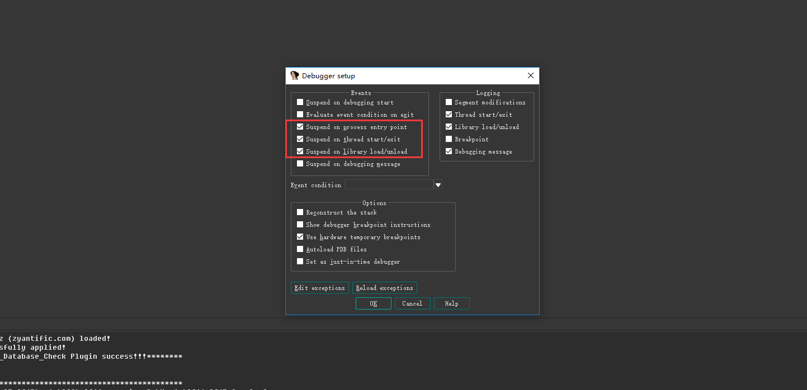

挂上去后，点击运行，或者F9，断在ELF的入口

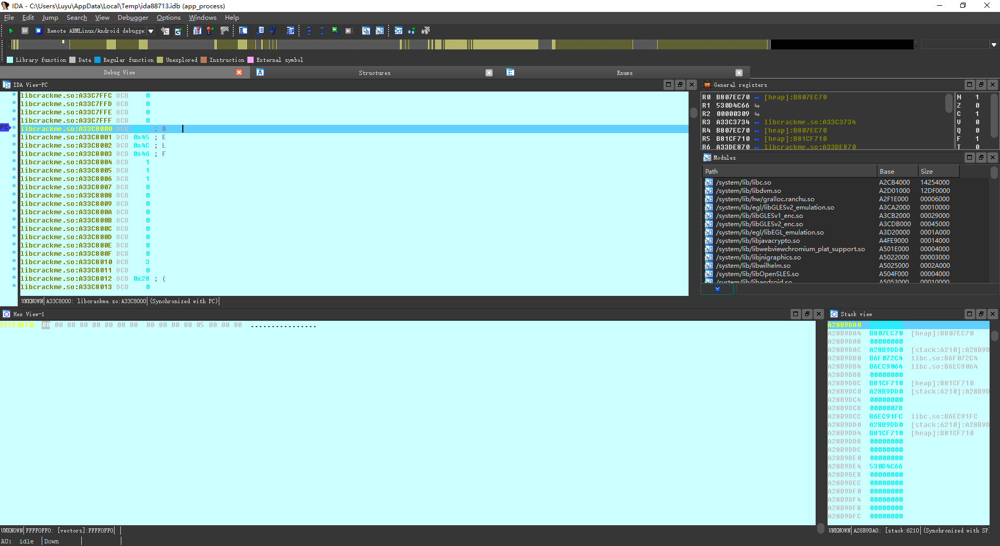

按照前两题的方法dump解密后的so即可
```
auto fp, dex_addr, end_addr;  
fp = fopen("E:\\libcrackme.so", "wb");  
for(dex_addr = 0xA33AC000; dex_addr < 0xA3406000; dex_addr++)
    fputc(Byte(dex_addr), fp);
```

文件头依旧是空的，使用正常的ELF文件头覆盖回去，使用IDA打开，找到` _Z9fdog_initv`，这里实现了反调试

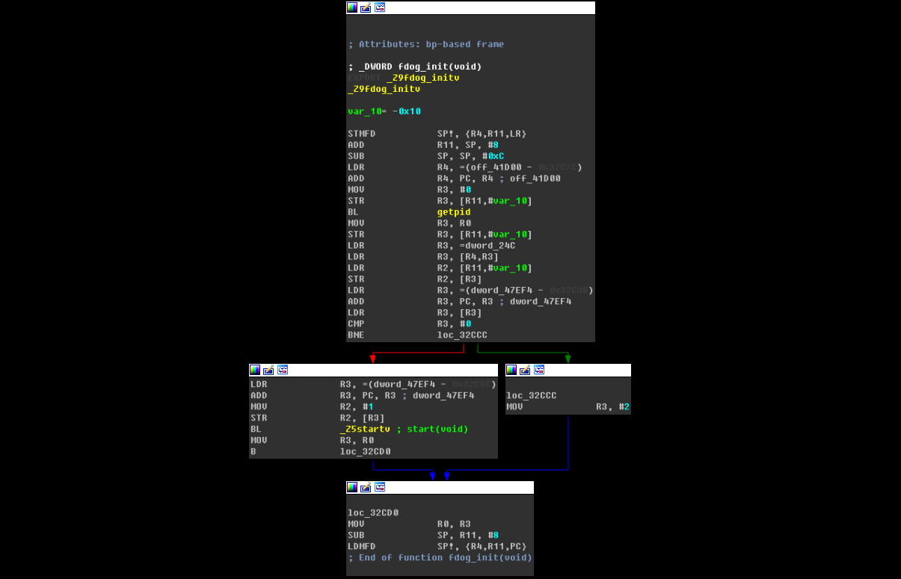

跟入该函数，该函数创建了很多的子线程进行反调试，我们一个个跟

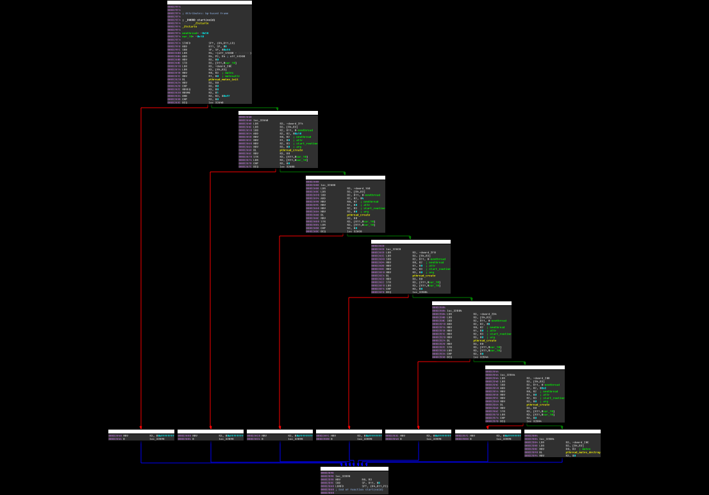

这里有一个问题，创建子线程时的函数地址是动态调试时内存的地址，如果不清楚我们看伪代码

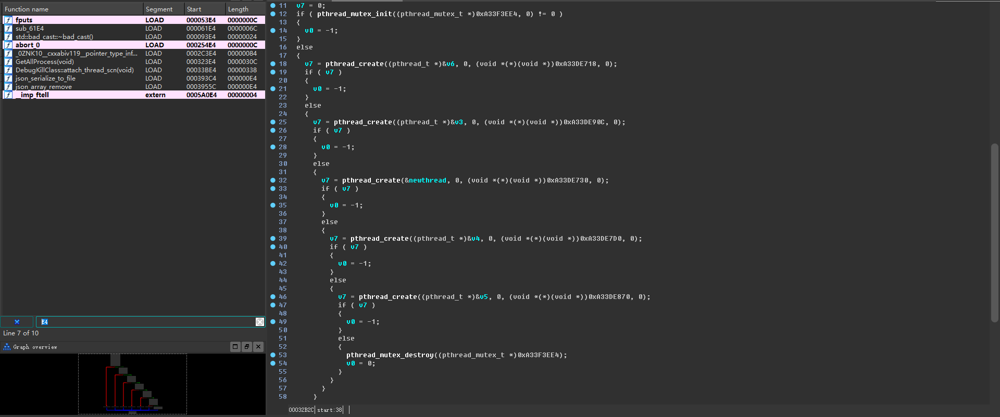

所有子线程的函数参数全是内存地址，有两种方法，第一种是动态调试，但是需要过掉反调试，第二种方法，可以看到我在上面的截图里已经体现出来了，so加载到内存里的地址一般都是`0x*****000`，所以我们可以根据地址的后三位来搜索函数，而且IDA识别函数后会将函数命名为`sub_****`，而且有地址的偏移等信息

那么我们来一个个找

第一个函数是`_Z13debuggdb_scanv`，实现了循环检测

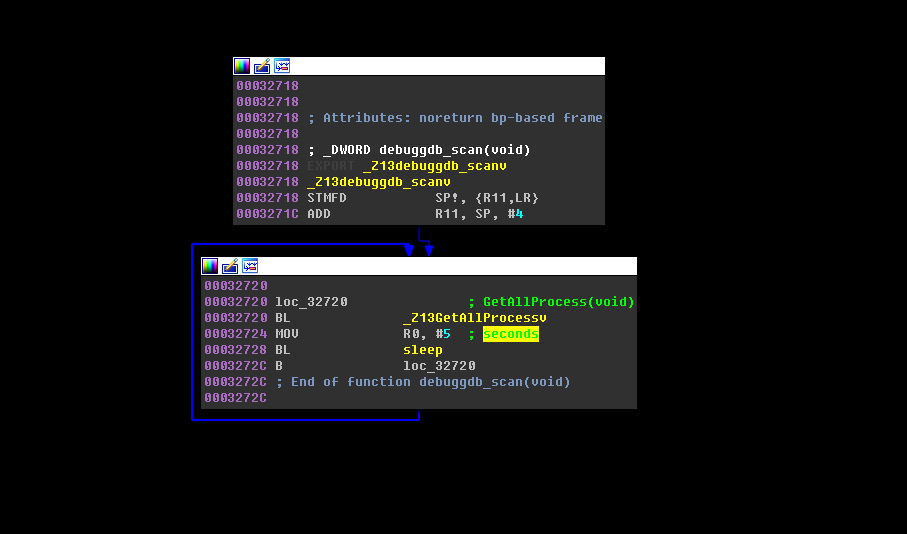

跟进其中调用的函数，检测的是进程名，分别检测了`gdb`，`gdbserver`，`android_server`，`xposed`


第二个函数`_Z26file_pro_thread_strengthenv`，这个函数我不知道是什么反调试操作，比较猥琐的感觉

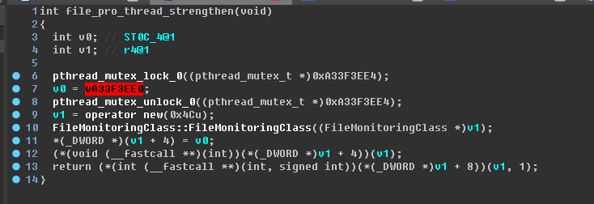

先放着，我找其他师傅再问问

第三个函数`_Z18prevent_attach_onev`，看起来好像是调用了上了锁的函数的样子

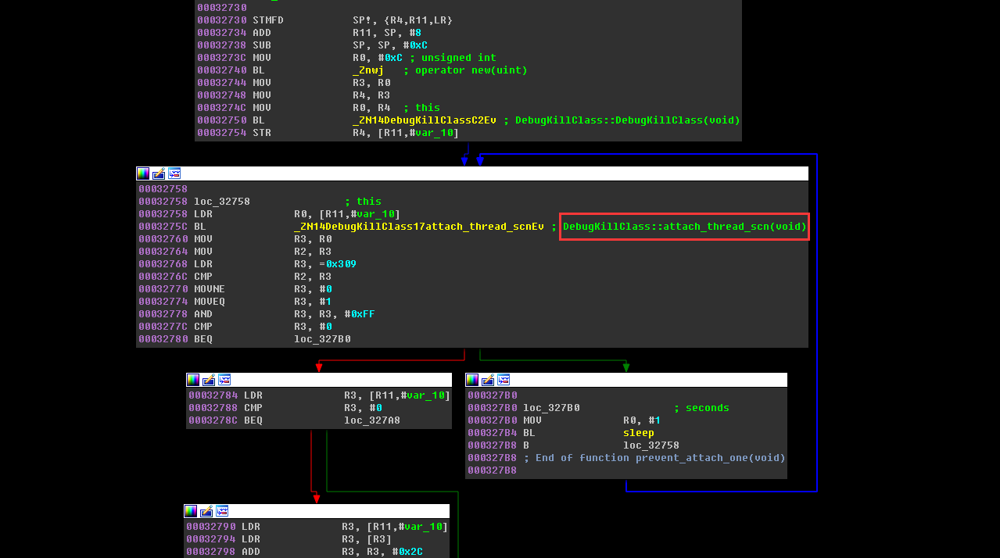

这个函数读取了进程的`/proc/%d/task/%s/stat`文件夹

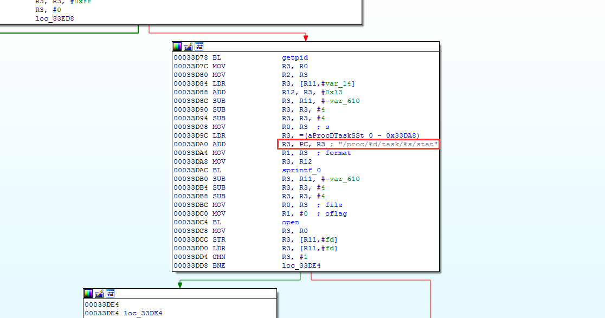

判断了标志位

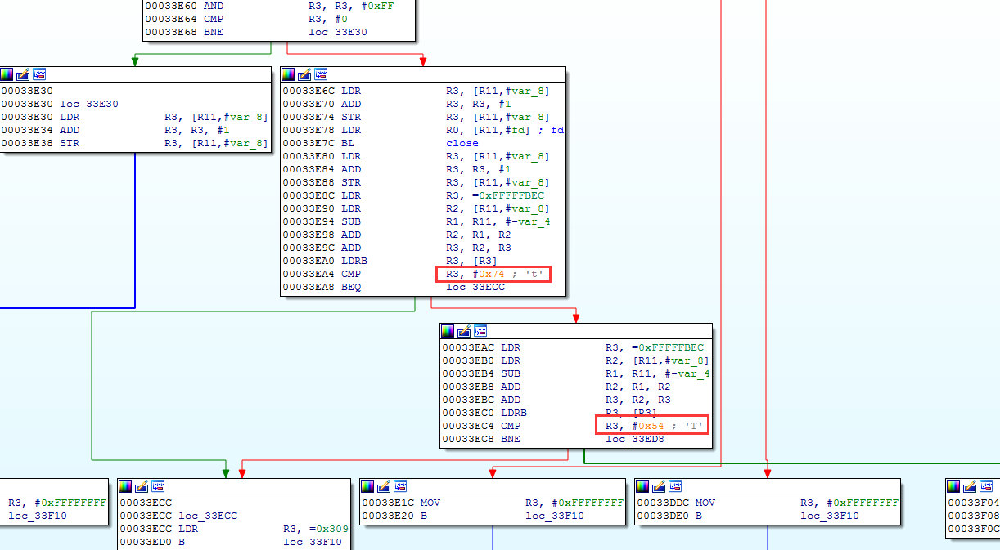

第四个函数`_Z18prevent_attach_twov`好像也是调用了上了锁的函数

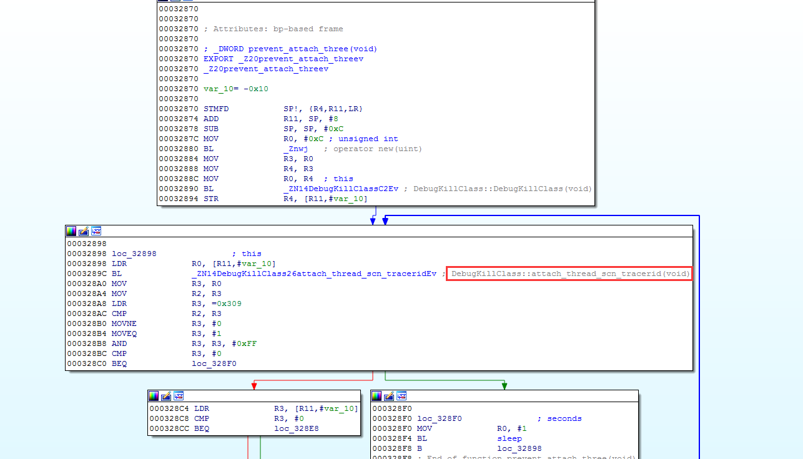

反调试部分大概就是这样

接下来我们来看校验部分

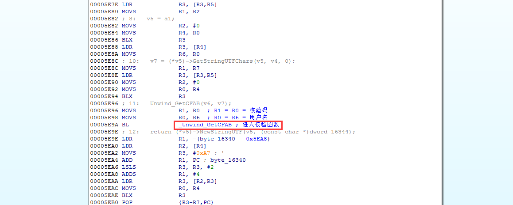

进入校验，先初始化内存空间存储用户名和注册码，然后进入校验


三处`-`判断，然后进入校验

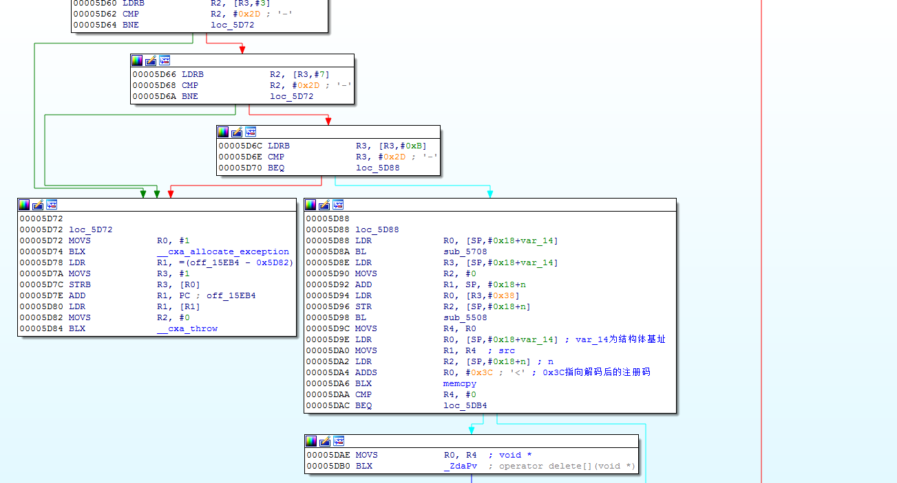

变量的初始化

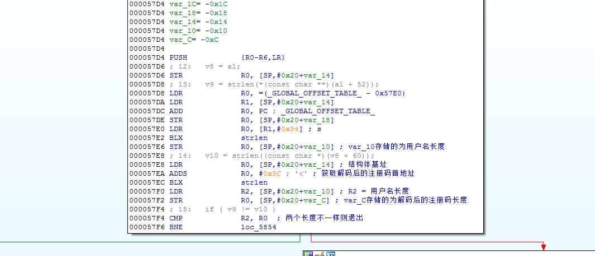

将解码后的数据前`n - 2`位进行奇数位和偶数位的交换

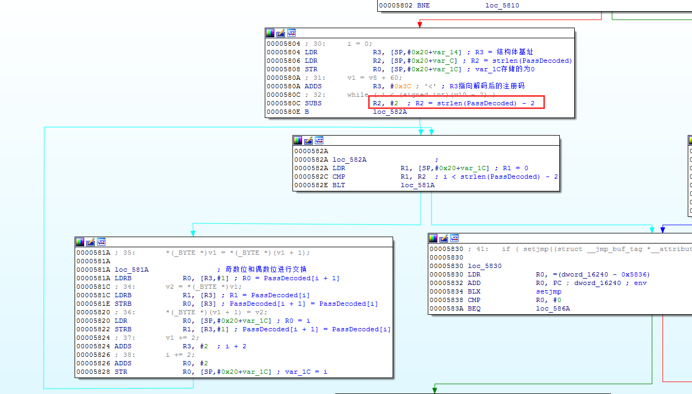

最后正常对比

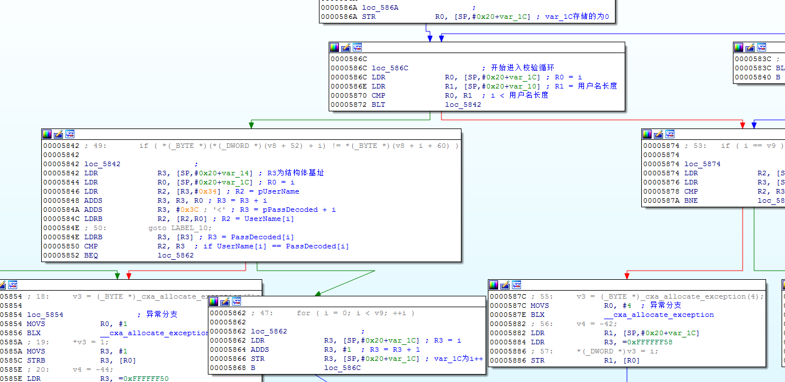

最后测试


注册代码
```
public class MyKeyGen {
    public static void main(String[] args) throws Exception {
        String userName = "You User Name";
        StringBuilder re_userName = new StringBuilder();
        for (int i = 0; i < userName.length() - 2; i += 2) {
            re_userName.append(userName.charAt(i + 1));
            re_userName.append(userName.charAt(i));
        }
        re_userName.append(userName.charAt(userName.length() - 1));
//        System.out.println(re_userName.toString());
        StringBuilder temp = new StringBuilder(Base64.getBase64(re_userName.toString()));
        System.out.println(temp);
        StringBuilder regCode = new StringBuilder();
        for (int i = 0; i < temp.length(); i++) {
            regCode.append(temp.charAt(i));
            if (temp.charAt(i + 1) == '=') {
                break;
            }
            if ((i + 1) % 3 == 0) {
                regCode.append('-');
            }
        }
        System.out.println(regCode);
    }
}
```

