# NAGA & PIOWIND 2014 APP应用攻防竞赛第二阶段第四题题解

**Author：wnagzihxa1n
Mail：tudouboom@163.com**

Java层比较简单

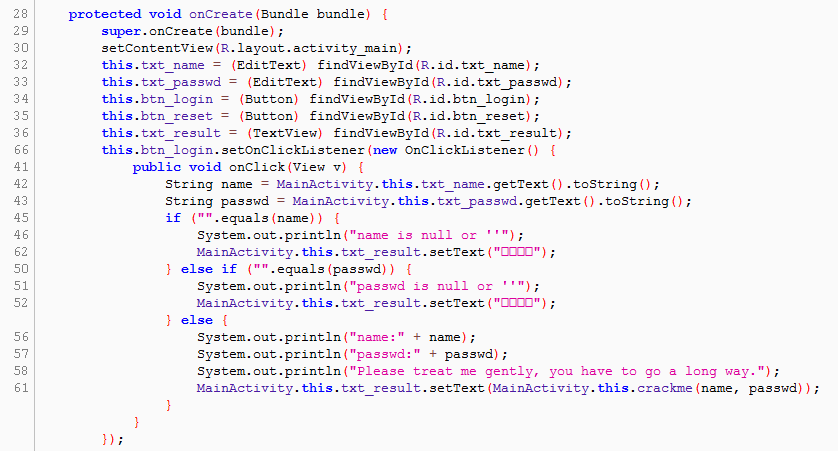

查看so，发现加密，依旧dump，IDA调试时未发现有反调试，不过有那么一瞬间看到了`inotify`，没具体看
```
auto fp, dex_addr, end_addr;  
fp = fopen("E:\\libcrackme.so", "wb");  
for(dex_addr = 0xA357D000; dex_addr < 0xA35DE000; dex_addr++)
    fputc(Byte(dex_addr), fp);
```

修复dump后的so文件头，使用IDA打开，关键的依旧是这个函数

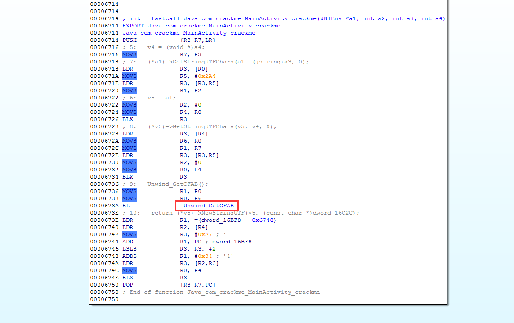

但是我们跟入后，发现壳好像没有脱干净（后来发现其实不是没脱干净）

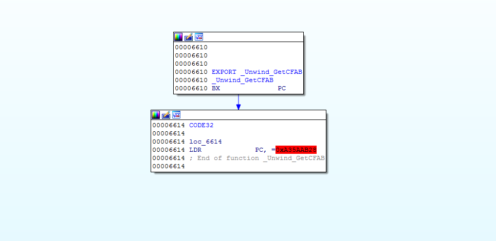

再次动态调试脱壳，这次我们找到校验函数，单步跟下去看看具体是什么情况

我们需要先找到校验函数的地址，使用给`dvmUserJNIBridge`函数下断点的方法

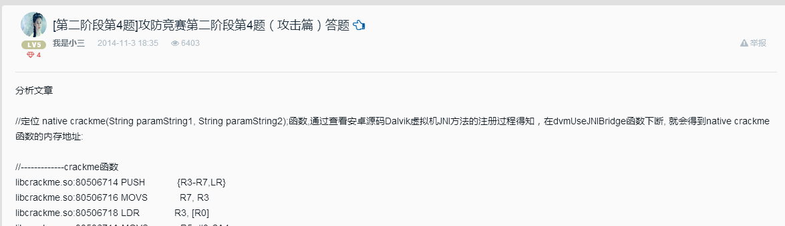

我们使用调试模式启动应用，IDA挂上去，找到`libdvm.so`的`dvmUseJNIBridge`函数，下断点

然后把IDA跑起来，在应用界面输入账号密码，点击登录，就可以发现断在这里了，我们注意观察参数，第二个参数就是我们的`crackme`函数

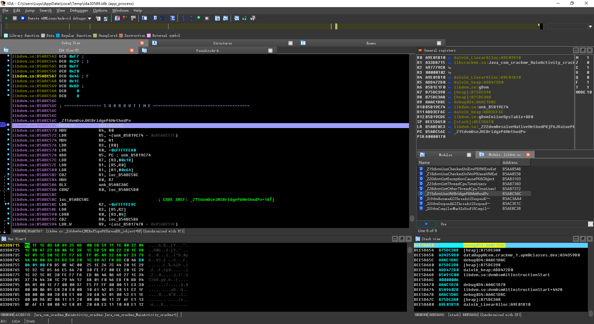

跟过去，可以看到确实是校验函数

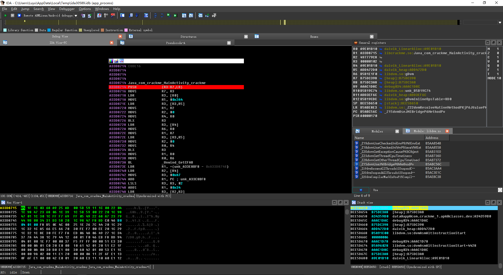

找到我们看到是跳转地址的地方

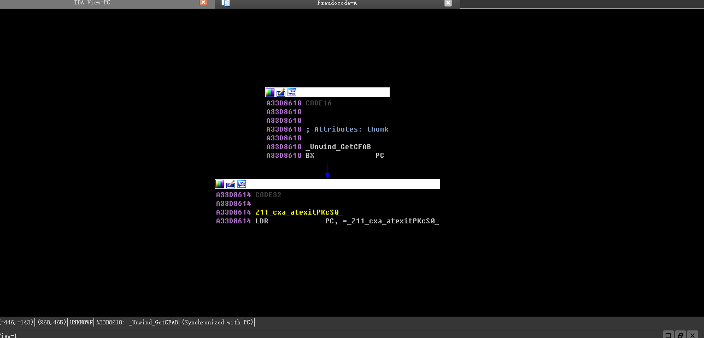

双击过去

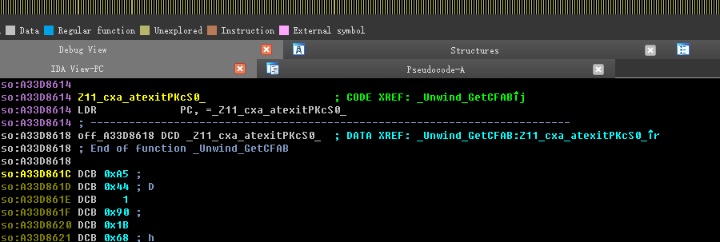

再次双击过去，发现是关键加解密点了，此时我们记录一下这个地址

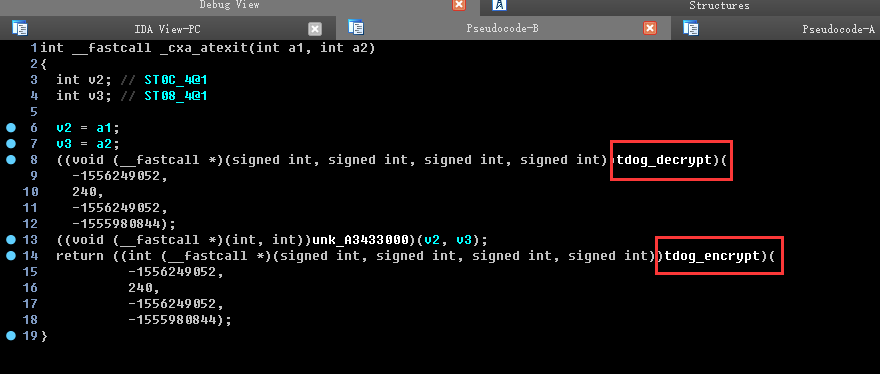

再次dump这个so文件

动静结合，接下来看能力了

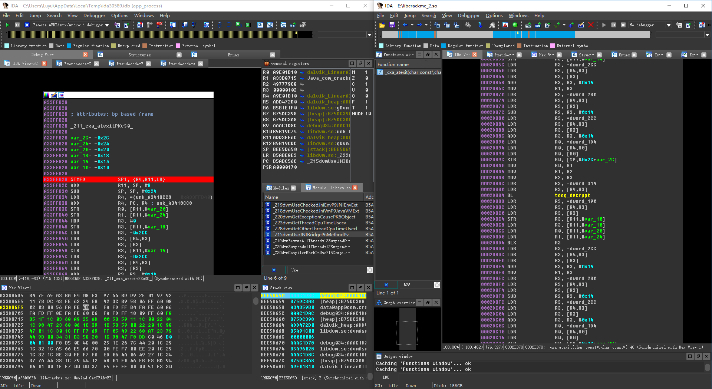

入口的数据初始化，然后调用`_Unwind_GetCFAB`，这和前几题是类似的

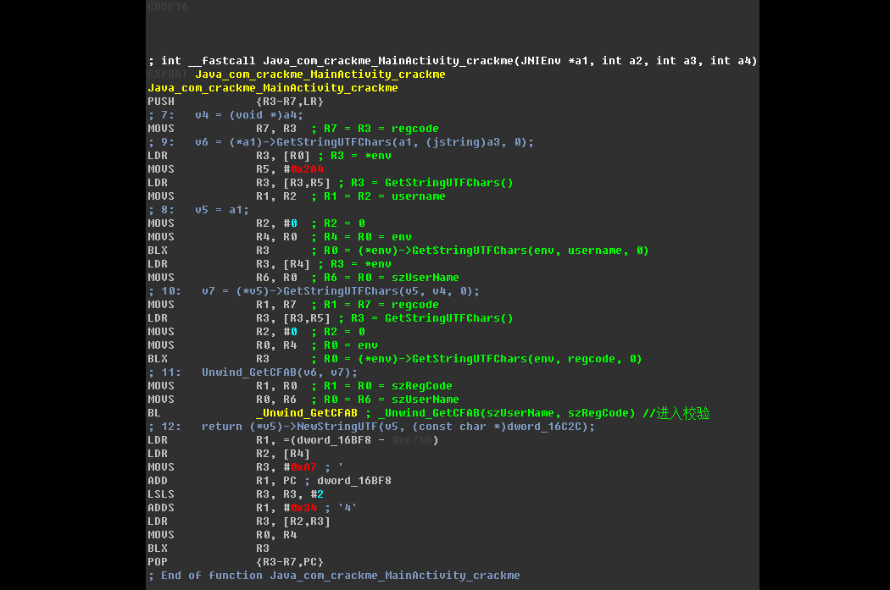

跟入，开始做了一些参数的存储操作，然后存储了`_Unwind_GetCFAB`函数的指针到栈中
```
LOAD:0002DB28 STMFD           SP!, {R4,R11,LR}
LOAD:0002DB2C ADD             R11, SP, #8
LOAD:0002DB30 SUB             SP, SP, #0x24
LOAD:0002DB34 LDR             R4, =(off_46CC8 - 0x2DB40)
LOAD:0002DB38 ADD             R4, PC, R4 ; off_46CC8 ; 神奇的地址，暂时不知道干什么的
LOAD:0002DB3C STR             R0, [R11,#var_20] ; R0 = var_20 = szUserName
LOAD:0002DB40 STR             R1, [R11,#var_24] ; R1 = var_24 = szRegCode
LOAD:0002DB44 MOV             R3, #0  ; R3 = 0
LOAD:0002DB48 STR             R3, [R11,#var_18] ; R3 = var_18 = 0
LOAD:0002DB4C LDR             R3, =dword_2CC ; R3 = 0x2CC
LOAD:0002DB50 LDR             R3, [R4,R3]
LOAD:0002DB54 LDR             R3, [R3]
LOAD:0002DB58 STR             R3, [R11,#var_14] ; var_14为_Unwind_GetCFAB函数指针
```

一开始并没有看出来，所以使用了动态调试来确定

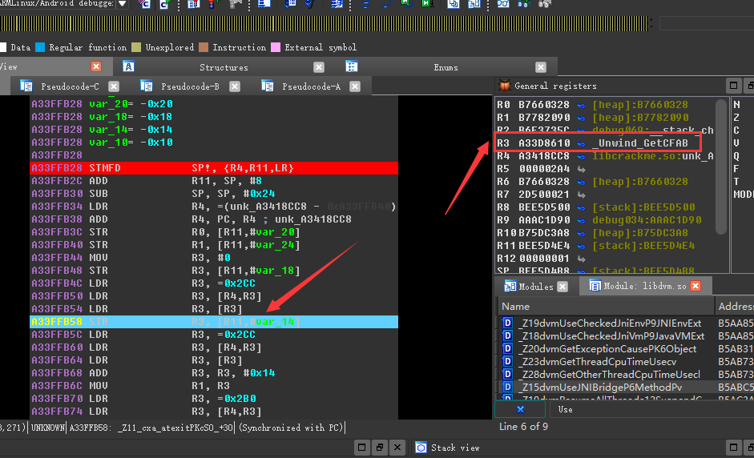

接下来的操作是为了调用`tdog_decrypt`而做参数的计算
```
LOAD:0002DB5C LDR             R3, =dword_2CC ; R3 = 0x2CC
LOAD:0002DB60 LDR             R3, [R4,R3]
LOAD:0002DB64 LDR             R3, [R3] ; R3 = _Unwind_GetCFAB
LOAD:0002DB68 ADD             R3, R3, #0x14 ; R3 = _Unwind_GetCFAB + 0x14
LOAD:0002DB6C MOV             R1, R3  ; R1 = R3 = R3 = _Unwind_GetCFAB + 0x14
LOAD:0002DB70 LDR             R3, =dword_2B0 ; R3 = 0x2B0
LOAD:0002DB74 LDR             R3, [R4,R3]
LOAD:0002DB78 LDR             R3, [R3] ; 动调 : R3 = 0x104
LOAD:0002DB7C SUB             R2, R3, #0x14 ; R2 = 0xF0
LOAD:0002DB80 LDR             R3, =dword_2CC ; R3 = 0x2CC
LOAD:0002DB84 LDR             R3, [R4,R3]
LOAD:0002DB88 LDR             R3, [R3] ; R3 = _Unwind_GetCFAB
LOAD:0002DB8C ADD             R3, R3, #0x14 ; R3 = _Unwind_GetCFAB + 0x14
LOAD:0002DB90 LDR             R0, =dword_1D4 ; R0 = 0x1D4
LOAD:0002DB94 LDR             R0, [R4,R0]
LOAD:0002DB98 LDR             R0, [R0]
LOAD:0002DB9C STR             R0, [SP,#0x2C+var_2C] ; var_2C = abs_export_function_key
LOAD:0002DBA0 MOV             R0, R1  ; R0 = _Unwind_GetCFAB + 0x14
LOAD:0002DBA4 MOV             R1, R2  ; R1 = R2 = 0xF0
LOAD:0002DBA8 MOV             R2, R3  ; R3 = _Unwind_GetCFAB + 0x14
LOAD:0002DBAC LDR             R3, =dword_314 ; R3 = 0x314
LOAD:0002DBB0 LDR             R3, [R4,R3] ; 指向内存
LOAD:0002DBB4 BL              tdog_decrypt
```

看名字就可以猜到这个函数很重要了
```
tdog_decrypt(_Unwind_GetCFAB + 0x14, 0xF0, _Unwind_GetCFAB + 0x14, 某内存变量指针)
```

双击跟入，发现其调用了一个`XorArray()`函数
```
LOAD:000387F8 STMFD           SP!, {R11,LR}
LOAD:000387FC ADD             R11, SP, #4
LOAD:00038800 SUB             SP, SP, #0x10
LOAD:00038804 ; 5:   v5 = a2;
LOAD:00038804 STR             R0, [R11,#var_8] ; R0 = var_8 = _Unwind_GetCFAB + 0x14
LOAD:00038808 STR             R1, [R11,#var_C] ; R1 = var_C = 0xF0
LOAD:0003880C ; 6:   v6 = a4;
LOAD:0003880C STR             R2, [R11,#var_10] ; R2 = var_10 = _Unwind_GetCFAB + 0x14
LOAD:00038810 STR             R3, [R11,#var_14] ; R3 = var_14 = 第四个参数，为一个指针
LOAD:00038814 ; 7:   XorArray(a5, a1, a1, a2);
LOAD:00038814 LDR             R2, [R11,#var_8] ; R2 = _Unwind_GetCFAB + 0x14
LOAD:00038818 LDR             R3, [R11,#var_8] ; R3 = _Unwind_GetCFAB + 0x14
LOAD:0003881C LDR             R0, [R11,#arg_0] ; 动调 : R0 = 0x5F7C8B38
LOAD:00038820 MOV             R1, R2  ; R1 = R2 = _Unwind_GetCFAB + 0x14
LOAD:00038824 MOV             R2, R3  ; R2 = R3 = _Unwind_GetCFAB + 0x14
LOAD:00038828 LDR             R3, [R11,#var_C] ; R3 = 0xF0
LOAD:0003882C BL              _Z8XorArrayjPhS_j ; XorArray(uint,uchar *,uchar *,uint)
```

在`XorArray`函数里有一个`PolyXorKey`函数，用于生成秘钥，这个函数在后续的娜迦壳里面是一个比较重要的特征，后续的类抽取技术里就有用到这个函数进行秘钥的计算

我一直觉得这里加了junk code，前面有些指令反复做同样的操作时我就感觉出来了，但是加的junk code并不是很多，比如这该函数的第一个函数块后面的几句
```
LOAD:00038D7C STMFD           SP!, {R11,LR}
LOAD:00038D80 ADD             R11, SP, #4
LOAD:00038D84 SUB             SP, SP, #0x20
LOAD:00038D88 ; 10:   v6 = a2;
LOAD:00038D88 STR             R0, [R11,#var_18] ; var_18 = 0X5F7C8B38 //神秘变量
LOAD:00038D8C STR             R1, [R11,#var_1C] ; var_1C = _Unwind_GetCFAB + 0x14
LOAD:00038D90 ; 11:   v5 = a3;
LOAD:00038D90 STR             R2, [R11,#var_20] ; var_20 = _Unwind_GetCFAB + 0x14
LOAD:00038D94 ; 12:   v4 = a4;
LOAD:00038D94 STR             R3, [R11,#var_24] ; var_24 = 0xF0
LOAD:00038D98 ; 13:   v7 = result;
LOAD:00038D98 LDR             R3, [R11,#var_18] ; R3 = 0X5F7C8B38 //神秘，神秘
LOAD:00038D9C STR             R3, [R11,#var_14] ; var_14 = 0X5F7C8B38 //又是神秘
LOAD:00038DA0 ; 14:   v8 = &v7;
LOAD:00038DA0 SUB             R3, R11, #-var_14
LOAD:00038DA4 STR             R3, [R11,#var_10] ; R3存储的是神秘变量0X5F7C8B38的指针
LOAD:00038DA8 ; 15:   v10 = 0;
LOAD:00038DA8 MOV             R3, #0  ; R3 = 0
LOAD:00038DAC STR             R3, [R11,#var_C] ; var_C = 0
LOAD:00038DB0 MOV             R3, #0  ; R3 = 0
LOAD:00038DB4 STR             R3, [R11,#var_8] ; var_8 = 0
LOAD:00038DB8 ; 16:   for ( i = 0; v4 > i; ++i )
LOAD:00038DB8 MOV             R3, #0  ; R3 = 0
LOAD:00038DBC STR             R3, [R11,#var_C] ; R3 = 0
LOAD:00038DC0 B               loc_38E40
```

开始进入循环
```
LOAD:00038E40 loc_38E40               ;
LOAD:00038E40 LDR             R2, [R11,#var_24] ; R2 = 0xF0 = 240
LOAD:00038E44 LDR             R3, [R11,#var_C] ; R3 = i
LOAD:00038E48 CMP             R2, R3
LOAD:00038E4C MOVLE           R3, #0
LOAD:00038E50 MOVGT           R3, #1  ; 循环中使用这一句 : i < 240 --- > R3 = 1
LOAD:00038E54 AND             R3, R3, #0xFF ; 用于判断是否到达退出条件
LOAD:00038E58 CMP             R3, #0
LOAD:00038E5C BNE             loc_38DC4
```

两个基址获取字节数据，进行异或操作，异或后的数据，存在`_Unwind_GetCFAB + 0x14 + i`指向的字节
```
LOAD:00038DC4 ; 19:     v5[i] = v6[i] ^ *((_BYTE *)v8 + v10);
LOAD:00038DC4 loc_38DC4               ;
LOAD:00038DC4 LDR             R3, [R11,#var_C] ; R3 = i
LOAD:00038DC8 LDR             R2, [R11,#var_20] ; R2 = _Unwind_GetCFAB + 0x14
LOAD:00038DCC ADD             R3, R2, R3 ; R3 = _Unwind_GetCFAB + 0x14 + i
LOAD:00038DD0 LDR             R2, [R11,#var_C] ; R2 = i
LOAD:00038DD4 LDR             R1, [R11,#var_1C] ; R1 = _Unwind_GetCFAB + 0x14
LOAD:00038DD8 ADD             R2, R1, R2 ; R2 = _Unwind_GetCFAB + 0x14 + i
LOAD:00038DDC ; 18:     result = (int)v8;
LOAD:00038DDC LDRB            R1, [R2] ; 取第一个字节，动调 : R1 = 0xBB
LOAD:00038DE0 LDR             R2, [R11,#var_8] ; R2 = j
LOAD:00038DE4 LDR             R0, [R11,#var_10] ; R0为神秘变量指针
LOAD:00038DE8 ADD             R2, R0, R2 ; R2 = 神秘变量指针 + j
LOAD:00038DEC LDRB            R2, [R2] ; 取第一个字节，动调 : 0x38
LOAD:00038DF0 EOR             R2, R1, R2 ; 两个取出来的字节异或
LOAD:00038DF4 AND             R2, R2, #0xFF
LOAD:00038DF8 STRB            R2, [R3]
LOAD:00038DFC ; 20:     if ( v10 == 3 )
LOAD:00038DFC LDR             R3, [R11,#var_8]
LOAD:00038E00 CMP             R3, #3
LOAD:00038E04 BNE             loc_38E28
```

这里是在计算一个四字节的数据

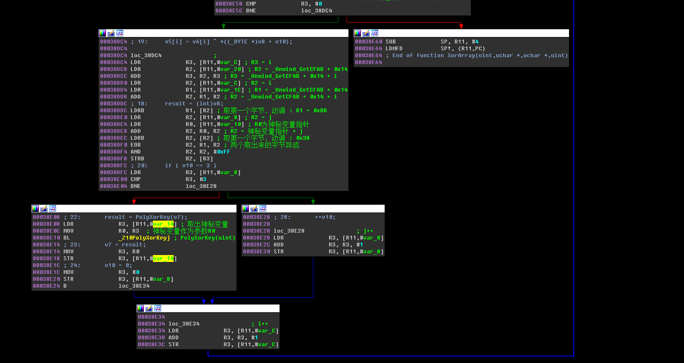

我们在内存中跟随，可以看到这四个字节的数据已经修改成了`83 93 00 23`，不清楚的同学可以在异或的地方下个断点循环调试看看

接着是调用`PolyXorKey`，参数是神秘变量自身
```
LOAD:00038E08 ; 22:       result = PolyXorKey(v7);
LOAD:00038E08 LDR             R3, [R11,#var_14] ; 取出神秘变量
LOAD:00038E0C MOV             R0, R3  ; 神秘变量作为参数R0
LOAD:00038E10 BL              _Z10PolyXorKeyj ; PolyXorKey(
```

先使用异或操作对神秘变量进行修改
```
LOAD:00038BC8 STR             R11, [SP,#-4+var_s0]!
LOAD:00038BCC ADD             R11, SP, #0
LOAD:00038BD0 SUB             SP, SP, #0x24
LOAD:00038BD4 ; 11:   v4 = 0;
LOAD:00038BD4 STR             R0, [R11,#var_20] ; var_20 = 神秘变量
LOAD:00038BD8 MOV             R3, #0  ; R3 = 0
LOAD:00038BDC STR             R3, [R11,#var_18] ; var_18 = 0
LOAD:00038BE0 MOV             R3, #0  ; R3 = 0
LOAD:00038BE4 STR             R3, [R11,#var_14] ; var_14 = 0
LOAD:00038BE8 ; 12:   v5 = 0;
LOAD:00038BE8 MOV             R3, #0  ; R3 = 0
LOAD:00038BEC STR             R3, [R11,#var_10] ; var_10 = 0
LOAD:00038BF0 ; 13:   v6 = (char *)&v2;
LOAD:00038BF0 SUB             R3, R11, #-var_20
LOAD:00038BF4 STR             R3, [R11,#var_C] ; var_C为神秘变量指针
LOAD:00038BF8 ; 14:   v7 = 0;
LOAD:00038BF8 MOV             R3, #0  ; R3 = 0
LOAD:00038BFC STRB            R3, [R11,#var_7] ; var_7指向的byte为0
LOAD:00038C00 ; 15:   v8 = 0;
LOAD:00038C00 MOV             R3, #0
LOAD:00038C04 STRB            R3, [R11,#var_6] ; var_6指向的byte为0
LOAD:00038C08 ; 16:   v9 = 0;
LOAD:00038C08 MOV             R3, #0
LOAD:00038C0C STRB            R3, [R11,#var_5] ; var_5指向的byte为0
LOAD:00038C10 ; 17:   v2 = a1 ^ 0xDF138530;
LOAD:00038C10 LDR             R3, [R11,#var_20] ; R3 = 神秘变量
LOAD:00038C14 MOV             R2, R3  ; R2 = R3 = 神秘变量
LOAD:00038C18 LDR             R3, =0xDF138530 ; R3 = 0xDF138530
LOAD:00038C1C EOR             R3, R2, R3 ; 神秘变量异或 ---> R3 = 0x5F7C8B38 ^ 0xDF138530
LOAD:00038C20 STR             R3, [R11,#var_20] ; 修改神秘变量为0x806F0E08
LOAD:00038C24 ; 18:   v3 = 0;
LOAD:00038C24 MOV             R3, #0  ; R3 = 0
LOAD:00038C28 STR             R3, [R11,#var_18] ; var_18 = 0
LOAD:00038C2C B               loc_38D48
```

进入大循环，整个大循环就是循环计算神秘变量的四个字节，但是内部又有很多的循环计算
```
LOAD:00038D48 ; 19:   while ( v3 <= 3 )
LOAD:00038D48 loc_38D48               ; 开始循环计算
LOAD:00038D48 LDR             R3, [R11,#var_18] ; R3 = i
LOAD:00038D4C CMP             R3, #3  ; 条件判断 i < 4
LOAD:00038D50 MOVGT           R3, #0
LOAD:00038D54 MOVLE           R3, #1
LOAD:00038D58 AND             R3, R3, #0xFF
LOAD:00038D5C CMP             R3, #0
LOAD:00038D60 BNE             loc_38C30
```

取字节，这里的`var_C`会在后面自加一
```
LOAD:00038C30 ; 21:     v7 = *v6;
LOAD:00038C30 loc_38C30               ;
LOAD:00038C30 LDR             R3, [R11,#var_C] ; R3为神秘变量指针
LOAD:00038C34 LDRB            R3, [R3] ; 获取计算后的神秘变量的字节
LOAD:00038C38 STRB            R3, [R11,#var_7] ; var_7 = 08
LOAD:00038C3C ; 22:     v4 = 128;
LOAD:00038C3C MOV             R3, #0x80 ; '€' ; R3 = 0x80
LOAD:00038C40 STR             R3, [R11,#var_14] ; var_14 = 0x80
LOAD:00038C44 ; 23:     v5 = 7;
LOAD:00038C44 MOV             R3, #7  ; R3 = 0x7
LOAD:00038C48 STR             R3, [R11,#var_10] ; var_10 = 0x7
LOAD:00038C4C B               loc_38CE0
```

内部的循环
```
LOAD:00038CE0 ; 24:     while ( v4 > 1 )
LOAD:00038CE0
LOAD:00038CE0 loc_38CE0               ;
LOAD:00038CE0 LDR             R3, [R11,#var_14] ; R3 = 0x80
LOAD:00038CE4 CMP             R3, #1
LOAD:00038CE8 MOVLE           R3, #0
LOAD:00038CEC MOVGT           R3, #1
LOAD:00038CF0 AND             R3, R3, #0xFF
LOAD:00038CF4 CMP             R3, #0
LOAD:00038CF8 BNE             loc_38C50
```

接下来的循环计算可以还原出C代码，但是具体是什么数学算法之类的就不是很清楚了，可能只是个计算，这个函数最终的功能目测应该是计算一个四字节的数据作为返回值
```
LOAD:00038C50 ; 27:       v8 = ((signed int)(unsigned __int8)(v7 & v4) >> v5) ^ v9;
LOAD:00038C50 loc_38C50               ; 进入循环，重命名神秘变量为sec
LOAD:00038C50 LDRB            R2, [R11,#var_7] ; R2 = 0x08
LOAD:00038C54 LDR             R3, [R11,#var_14] ; R3 = 0x80
LOAD:00038C58 AND             R2, R2, R3 ; R2 = sec[i] & 0x80
LOAD:00038C5C LDR             R3, [R11,#var_10] ; R3 = 0x07
LOAD:00038C60 MOV             R3, R2,ASR R3 ; R3 = (sec[i] & 0x80) / 0x07
LOAD:00038C64 ; 26:       v9 = (v7 & v4 / 2) >> (v5 - 1);
LOAD:00038C64 STRB            R3, [R11,#var_6] ; var_6 = (sec[i] & 0x80) / 0x07
LOAD:00038C68 LDRB            R2, [R11,#var_7] ; R2 = sec[i]
LOAD:00038C6C LDR             R3, [R11,#var_14] ; R3 = 0x80
LOAD:00038C70 MOV             R1, R3,LSR#31 ; R1 = 0x00000080 >> 31 = 0
LOAD:00038C74 ADD             R3, R1, R3 ; R3 = 0x80
LOAD:00038C78 MOV             R3, R3,ASR#1 ; R3 = 0x80 / 2
LOAD:00038C7C AND             R2, R2, R3 ; R2 = sec[i] & (0x80 / 2)
LOAD:00038C80 LDR             R3, [R11,#var_10] ; R3 = 0x07
LOAD:00038C84 SUB             R3, R3, #1 ; R3 = 0x07 - 1
LOAD:00038C88 MOV             R3, R2,ASR R3 ; R3 = (sec[i] & (0x80 / 2)) / (0x07 - 1)
LOAD:00038C8C STRB            R3, [R11,#var_5] ; var_5存储计算后的结果
LOAD:00038C90 LDRB            R2, [R11,#var_6] ; R2 = (sec[i] & 0x80) / 0x07
LOAD:00038C94 LDRB            R3, [R11,#var_5] ; R3 = (sec[i] & (0x80 / 2)) / (0x07 - 1)
LOAD:00038C98 EOR             R3, R2, R3 ; 上面两个进行异或，存储到R3
LOAD:00038C9C STRB            R3, [R11,#var_6] ; 异或结果存储到var_6
LOAD:00038CA0 ; 28:       v8 <<= v5;
LOAD:00038CA0 LDRB            R2, [R11,#var_6] ; R2 = 异或结果
LOAD:00038CA4 LDR             R3, [R11,#var_10] ; R3 = 0x07
LOAD:00038CA8 MOV             R3, R2,LSL R3 ; R3 = 异或结果 << 0x07
LOAD:00038CAC STRB            R3, [R11,#var_6] ; var_6 = 异或结果 << 0x07
LOAD:00038CB0 ; 29:       v7 |= v8;
LOAD:00038CB0 LDRB            R2, [R11,#var_7] ; R2 = sec[i]
LOAD:00038CB4 LDRB            R3, [R11,#var_6] ; R3 = 异或结果 << 0x07
LOAD:00038CB8 ORR             R3, R2, R3 ; R3 = sec[i] | (异或结果 << 0x07)
LOAD:00038CBC STRB            R3, [R11,#var_7] ; var_7 = sec[i] | (异或结果 << 0x07)
LOAD:00038CC0 ; 30:       v4 /= 2;
LOAD:00038CC0 LDR             R3, [R11,#var_14] ; R3 = 0x80
LOAD:00038CC4 MOV             R2, R3,LSR#31 ; R2 = 0
LOAD:00038CC8 ADD             R3, R2, R3 ; R3 = 0x80
LOAD:00038CCC MOV             R3, R3,ASR#1 ; R3 = 0x80 / 2
LOAD:00038CD0 STR             R3, [R11,#var_14] ; var_14 = 0x80 / 2 //这里应该是这个变量循环除2
LOAD:00038CD4 ; 31:       --v5;
LOAD:00038CD4 LDR             R3, [R11,#var_10] ; 0x07-- //这里也是这个变量循环自减一结果作为下次循环的值
LOAD:00038CD8 SUB             R3, R3, #1
LOAD:00038CDC STR             R3, [R11,#var_10]
```

直接在最后面下个断点跑完这个函数，可以看到返回值是`0x80FF1E18`


这是整个大循环


回到上一层函数，这个值应该是固定的，暂时没有看到有其它参数对这个计算过程造成了影响

一边分析一边写的，估计有些地方会分析错

这个函数整个大循环是`0xF0`次，也就是`240`次，我们来验证一下`PolyXorKey`函数是否每次都是生成一样的数据
```
0xFFFCBF78
0x60FF7ED8
0xFFFCFFF8
0x60FFFED8
0xFFFCFFF8
0x60FFFED8
0xFFFCFFF8
0x60FFFED8
0xFFFCFFF8
..........
0xFFFCFFF8
```

开始变成两个常数的交替出现，难道是动态调试出问题了

先放一边好了

这里非常绕，跟了好几次都没有找到关键的地方，后来半猜半想，根据调用`operator new[]()`的函数往回找，找到了和前几题一样的函数，虽然这里算法不一样，但是对于用户名和注册码的存储还是一样的

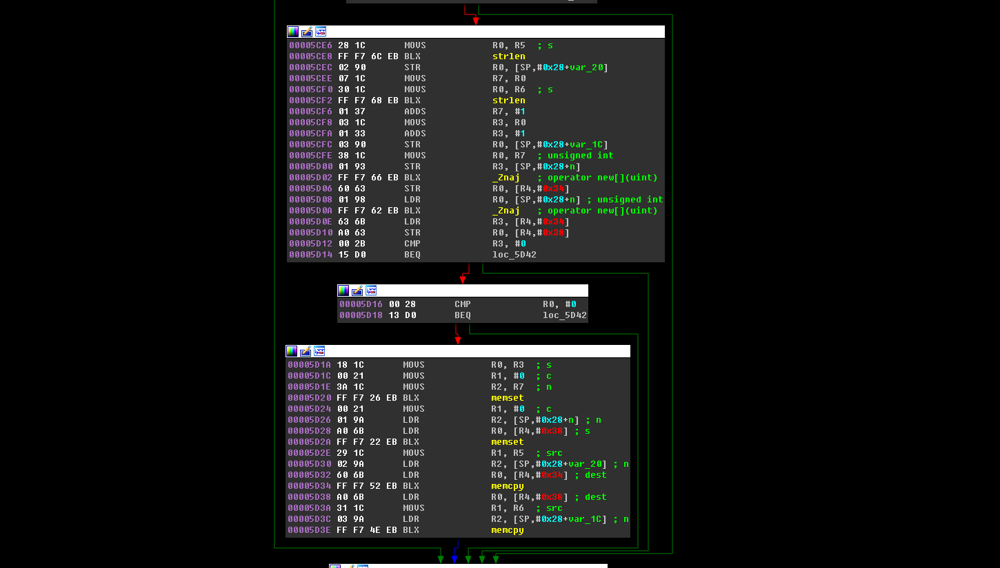

接下来是校验的地方，单步走一遍先，找到关键的地方，可以看到这里调用了四个函数

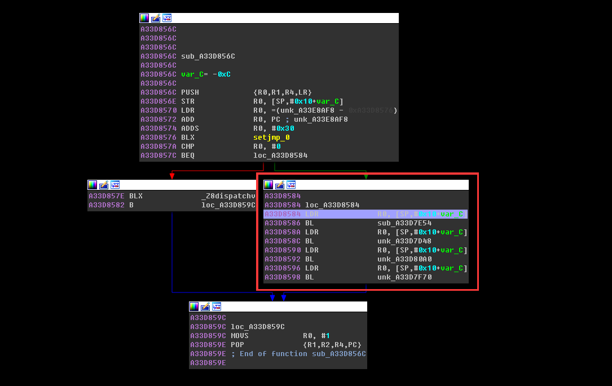

但是在静态时这位置我是手动找的，这个费劲，有的函数没有识别出来，红色的。。。。。。


其实还有非常多的函数未识别出来，不过并不是很重要

由于前面没有完整的跟过来，所以这里的一些偏移需要根据动态调试确定指向的数据是什么

那么`0x34`偏移指向的就是用户名

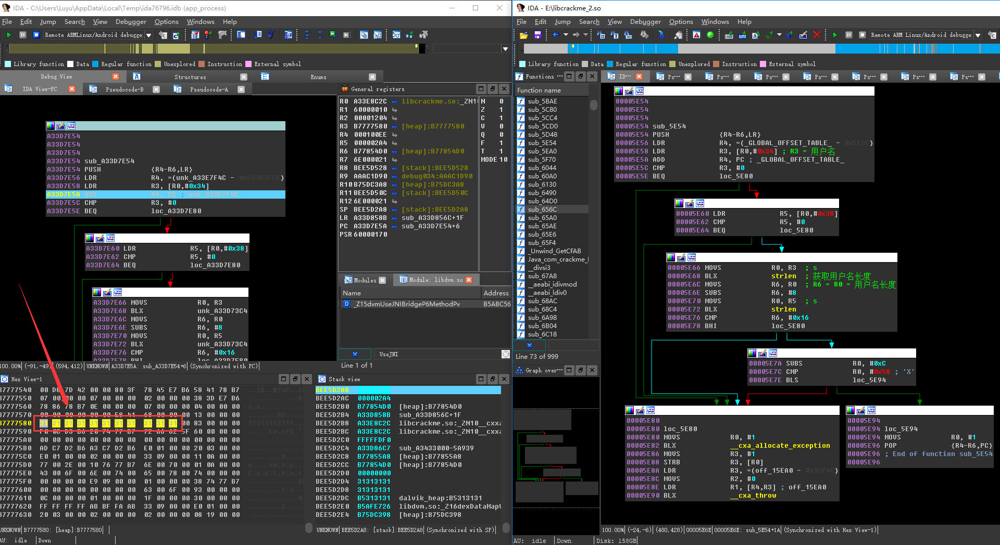

并且有长度的限制，用户名长度应该在`[8, 24]`之间
```
LOAD:00005E66 MOVS            R0, R3  ; s
LOAD:00005E68 BLX             strlen  ; 获取用户名长度
LOAD:00005E6C MOVS            R6, R0  ; R6 = R0 = 用户名长度
LOAD:00005E6E SUBS            R6, #8  ; R6 = strlen(UserName) - 8
LOAD:00005E70 MOVS            R0, R5  ; s
LOAD:00005E72 BLX             strlen  ; 获取注册码长度
LOAD:00005E76 CMP             R6, #0x16 ; 对比strlen(UserName) - 8和0x16
LOAD:00005E78 BHI             loc_5E80
```

偏移`0x38`指向的是注册码，注册码长度需要在`[12, 100]`之间
```
LOAD:00005E7A SUBS            R0, #0xC
LOAD:00005E7C CMP             R0, #0x58 ; 'X' ; 对比strlen(RegCode) - 0xC和0x58
LOAD:00005E7E BLS             loc_5E94
```

第二个函数比较长

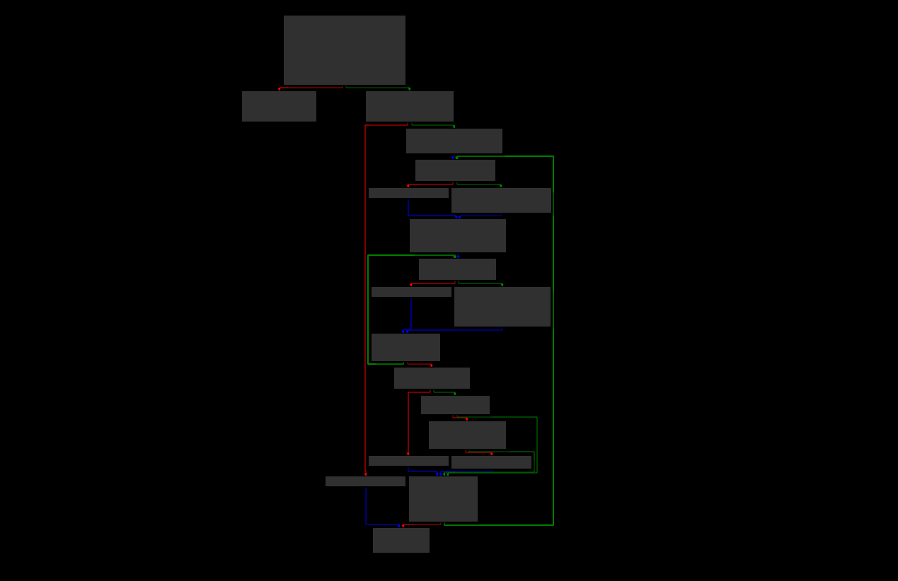

获取用户名
```
LOAD:00005D48 PUSH            {LR}
LOAD:00005D4A SUB             SP, SP, #0x2C
LOAD:00005D4C STR             R0, [SP,#0x30+var_20] ; 结构体基址
LOAD:00005D4E LDR             R0, [R0,#0x34] ; 获取用户名
LOAD:00005D50 BLX             strlen  ; R0 = 用户名长度
LOAD:00005D54 CMP             R0, #7  ; 用户名长度与7进行对比
LOAD:00005D56 BGT             loc_5D6E ; 用户名长度需要大于7 ---> strlen(UserMame) >= 8
```

存储一下中间变量
```
LOAD:00005D84 loc_5D84
LOAD:00005D84 LDR             R3, =(dword_16AF8 - 0x5D8A)
LOAD:00005D86 ADD             R3, PC ; dword_16AF8
LOAD:00005D88 ADDS            R3, #0x30 ; '0' ; env
LOAD:00005D8A STR             R3, [SP,#0x30+env] ; 将env变量存储到栈中
LOAD:00005D8C STR             R3, [SP,#0x30+var_C] ; var_C = env
```

进入一个`0x08 * 0x100`次的循环，循环获取用户名的前八位数据
```
LOAD:00005D9E loc_5D9E                ;
LOAD:00005D9E LDR             R1, [SP,#0x30+var_20] ; R1为结构体基址
LOAD:00005DA0 LDR             R2, [SP,#0x30+var_28] ; R2 = 0
LOAD:00005DA2 LDR             R3, [R1,#0x34] ; R3 = pUserName
LOAD:00005DA4 LDRB            R3, [R3,R2] ; 循环取用户名的字节数据
LOAD:00005DA6 STR             R3, [SP,#0x30+var_2C] ; 获取的数据暂存栈中
```

获取一个关键偏移
```
LOAD:00005DA8 loc_5DA8                ;
LOAD:00005DA8 MOVS            R3, #0  ; R3 = 0
LOAD:00005DAA STR             R3, [SP,#0x30+var_24] ; var_24 = 0
LOAD:00005DAC LDR             R3, =(dword_16AF8 - 0x5DB4)
LOAD:00005DAE LDR             R1, =0x104B2 ; R1 = 0x104B2
LOAD:00005DB0 ADD             R3, PC ; dword_16AF8 ; 定位结构体基址
LOAD:00005DB2 ADDS            R3, #0x30 ; '0' ; env
LOAD:00005DB4 STR             R3, [SP,#0x30+var_14] ; var_14 = env
LOAD:00005DB6 STR             R1, [SP,#0x30+var_10] ; var_10 = 0x104B2
```

这个偏移在这里的作用是重定位一个Table，通过和用户名相同的偏移来进行数据获取，然后两者异或
```
LOAD:00005DC8 loc_5DC8                ;
LOAD:00005DC8 LDR             R3, [SP,#0x30+var_10] ; R3 = 0x104B2
LOAD:00005DCA LDR             R2, [SP,#0x30+var_24] ; R2 = i
LOAD:00005DCC LDR             R1, [SP,#0x30+var_2C] ; R1 = UserName[i]
LOAD:00005DCE ADD             R3, PC  ; 动调 : R3 = 0xA33E8284
LOAD:00005DD0 ADDS            R3, #0x38 ; '8'
LOAD:00005DD2 LDRB            R3, [R2,R3] ; 同一偏移取某地址字节数据
LOAD:00005DD4 EORS            R3, R1  ; 两个地址同偏移数据异或
LOAD:00005DD6 LSLS            R3, R3, #0x18 ; 这两句效果等效&0xFF
LOAD:00005DD8 LSRS            R3, R3, #0x18
LOAD:00005DDA STR             R3, [SP,#0x30+var_2C]
```

大概就是
```
var_2C = ((byte) UserName[i] ^ (byte) Table[i]) & 0xFF
```

最后进行次数的判断
```
LOAD:00005DDC loc_5DDC                ;
LOAD:00005DDC LDR             R2, [SP,#0x30+var_24] ; var_24 = i
LOAD:00005DDE MOVS            R3, #0x100 ; R3 = 0x100
LOAD:00005DE2 ADDS            R2, #1  ; i++
LOAD:00005DE4 STR             R2, [SP,#0x30+var_24]
LOAD:00005DE6 CMP             R2, R3  ; i < 0x100 //循环0x100次
LOAD:00005DE8 BNE             loc_5DB8
```

每个字节一共是`0x100`次，动态调试把整个表dump出来
```
1A B7 00 3A 19 B7 00 2A  20 00 9D E5 C7 97 00 AA
C6 97 00 BA 91 03 03 E0  C8 3D 00 1A C7 3D 00 0A
48 60 9D E5 03 C2 00 CA  02 C2 00 DA 3C 40 8D E5
B4 3F 00 2A B3 3F 00 3A  E7 76 27 E2 F0 31 00 6A
EF 31 00 7A DA 2C 4C E2  AE A2 00 1A AD A2 00 0A
0A 6B 86 E2 04 C1 00 4A  03 C1 00 5A B4 20 9D E5
B2 18 00 AA B1 18 00 BA  06 30 8A E0 83 0C 00 0A
82 0C 00 1A 0A 80 88 E0  FA BE 00 3A F9 BE 00 2A
0C 10 21 E0 4A 9D 00 0A  49 9D 00 1A 21 5A 8F E2
DE 5E 85 E2 00 50 95 E5  63 84 00 AA 62 84 00 BA
D8 70 9D E5 E6 09 00 CA  E5 09 00 DA 91 02 02 E0
88 6B 00 6A 87 6B 00 7A  02 20 86 E0 DE 10 00 2A
DD 10 00 3A 87 3C 83 E2  31 C2 00 9A 30 C2 00 8A
9C B0 9D E5 EE A4 00 9A  ED A4 00 8A DD 06 00 1A
8C 8A 00 3A 8B 8A 00 2A  71 25 82 E2 F0 0C 00 6A
EF 0C 00 7A FA 19 21 E2  65 AF 00 6A 64 AF 00 7A
```

补充一点，这个表其实不是动态生成的，静态分析时就可以dump出来

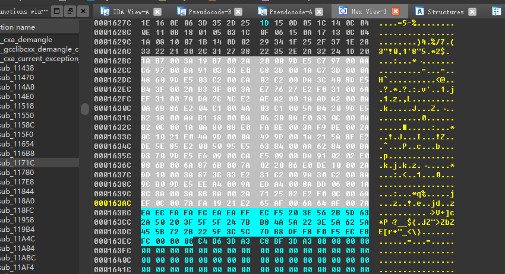

因为异或的计算比较有意思，整个表循环异或一遍其实可以等效于异或一个值，这个值我们可以通过计算来确定，输入为`0x00`，看输出是什么即可

在IDA里将这个表保存为文件，使用WinHex打开，拷贝存为C Source
```
unsigned AnsiChar data[256] = {
	0x1A, 0xB7, 0x00, 0x3A, 0x19, 0xB7, 0x00, 0x2A, 0x20, 0x00, 0x9D, 0xE5, 0xC7, 0x97, 0x00, 0xAA, 
	0xC6, 0x97, 0x00, 0xBA, 0x91, 0x03, 0x03, 0xE0, 0xC8, 0x3D, 0x00, 0x1A, 0xC7, 0x3D, 0x00, 0x0A, 
	0x48, 0x60, 0x9D, 0xE5, 0x03, 0xC2, 0x00, 0xCA, 0x02, 0xC2, 0x00, 0xDA, 0x3C, 0x40, 0x8D, 0xE5, 
	0xB4, 0x3F, 0x00, 0x2A, 0xB3, 0x3F, 0x00, 0x3A, 0xE7, 0x76, 0x27, 0xE2, 0xF0, 0x31, 0x00, 0x6A, 
	0xEF, 0x31, 0x00, 0x7A, 0xDA, 0x2C, 0x4C, 0xE2, 0xAE, 0xA2, 0x00, 0x1A, 0xAD, 0xA2, 0x00, 0x0A, 
	0x0A, 0x6B, 0x86, 0xE2, 0x04, 0xC1, 0x00, 0x4A, 0x03, 0xC1, 0x00, 0x5A, 0xB4, 0x20, 0x9D, 0xE5, 
	0xB2, 0x18, 0x00, 0xAA, 0xB1, 0x18, 0x00, 0xBA, 0x06, 0x30, 0x8A, 0xE0, 0x83, 0x0C, 0x00, 0x0A, 
	0x82, 0x0C, 0x00, 0x1A, 0x0A, 0x80, 0x88, 0xE0, 0xFA, 0xBE, 0x00, 0x3A, 0xF9, 0xBE, 0x00, 0x2A, 
	0x0C, 0x10, 0x21, 0xE0, 0x4A, 0x9D, 0x00, 0x0A, 0x49, 0x9D, 0x00, 0x1A, 0x21, 0x5A, 0x8F, 0xE2, 
	0xDE, 0x5E, 0x85, 0xE2, 0x00, 0x50, 0x95, 0xE5, 0x63, 0x84, 0x00, 0xAA, 0x62, 0x84, 0x00, 0xBA, 
	0xD8, 0x70, 0x9D, 0xE5, 0xE6, 0x09, 0x00, 0xCA, 0xE5, 0x09, 0x00, 0xDA, 0x91, 0x02, 0x02, 0xE0, 
	0x88, 0x6B, 0x00, 0x6A, 0x87, 0x6B, 0x00, 0x7A, 0x02, 0x20, 0x86, 0xE0, 0xDE, 0x10, 0x00, 0x2A, 
	0xDD, 0x10, 0x00, 0x3A, 0x87, 0x3C, 0x83, 0xE2, 0x31, 0xC2, 0x00, 0x9A, 0x30, 0xC2, 0x00, 0x8A, 
	0x9C, 0xB0, 0x9D, 0xE5, 0xEE, 0xA4, 0x00, 0x9A, 0xED, 0xA4, 0x00, 0x8A, 0xDD, 0x06, 0x00, 0x1A, 
	0x8C, 0x8A, 0x00, 0x3A, 0x8B, 0x8A, 0x00, 0x2A, 0x71, 0x25, 0x82, 0xE2, 0xF0, 0x0C, 0x00, 0x6A, 
	0xEF, 0x0C, 0x00, 0x7A, 0xFA, 0x19, 0x21, 0xE2, 0x65, 0xAF, 0x00, 0x6A, 0x64, 0xAF, 0x00, 0x7A
};
```

写个程序跑一下
```
#include <iostream>
#include <cstdio>
#include <cstring>

using namespace std;

unsigned char xor_table[256] = {
	0x1A, 0xB7, 0x00, 0x3A, 0x19, 0xB7, 0x00, 0x2A, 0x20, 0x00, 0x9D, 0xE5, 0xC7, 0x97, 0x00, 0xAA,
	0xC6, 0x97, 0x00, 0xBA, 0x91, 0x03, 0x03, 0xE0, 0xC8, 0x3D, 0x00, 0x1A, 0xC7, 0x3D, 0x00, 0x0A,
	0x48, 0x60, 0x9D, 0xE5, 0x03, 0xC2, 0x00, 0xCA, 0x02, 0xC2, 0x00, 0xDA, 0x3C, 0x40, 0x8D, 0xE5,
	0xB4, 0x3F, 0x00, 0x2A, 0xB3, 0x3F, 0x00, 0x3A, 0xE7, 0x76, 0x27, 0xE2, 0xF0, 0x31, 0x00, 0x6A,
	0xEF, 0x31, 0x00, 0x7A, 0xDA, 0x2C, 0x4C, 0xE2, 0xAE, 0xA2, 0x00, 0x1A, 0xAD, 0xA2, 0x00, 0x0A,
	0x0A, 0x6B, 0x86, 0xE2, 0x04, 0xC1, 0x00, 0x4A, 0x03, 0xC1, 0x00, 0x5A, 0xB4, 0x20, 0x9D, 0xE5,
	0xB2, 0x18, 0x00, 0xAA, 0xB1, 0x18, 0x00, 0xBA, 0x06, 0x30, 0x8A, 0xE0, 0x83, 0x0C, 0x00, 0x0A,
	0x82, 0x0C, 0x00, 0x1A, 0x0A, 0x80, 0x88, 0xE0, 0xFA, 0xBE, 0x00, 0x3A, 0xF9, 0xBE, 0x00, 0x2A,
	0x0C, 0x10, 0x21, 0xE0, 0x4A, 0x9D, 0x00, 0x0A, 0x49, 0x9D, 0x00, 0x1A, 0x21, 0x5A, 0x8F, 0xE2,
	0xDE, 0x5E, 0x85, 0xE2, 0x00, 0x50, 0x95, 0xE5, 0x63, 0x84, 0x00, 0xAA, 0x62, 0x84, 0x00, 0xBA,
	0xD8, 0x70, 0x9D, 0xE5, 0xE6, 0x09, 0x00, 0xCA, 0xE5, 0x09, 0x00, 0xDA, 0x91, 0x02, 0x02, 0xE0,
	0x88, 0x6B, 0x00, 0x6A, 0x87, 0x6B, 0x00, 0x7A, 0x02, 0x20, 0x86, 0xE0, 0xDE, 0x10, 0x00, 0x2A,
	0xDD, 0x10, 0x00, 0x3A, 0x87, 0x3C, 0x83, 0xE2, 0x31, 0xC2, 0x00, 0x9A, 0x30, 0xC2, 0x00, 0x8A,
	0x9C, 0xB0, 0x9D, 0xE5, 0xEE, 0xA4, 0x00, 0x9A, 0xED, 0xA4, 0x00, 0x8A, 0xDD, 0x06, 0x00, 0x1A,
	0x8C, 0x8A, 0x00, 0x3A, 0x8B, 0x8A, 0x00, 0x2A, 0x71, 0x25, 0x82, 0xE2, 0xF0, 0x0C, 0x00, 0x6A,
	0xEF, 0x0C, 0x00, 0x7A, 0xFA, 0x19, 0x21, 0xE2, 0x65, 0xAF, 0x00, 0x6A, 0x64, 0xAF, 0x00, 0x7A
};

int main()
{
	unsigned char test =0x00;
	for (int i = 0; i < 256; i++)
	{
		test ^= xor_table[i];
	}
	printf("0x%x\n", test);
	return 0;
}
```

可以看到整个异或表的异或效果和单独异或`0x93`的效果是一样的


计算完后会判断计算后的数据是否为0
```
LOAD:00005DFE loc_5DFE                ;
LOAD:00005DFE LDR             R1, [SP,#0x30+var_1C] ; R1 = 异或后的数据
LOAD:00005E00 CMP             R1, #0  ; 判断异或后的数据是否为0
LOAD:00005E02 BNE             loc_5E1E
```

如果是0，则会改为`0x99`
```
LOAD:00005E04 LDR             R0, =(dword_16AF8 - 0x5E0A)
LOAD:00005E06 ADD             R0, PC ; dword_16AF8
LOAD:00005E08 ADDS            R0, #0x30 ; '0' ; env
LOAD:00005E0A BLX             setjmp_0
LOAD:00005E0E MOVS            R2, #0x99 ; '
LOAD:00005E10 STR             R2, [SP,#0x30+var_2C] ; 如果计算后的数据为0，则改为0x99
LOAD:00005E12 CMP             R0, #0
LOAD:00005E14 BEQ             loc_5E1E
```

每个字节计算完成存储到栈中，一共八次
```
LOAD:00005E1E loc_5E1E                ;
LOAD:00005E1E LDR             R2, [SP,#0x30+var_28] ; R2 = i
LOAD:00005E20 LDR             R1, [SP,#0x30+var_20] ; R1 = 结构体基址
LOAD:00005E22 ADDS            R3, R1, R2
LOAD:00005E24 LDR             R2, [SP,#0x30+var_28]
LOAD:00005E26 MOV             R1, SP
LOAD:00005E28 LDRB            R1, [R1,#0x30+var_2C]
LOAD:00005E2A ADDS            R3, #0x5A ; 'Z' ; 0x5A为计算后数据存储偏移
LOAD:00005E2C ADDS            R2, #1
LOAD:00005E2E STRB            R1, [R3] ; 将计算后的值存储到栈中
LOAD:00005E30 STR             R2, [SP,#0x30+var_28]
LOAD:00005E32 CMP             R2, #8  ; 计算8字节，那么取的就是用户名前8位
LOAD:00005E34 BNE             loc_5D8E
```

最终我们可以看到生成的8字节数据

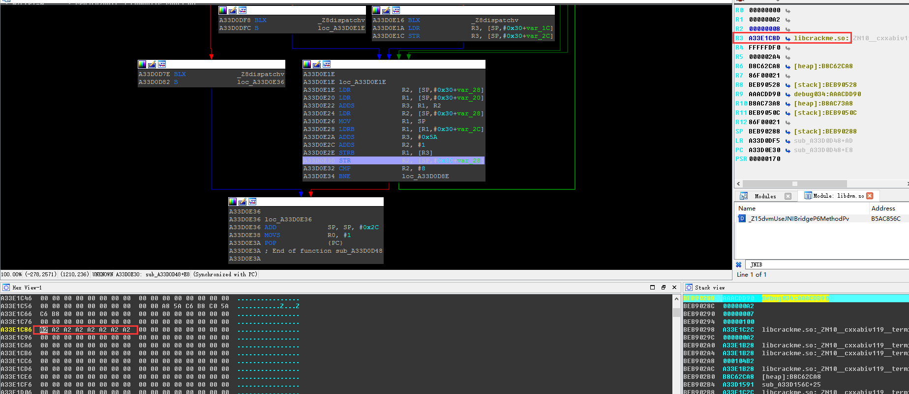

在上图的位置下个断点，数据区跟随`R3`，可以看到完整的生成过程

第三个函数，就一个小循环，应该比较简单

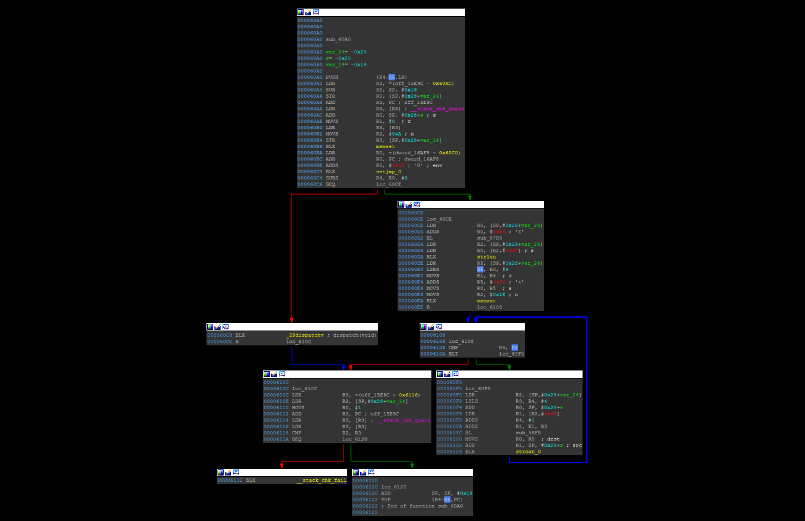

后来分析下来是我错了，它不简单，参数之类的预处理
```
LOAD:000060A0 PUSH            {R4-R6,LR}
LOAD:000060A2 LDR             R3, =(off_15E9C - 0x60AC)
LOAD:000060A4 SUB             SP, SP, #0x18
LOAD:000060A6 STR             R0, [SP,#0x28+var_24] ; var_24 = 结构体基址
LOAD:000060A8 ADD             R3, PC ; off_15E9C
LOAD:000060AA LDR             R3, [R3] ; __stack_chk_guard
LOAD:000060AC ADD             R0, SP, #0x28+s ; s
LOAD:000060AE MOVS            R1, #0  ; R1 = 0
LOAD:000060B0 LDR             R3, [R3]
LOAD:000060B2 MOVS            R2, #0xA ; R2 = 0x0A
LOAD:000060B4 STR             R3, [SP,#0x28+var_14] ; 栈保护
LOAD:000060B6 BLX             memset  ; memset(s, 0, 0x0A)
LOAD:000060BA LDR             R0, =(dword_16AF8 - 0x60C0)
LOAD:000060BC ADD             R0, PC ; dword_16AF8
LOAD:000060BE ADDS            R0, #0x30 ; '0' ; env
LOAD:000060C0 BLX             setjmp_0
LOAD:000060C4 SUBS            R4, R0, #0 ; R4 = 0 //影响了标志位，这里用于判断函数的执行
LOAD:000060C6 BEQ             loc_60CE
```

调用了一个函数，这个函数可复杂了
```
LOAD:000060CE loc_60CE                ;
LOAD:000060CE LDR             R0, [SP,#0x28+var_24] ; R0 = 结构体基址
LOAD:000060D0 ADDS            R0, #0x5A ; 'Z' ; 取出计算后的8字节数据
LOAD:000060D2 BL              sub_57D4
```

参数是计算后的8字节数据，里面有五个函数的调用，继续一个个跟

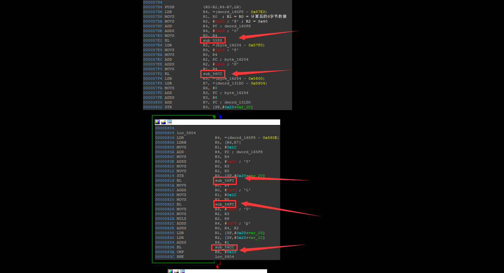

开始做参数的存储，重定位了一个Table
```
LOAD:000057D4 PUSH            {R0-R2,R4-R7,LR}
LOAD:000057D6 LDR             R4, =(dword_165F8 - 0x57E0)
LOAD:000057D8 MOVS            R1, R0  ; R1 = R0 = 计算后的8字节数据
LOAD:000057DA MOVS            R2, #0x40 ; '@' ; R2 = 0x40
LOAD:000057DC ADD             R4, PC ; dword_165F8
```

这个Table在动态调试的过程中是有值的

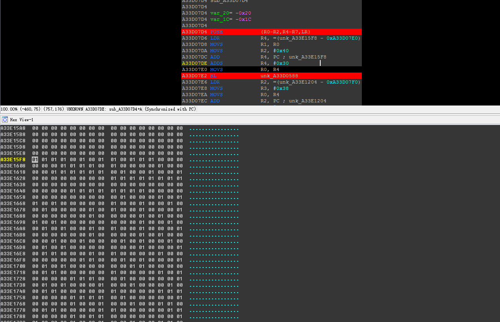

但是在静态分析的时候是空的，这里有一个`0x30`的偏移

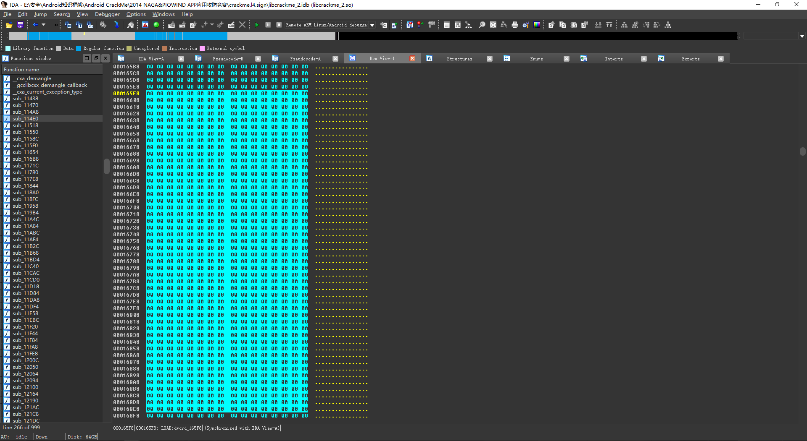

接下来以为我会继续分析下去吗？

不，其实这里是初始化秘钥的地方，我还分析下去，神经病啊

我看到了后面一层又一层的，而且明显的跟其它数据分开了

我发现不对劲，而且这么多计算我都看不懂，于是开启猜测模式

这里应该是某加密，前面那个8字节应该是秘钥，然后后面的函数一个个看，看看有没有什么Table，现代加密算法一般都有各种Table去做计算

运气不错，发现了DES加密算法的S盒，要是不知道S盒是啥的。。。。。。

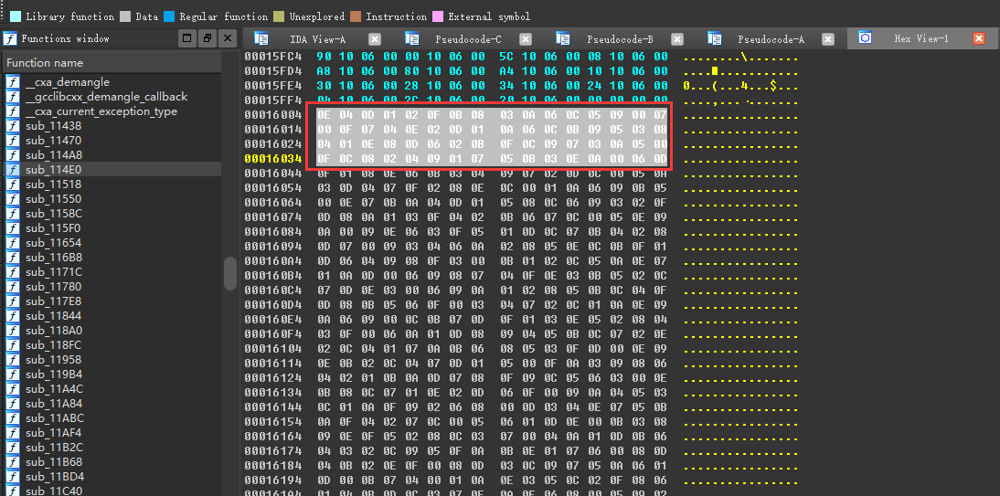

它是八个二维数组，规格就是`8 * 4 * 16`

可以自行对比一下，当然也可以靠其它Table的特征

当然AES也有S盒，但是这两者的S盒是有很多区别的，比如AES的S盒如下
```
unsigned char sBox[] =
{ /*  0    1    2    3    4    5    6    7    8    9    a    b    c    d    e    f */
    0x63, 0x7c, 0x77, 0x7b, 0xf2, 0x6b, 0x6f, 0xc5, 0x30, 0x01, 0x67, 0x2b, 0xfe, 0xd7, 0xab, 0x76, /*0*/ 
    0xca, 0x82, 0xc9, 0x7d, 0xfa, 0x59, 0x47, 0xf0, 0xad, 0xd4, 0xa2, 0xaf, 0x9c, 0xa4, 0x72, 0xc0, /*1*/
    0xb7, 0xfd, 0x93, 0x26, 0x36, 0x3f, 0xf7, 0xcc, 0x34, 0xa5, 0xe5, 0xf1, 0x71, 0xd8, 0x31, 0x15, /*2*/
    0x04, 0xc7, 0x23, 0xc3, 0x18, 0x96, 0x05, 0x9a, 0x07, 0x12, 0x80, 0xe2, 0xeb, 0x27, 0xb2, 0x75, /*3*/
    0x09, 0x83, 0x2c, 0x1a, 0x1b, 0x6e, 0x5a, 0xa0, 0x52, 0x3b, 0xd6, 0xb3, 0x29, 0xe3, 0x2f, 0x84, /*4*/
    0x53, 0xd1, 0x00, 0xed, 0x20, 0xfc, 0xb1, 0x5b, 0x6a, 0xcb, 0xbe, 0x39, 0x4a, 0x4c, 0x58, 0xcf, /*5*/
    0xd0, 0xef, 0xaa, 0xfb, 0x43, 0x4d, 0x33, 0x85, 0x45, 0xf9, 0x02, 0x7f, 0x50, 0x3c, 0x9f, 0xa8, /*6*/ 
    0x51, 0xa3, 0x40, 0x8f, 0x92, 0x9d, 0x38, 0xf5, 0xbc, 0xb6, 0xda, 0x21, 0x10, 0xff, 0xf3, 0xd2, /*7*/
    0xcd, 0x0c, 0x13, 0xec, 0x5f, 0x97, 0x44, 0x17, 0xc4, 0xa7, 0x7e, 0x3d, 0x64, 0x5d, 0x19, 0x73, /*8*/
    0x60, 0x81, 0x4f, 0xdc, 0x22, 0x2a, 0x90, 0x88, 0x46, 0xee, 0xb8, 0x14, 0xde, 0x5e, 0x0b, 0xdb, /*9*/
    0xe0, 0x32, 0x3a, 0x0a, 0x49, 0x06, 0x24, 0x5c, 0xc2, 0xd3, 0xac, 0x62, 0x91, 0x95, 0xe4, 0x79, /*a*/
    0xe7, 0xc8, 0x37, 0x6d, 0x8d, 0xd5, 0x4e, 0xa9, 0x6c, 0x56, 0xf4, 0xea, 0x65, 0x7a, 0xae, 0x08, /*b*/
    0xba, 0x78, 0x25, 0x2e, 0x1c, 0xa6, 0xb4, 0xc6, 0xe8, 0xdd, 0x74, 0x1f, 0x4b, 0xbd, 0x8b, 0x8a, /*c*/
    0x70, 0x3e, 0xb5, 0x66, 0x48, 0x03, 0xf6, 0x0e, 0x61, 0x35, 0x57, 0xb9, 0x86, 0xc1, 0x1d, 0x9e, /*d*/
    0xe1, 0xf8, 0x98, 0x11, 0x69, 0xd9, 0x8e, 0x94, 0x9b, 0x1e, 0x87, 0xe9, 0xce, 0x55, 0x28, 0xdf, /*e*/
    0x8c, 0xa1, 0x89, 0x0d, 0xbf, 0xe6, 0x42, 0x68, 0x41, 0x99, 0x2d, 0x0f, 0xb0, 0x54, 0xbb, 0x16  /*f*/
};
```

首先是规模不一样，其实是数量不一样，输入输出的值也都不一样

那么这里可以确定是DES加密算法，但是它是加密还是解密就需要再考量一下了

先放着，我们接着看代码，在初始化完秘钥后，开始给两个数组进行初始化操作
```
LOAD:000060D6 LDR             R2, [SP,#0x28+var_24] ; R2 = 结构体基址
LOAD:000060D8 LDR             R0, [R2,#0x38] ; R0 = s1 //结构体偏移0x38，为注册码
LOAD:000060DA BLX             strlen  ; R0 = strlen(s)
LOAD:000060DE LDR             R5, [SP,#0x28+var_24] ; R5 = 结构体基址
LOAD:000060E0 LSRS            R6, R0, #4 ; R6 = strlen(s) >> 4 //长度一定是非负，等效于除16
LOAD:000060E2 MOVS            R1, R4  ; R1 = R4 = 0
LOAD:000060E4 ADDS            R5, #0x3C ; '<' ; R5 = s2 //结构体偏移0x3C
LOAD:000060E6 MOVS            R0, R5  ; R0 = R5 = s2
LOAD:000060E8 MOVS            R2, #0x1E ; R2 = 0x1E
LOAD:000060EA BLX             memset  ; memset(s2, 0, 0x1E)
LOAD:000060EE B               loc_6108
```

顺带把注册码分为16字节每组，每组进行循环解密
```
LOAD:00006108 loc_6108
LOAD:00006108 CMP             R4, R6
LOAD:0000610A BLT             loc
```

解密后的数据存储到`s2`，结构体偏移`0x3C`
```
LOAD:000060F0 loc_60F0                ;
LOAD:000060F0 LDR             R2, [SP,#0x28+var_24] ; R2 = 结构体基址
LOAD:000060F2 LSLS            R3, R4, #4 ; i << 4 //此处用于注册码偏移的跳转
LOAD:000060F4 ADD             R0, SP, #0x28+s ; R0 = s = buffer
LOAD:000060F6 LDR             R1, [R2,#0x38] ; R1 = s1 = 注册码
LOAD:000060F8 ADDS            R4, #1
LOAD:000060FA ADDS            R1, R1, R3
LOAD:000060FC BL              sub_58F8 ; 此处入口对数据进行解密
LOAD:00006100 MOVS            R0, R5  ; dest
LOAD:00006102 ADD             R1, SP, #0x28+s ; src
LOAD:00006104 BLX             strcat_0 ; 解密后的数据存储到s2
```

最后第四个函数就是解密后的注册码和用户名进行对比，红色表示异常分支，蓝色表示正常循环，最后由两个灰色的代码块结束循环

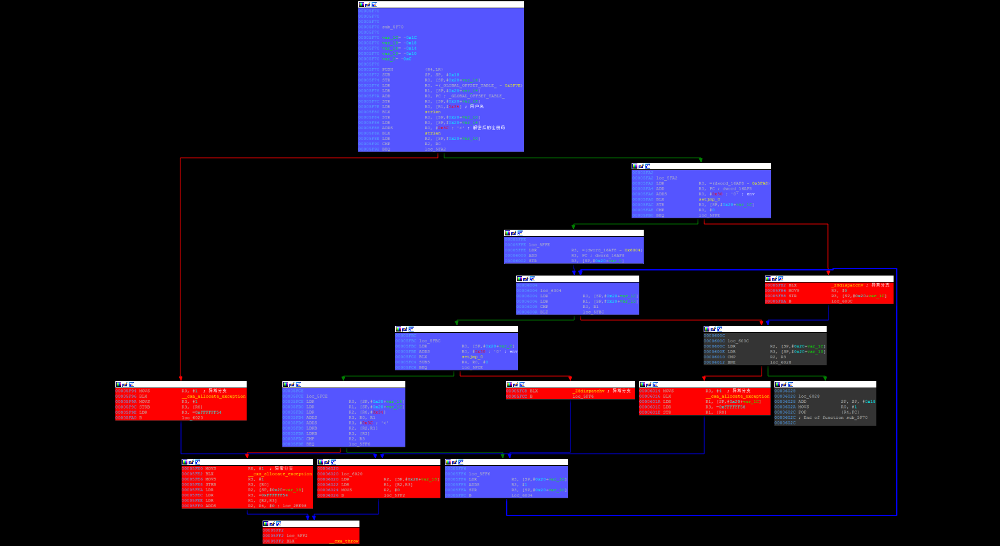

那么，那么，那么

我们来计算一组有效的KEY

不过好像出了点问题，哪里不对的样子

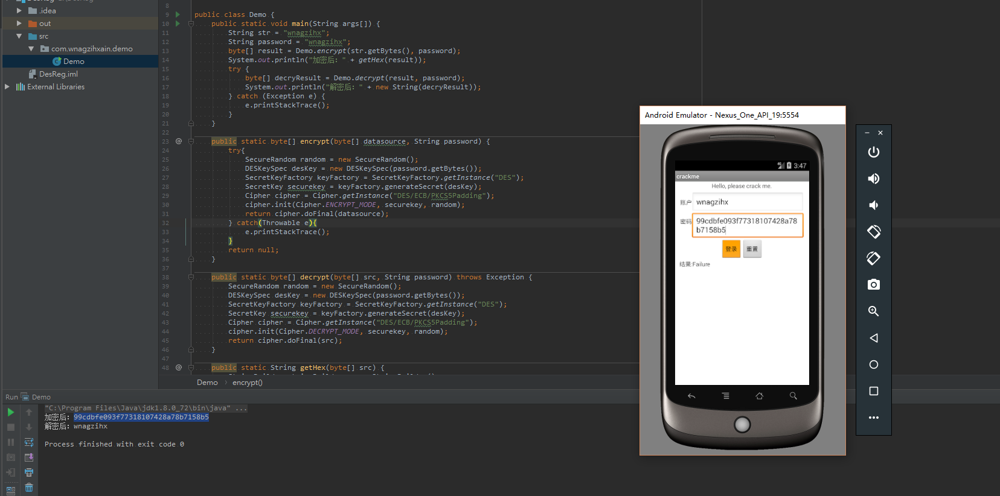

因为在分析的时候我注意到了取了用户名前8位进行计算秘钥，而且后续使用了十六位进行分组解密

所以这里单纯的使用了一个八字节字符串当做用户名进行输入

竟然出错了。。。。。。

再次打个断点进行调试，看看解密后的数据是个啥

首先获取注册码

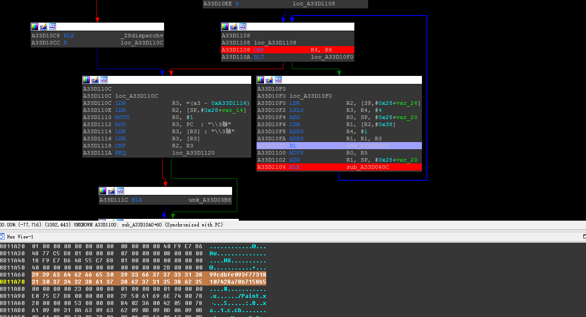

然后两组计算完后，得到解密后的数据

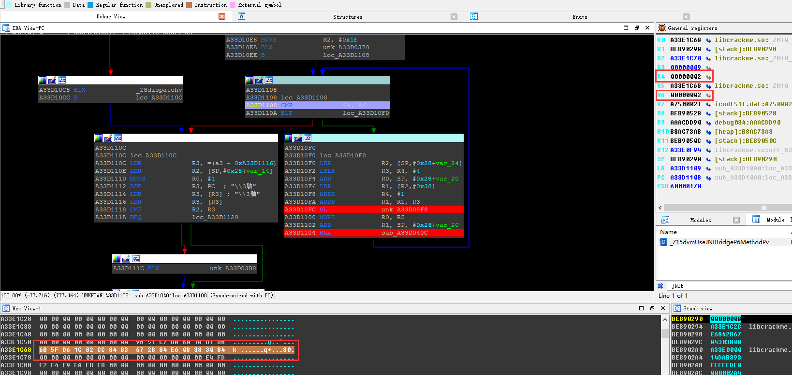

那这个就很尴尬了，怎么会多出八位

百撕不得姐，于是找老司机求教

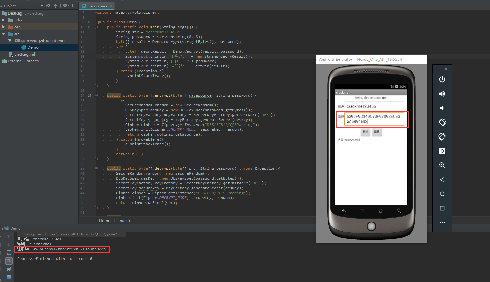

发现用Java的加解密库计算出来的数据并不正确，其实可能是校验的过程改了

正常情况下解密出来的数据应该是这样的

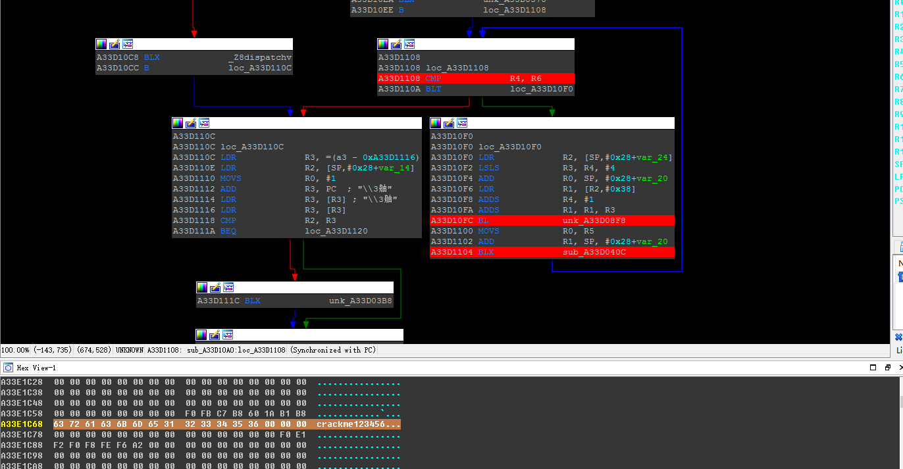

而我上面那个是个啥玩意。。。。。。

搞得我很尴尬啊。。。。。。

既然这样，那我就不客气了，去网上找DES的C代码实现

随意找了个代码，看到了S盒，想起刚才也是S盒，会不会S盒动了手脚，于是对比了一波S盒

首先把正常DES算法的S盒准备好
```
static char S_Box[8][4][16] = {
	// S1 
	14, 4, 13, 1, 2, 15, 11, 8, 3, 10, 6, 12, 5, 9, 0, 7,
	0, 15, 7, 4, 14, 2, 13, 1, 10, 6, 12, 11, 9, 5, 3, 8,
	4, 1, 14, 8, 13, 6, 2, 11, 15, 12, 9, 7, 3, 10, 5, 0,
	15, 12, 8, 2, 4, 9, 1, 7, 5, 11, 3, 14, 10, 0, 6, 13,
	// S2 
	15, 1, 8, 14, 6, 11, 3, 4, 9, 7, 2, 13, 12, 0, 5, 10,
	3, 13, 4, 7, 15, 2, 8, 14, 12, 0, 1, 10, 6, 9, 11, 5,
	0, 14, 7, 11, 10, 4, 13, 1, 5, 8, 12, 6, 9, 3, 2, 15,
	13, 8, 10, 1, 3, 15, 4, 2, 11, 6, 7, 12, 0, 5, 14, 9,
	// S3 
	10, 0, 9, 14, 6, 3, 15, 5, 1, 13, 12, 7, 11, 4, 2, 8,
	13, 7, 0, 9, 3, 4, 6, 10, 2, 8, 5, 14, 12, 11, 15, 1,
	13, 6, 4, 9, 8, 15, 3, 0, 11, 1, 2, 12, 5, 10, 14, 7,
	1, 10, 13, 0, 6, 9, 8, 7, 4, 15, 14, 3, 11, 5, 2, 12,
	// S4 
	7, 13, 14, 3, 0, 6, 9, 10, 1, 2, 8, 5, 11, 12, 4, 15,
	13, 8, 11, 5, 6, 15, 0, 3, 4, 7, 2, 12, 1, 10, 14, 9,
	10, 6, 9, 0, 12, 11, 7, 13, 15, 1, 3, 14, 5, 2, 8, 4,
	3, 15, 0, 6, 10, 1, 13, 8, 9, 4, 5, 11, 12, 7, 2, 14,
	// S5 
	2, 12, 4, 1, 7, 10, 11, 6, 8, 5, 3, 15, 13, 0, 14, 9,
	14, 11, 2, 12, 4, 7, 13, 1, 5, 0, 15, 10, 3, 9, 8, 6,
	4, 2, 1, 11, 10, 13, 7, 8, 15, 9, 12, 5, 6, 3, 0, 14,
	11, 8, 12, 7, 1, 14, 2, 13, 6, 15, 0, 9, 10, 4, 5, 3,
	// S6 
	12, 1, 10, 15, 9, 2, 6, 8, 0, 13, 3, 4, 14, 7, 5, 11,
	10, 15, 4, 2, 7, 12, 9, 5, 6, 1, 13, 14, 0, 11, 3, 8,
	9, 14, 15, 5, 2, 8, 12, 3, 7, 0, 4, 10, 1, 13, 11, 6,
	4, 3, 2, 12, 9, 5, 15, 10, 11, 14, 1, 7, 6, 0, 8, 13,
	// S7 
	4, 11, 2, 14, 15, 0, 8, 13, 3, 12, 9, 7, 5, 10, 6, 1,
	13, 0, 11, 7, 4, 9, 1, 10, 14, 3, 5, 12, 2, 15, 8, 6,
	1, 4, 11, 13, 12, 3, 7, 14, 10, 15, 6, 8, 0, 5, 9, 2,
	6, 11, 13, 8, 1, 4, 10, 7, 9, 5, 0, 15, 14, 2, 3, 12,
	// S8 
	13, 2, 8, 4, 6, 15, 11, 1, 10, 9, 3, 14, 5, 0, 12, 7,
	1, 15, 13, 8, 10, 3, 7, 4, 12, 5, 6, 11, 0, 14, 9, 2,
	7, 11, 4, 1, 9, 12, 14, 2, 0, 6, 10, 13, 15, 3, 5, 8,
	2, 1, 14, 7, 4, 10, 8, 13, 15, 12, 9, 0, 3, 5, 6, 11
};
```

然后将动态调试时的S盒dump出来

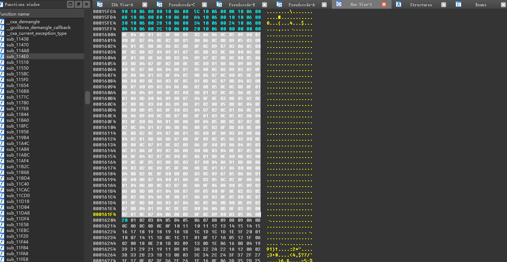

跟前面拷贝出`xor_table`一样，使用保存为文件，然后WinHex转为C Source
```
unsigned AnsiChar data[512] = {
	0x0E, 0x04, 0x0D, 0x01, 0x02, 0x0F, 0x0B, 0x08, 0x03, 0x0A, 0x06, 0x0C, 0x05, 0x09, 0x00, 0x07, 
	0x00, 0x0F, 0x07, 0x04, 0x0E, 0x02, 0x0D, 0x01, 0x0A, 0x06, 0x0C, 0x0B, 0x09, 0x05, 0x03, 0x08, 
	0x04, 0x01, 0x0E, 0x08, 0x0D, 0x06, 0x02, 0x0B, 0x0F, 0x0C, 0x09, 0x07, 0x03, 0x0A, 0x05, 0x00, 
	0x0F, 0x0C, 0x08, 0x02, 0x04, 0x09, 0x01, 0x07, 0x05, 0x0B, 0x03, 0x0E, 0x0A, 0x00, 0x06, 0x0D, 
	0x0F, 0x01, 0x08, 0x0E, 0x06, 0x0B, 0x03, 0x04, 0x09, 0x07, 0x02, 0x0D, 0x0C, 0x00, 0x05, 0x0A, 
	0x03, 0x0D, 0x04, 0x07, 0x0F, 0x02, 0x08, 0x0E, 0x0C, 0x00, 0x01, 0x0A, 0x06, 0x09, 0x0B, 0x05, 
	0x00, 0x0E, 0x07, 0x0B, 0x0A, 0x04, 0x0D, 0x01, 0x05, 0x08, 0x0C, 0x06, 0x09, 0x03, 0x02, 0x0F, 
	0x0D, 0x08, 0x0A, 0x01, 0x03, 0x0F, 0x04, 0x02, 0x0B, 0x06, 0x07, 0x0C, 0x00, 0x05, 0x0E, 0x09, 
	0x0A, 0x00, 0x09, 0x0E, 0x06, 0x03, 0x0F, 0x05, 0x01, 0x0D, 0x0C, 0x07, 0x0B, 0x04, 0x02, 0x08, 
	0x0D, 0x07, 0x00, 0x09, 0x03, 0x04, 0x06, 0x0A, 0x02, 0x08, 0x05, 0x0E, 0x0C, 0x0B, 0x0F, 0x01, 
	0x0D, 0x06, 0x04, 0x09, 0x08, 0x0F, 0x03, 0x00, 0x0B, 0x01, 0x02, 0x0C, 0x05, 0x0A, 0x0E, 0x07, 
	0x01, 0x0A, 0x0D, 0x00, 0x06, 0x09, 0x08, 0x07, 0x04, 0x0F, 0x0E, 0x03, 0x0B, 0x05, 0x02, 0x0C, 
	0x07, 0x0D, 0x0E, 0x03, 0x00, 0x06, 0x09, 0x0A, 0x01, 0x02, 0x08, 0x05, 0x0B, 0x0C, 0x04, 0x0F, 
	0x0D, 0x08, 0x0B, 0x05, 0x06, 0x0F, 0x00, 0x03, 0x04, 0x07, 0x02, 0x0C, 0x01, 0x0A, 0x0E, 0x09, 
	0x0A, 0x06, 0x09, 0x00, 0x0C, 0x0B, 0x07, 0x0D, 0x0F, 0x01, 0x03, 0x0E, 0x05, 0x02, 0x08, 0x04, 
	0x03, 0x0F, 0x00, 0x06, 0x0A, 0x01, 0x0D, 0x08, 0x09, 0x04, 0x05, 0x0B, 0x0C, 0x07, 0x02, 0x0E, 
	0x02, 0x0C, 0x04, 0x01, 0x07, 0x0A, 0x0B, 0x06, 0x08, 0x05, 0x03, 0x0F, 0x0D, 0x00, 0x0E, 0x09, 
	0x0E, 0x0B, 0x02, 0x0C, 0x04, 0x07, 0x0D, 0x01, 0x05, 0x00, 0x0F, 0x0A, 0x03, 0x09, 0x08, 0x06, 
	0x04, 0x02, 0x01, 0x0B, 0x0A, 0x0D, 0x07, 0x08, 0x0F, 0x09, 0x0C, 0x05, 0x06, 0x03, 0x00, 0x0E, 
	0x0B, 0x08, 0x0C, 0x07, 0x01, 0x0E, 0x02, 0x0D, 0x06, 0x0F, 0x00, 0x09, 0x0A, 0x04, 0x05, 0x03, 
	0x0C, 0x01, 0x0A, 0x0F, 0x09, 0x02, 0x06, 0x08, 0x00, 0x0D, 0x03, 0x04, 0x0E, 0x07, 0x05, 0x0B, 
	0x0A, 0x0F, 0x04, 0x02, 0x07, 0x0C, 0x00, 0x05, 0x06, 0x01, 0x0D, 0x0E, 0x00, 0x0B, 0x03, 0x08, 
	0x09, 0x0E, 0x0F, 0x05, 0x02, 0x08, 0x0C, 0x03, 0x07, 0x00, 0x04, 0x0A, 0x01, 0x0D, 0x0B, 0x06, 
	0x04, 0x03, 0x02, 0x0C, 0x09, 0x05, 0x0F, 0x0A, 0x0B, 0x0E, 0x01, 0x07, 0x06, 0x00, 0x08, 0x0D, 
	0x04, 0x0B, 0x02, 0x0E, 0x0F, 0x00, 0x08, 0x0D, 0x03, 0x0C, 0x09, 0x07, 0x05, 0x0A, 0x06, 0x01, 
	0x0D, 0x00, 0x0B, 0x07, 0x04, 0x00, 0x01, 0x0A, 0x0E, 0x03, 0x05, 0x0C, 0x02, 0x0F, 0x08, 0x06, 
	0x01, 0x04, 0x0B, 0x0D, 0x0C, 0x03, 0x07, 0x0E, 0x0A, 0x0F, 0x06, 0x08, 0x00, 0x05, 0x09, 0x02, 
	0x06, 0x0B, 0x0D, 0x08, 0x01, 0x04, 0x0A, 0x07, 0x09, 0x05, 0x00, 0x0F, 0x0E, 0x02, 0x03, 0x0C, 
	0x0D, 0x02, 0x08, 0x04, 0x06, 0x0F, 0x0B, 0x01, 0x0A, 0x09, 0x03, 0x0E, 0x05, 0x00, 0x0C, 0x07, 
	0x01, 0x0F, 0x0D, 0x08, 0x0A, 0x03, 0x07, 0x04, 0x0C, 0x05, 0x06, 0x0B, 0x00, 0x0E, 0x09, 0x02, 
	0x07, 0x0B, 0x04, 0x01, 0x09, 0x0C, 0x0E, 0x02, 0x00, 0x06, 0x0A, 0x0D, 0x0F, 0x03, 0x05, 0x08, 
	0x02, 0x01, 0x0E, 0x07, 0x04, 0x0A, 0x08, 0x0D, 0x0F, 0x0C, 0x09, 0x00, 0x03, 0x05, 0x06, 0x0B
};
```

然后跟上面正常的S盒进行循环对比，找到不同的地方

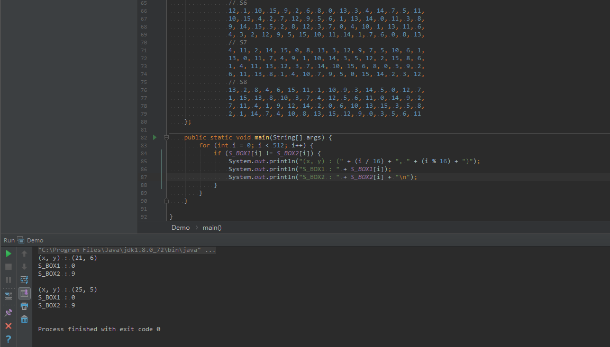

还真的有两处不一样，出题的你良心不会痛吗？

那看来这里是需要自己实现加密代码了。。。。。。

好在以前存了不少代码，小书包翻啊翻，把Java实现的代码翻了出来

不过测试的时候发现各种问题，弄的很尴尬。。。。。。

所以还是老实找C语言实现的代码

接下来就开始扎心了。。。。。。

找了个C实现的DES算法代码，发现结果不对

想了想，如果S盒有问题，那么其它几个Table和盒子可能也有问题，于是开始对比了一波，最后发现PC2_Table有问题

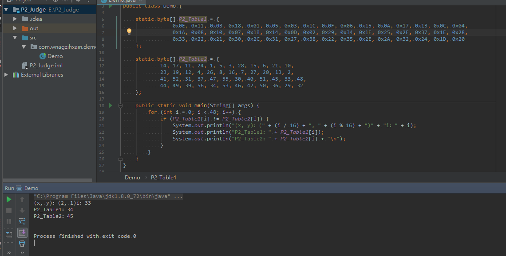

再一次的计算，发现注册码计算还是有问题，当时场面一度很尴尬。。。。。。

突然，我想起了一件事，秘钥开始的时候经过了一次神奇的异或

这尼玛。。。。。。

赶紧的赶紧的，继续改代码

东平西凑，瞎改瞎改

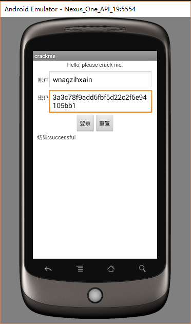

就先这样吧，眼泪掉下来，以后在找个时间分析一个这个样本的保护技术

最后，如果是第一次接触这种动静结合分析的同学，要时刻注意指令集的切换，中间有大量的指令集切换，看指令的地址即可，通常都是三步走，断在调用处，先别跟过去，此时跟过去会断不下来的，直接效果就是和F9一样，这一点应该有体会吧，比如使用的是`BL R3`，在这一句下个断点，先断下来，直接在反汇编窗口跟随R3，就可以看到要执行的代码了，但是如果指令集识别有问题，需要先`ALT + G`，选择Thumb模式，然后按一下C转为代码模式，再按P识别函数

这几天大学陆续开学了，看着那些萌新，突然就想起四年前自己到学校报到的场景，阳光明媚，岁月静好

Hey guys，I miss you

现在分析东西比以前费劲多了，分析到一半，下班时间到了，不赶紧走的话一会连地铁都赶不上了，回家想接着分析，环境又得重新跑。。。。。。

所以IDA的配色变来变去的

今天的补天沙龙没去，有事，星期二和星期三的2017ISC，DefCon 010，Syscan 360也去不了了，每次和湿敷们约好面基都各种原因去不了，而又会在某些不经意的场合碰到，所以，以后有时间再约吧

看着最近小盆友们秋招，后悔为毛去年不海投一波

不过估计投了也只能和现在一样每天拖地


