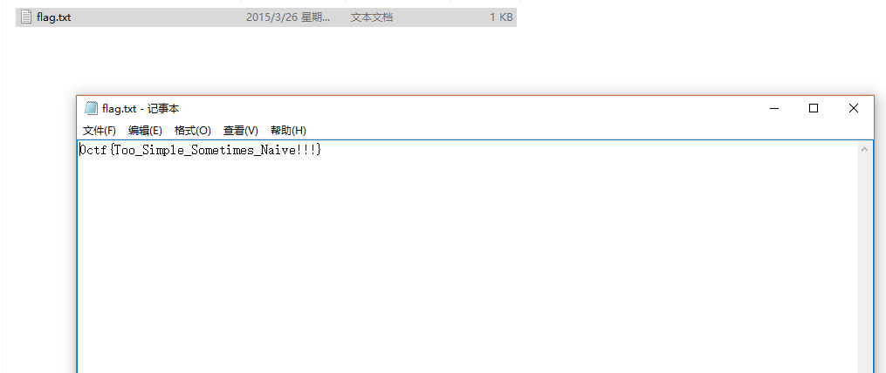

# 20150CTF-simple

**Author：wnagzihxain
Mail：tudouboom@163.com**

## 0x00 前言
20150CTF的Mobile第二题，分值150

## 0x01 分析
Java层简单明了的写了从`res/raw`文件夹读取`flag.txt`，然后输入数据进行对比


对着目录找到`flag.txt`



Flag：0ctf{Too_Simple_Sometimes_Naive!!!}

仿佛是在嘲笑我

抱着**打死不信出题人半个字**的原则，输入APP验证，然而`Wrong`

发现有一个so文件

IDA打开，发现有`.init_array`段，调用了`my_init()`
```
__int64 my_init()
{
    int PID; // r0@3
    __int64 v1; // ST00_8@3

    j_j_set_logfunction(nullsub_2);
    if ( CheckSig() )
        j_j_exit(0);
    PID = j_j_getpid();
    j_j_hook(&unk_6004, PID, "libc.", "read", CheckStrace, CheckPtrace, 0);
    return v1;
}
```

看着这命名，目测是签名验证反调试，然后有一个hook操作

回想在Java层输入的Flag不正确，再结合这里，应该就是有坑，这个坑目测就是hook了某个函数

再从传入的参数来看，应该是`read()`

于是就翻啊翻，找啊找，找到一个小朋友......


通常在自定义的函数里有异或操作往往说明这里是一个关键

注意前面有一个`v5`，其中的两个参数用在了后面的异或操作中，`v3`可能是某数组的起始地址，`v10`可能是长度

再进一步猜测，它是`read()`想到这里，我们把`dest[]`数组从so里拷贝出来

这里有个小技巧，可以使用Winhex的拷贝功能，找到偏移后，右键用`C Source`
```
unsigned AnsiChar data[35] = {
	0x00, 0x00, 0x00, 0x00, 0x00, 0x1D, 0x1B, 0x48, 0x2C, 0x0C, 0x24, 0x02, 0x02, 0x09, 0x3A, 0x0B, 
	0x3B, 0x0E, 0x03, 0x3A, 0x39, 0x0C, 0x08, 0x11, 0x00, 0x00, 0x1A, 0x09, 0x0C, 0x29, 0x20, 0x58, 
	0x44, 0x00, 0x00
};
```

写个简单的脚本异或一下
```
# coding = utf-8

data = [
    0x00, 0x00, 0x00, 0x00, 0x00, 0x1D, 0x1B, 0x48, 0x2C, 0x0C, 0x24, 0x02, 0x02, 0x09, 0x3A, 0x0B, 
    0x3B, 0x0E, 0x03, 0x3A, 0x39, 0x0C, 0x08, 0x11, 0x00, 0x00, 0x1A, 0x09, 0x0C, 0x29, 0x20, 0x58, 
    0x44, 0x00, 0x00]

old_flag = "0ctf{Too_Simple_Sometimes_Naive!!!}"

def main():
    flag = []
    for i in range(len(old_flag)):
        flag.append(chr(ord(old_flag[i]) ^ data[i]))
    print "".join(flag)

if __name__ == '__main__':
    main()
```

输出
```
0ctf{It's_More_Than_Meets_The_Eye!}
```

到这里可以确定我们的猜测，so里hook了`read()`函数，我们输入的字符串被异或后再和`flag.txt`里的数据对比

## 0x02 小结
相比另一道150的Mobile，我觉得这题很值


