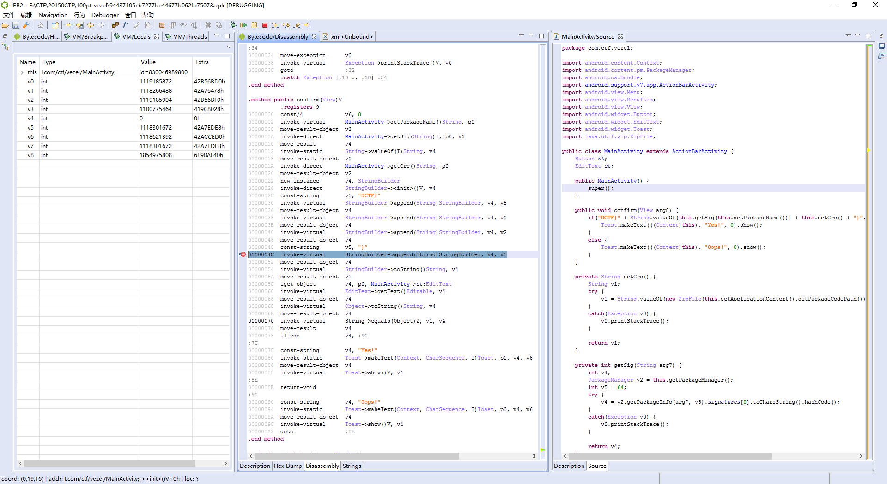

# 20150CTF-vezel

**Author：wnagzihxain
Mail：wnagzihxa1n@gmail.com**

## 0x00 前言
20150CTF的Mobile第一题，分值100

## 0x01 分析
JEB打开一瞧，没有so，想想0CTF分数动不动好几百的比赛，100分的题目还上so那就太不道德了，关键三段代码如下，非常简单
```
public void confirm(View v) {
    if("0CTF{" + String.valueOf(this.getSig(this.getPackageName())) + this.getCrc() + "}".equals(
            this.et.getText().toString())) {
        Toast.makeText(((Context)this), "Yes!", 0).show();
    }
    else {
        Toast.makeText(((Context)this), "0ops!", 0).show();
    }
}

private String getCrc() {
    String v1;
    try {
        v1 = String.valueOf(new ZipFile(this.getApplicationContext().getPackageCodePath()).getEntry(
                "classes.dex").getCrc());
    }
    catch(Exception v0) {
        v0.printStackTrace();
    }

    return v1;
}

private int getSig(String packageName) {
    int v4;
    PackageManager v2 = this.getPackageManager();
    int v5 = 64;
    try {
        v4 = v2.getPackageInfo(packageName, v5).signatures[0].toCharsString().hashCode();
    }
    catch(Exception v0) {
        v0.printStackTrace();
    }

    return v4;
}
```

首先是签名部分，有的同学会认为这里是`Dex Header`里的`SHA1 Signature`，不是的，这里计算出来是很长的一大串

如果要算的话，我们写个APP去获取，代码如下（百度上临时找的）
```
package com.wnagzihxain.myapplication;

import android.content.pm.PackageInfo;
import android.content.pm.PackageManager;
import android.content.pm.Signature;
import android.support.v7.app.AppCompatActivity;
import android.os.Bundle;
import android.text.TextUtils;
import android.util.Log;
import android.widget.Toast;

public class MainActivity extends AppCompatActivity {
    
    private StringBuilder builder;

    public void onCreate(Bundle savedInstanceState) {
        super.onCreate(savedInstanceState);
        setContentView(R.layout.activity_main);
        PackageManager manager = getPackageManager();
        builder = new StringBuilder();
        String pkgname = "com.ctf.vezel";
        boolean isEmpty = TextUtils.isEmpty(pkgname);
        if (isEmpty) {
            Toast.makeText(this, "应用程序的包名不能为空！", Toast.LENGTH_SHORT);
        } else {
            try {
                PackageInfo packageInfo = manager.getPackageInfo(pkgname, PackageManager.GET_SIGNATURES);
                Signature[] signatures = packageInfo.signatures;
                for (Signature signature : signatures) {
                    builder.append(signature.toCharsString());
                }
                String signature = builder.toString();
                Log.i("toT0C", signature);
            } catch (PackageManager.NameNotFoundException e) {
                e.printStackTrace();
            }
        }
    }
}
```	

输出
```
04-01 23:35:12.497 5939-5939/com.wnagzihxain.myapplication I/toT0C: 308203473082022fa00302010202043920b637300d06092a864886f70d01010b05003054310b300906035504061302434e310b300906035504081302434e310b3009060355040713025348310d300b060355040a1304534a5455310d300b060355040b1304306f7073310d300b0603550403130430637466301e170d3135303330363035323930315a170d3430303232383035323930315a3054310b300906035504061302434e310b300906035504081302434e310b3009060355040713025348310d300b060355040a1304534a5455310d300b060355040b1304306f7073310d300b060355040313043063746630820122300d06092a864886f70d01010105000382010f003082010a0282010100dd03fbab4ce3ba02230cf7a6a756309c8a45ae25384fef3d4a293c1b298082aee969e689128bef54bd763bb5f1a20218d824ac934d86a97d4a17bff345e146bbe3d506246bb86766745da46d16bad78e692db746528dbbf365c15b8e529132631e2cc3970910fb58caa3d082ab419f61d9c80379b6b7b40b1458173871efcaf2e7f69ffc29521cbefc641461de8a799c88d359f0bed6c1fcda939c954fe117ae45888829b6a8ae12d566709b434f2f8ae0c13bd3fbd9a4492c1a09201521b8e8a299adc4b6e8a1adeb7a11a7aef4a9ae13806b11acc4da0d6c420450e073927f6d094e91b5a18e74beec3083f8ff95ce8fcb091a411db1e4d64a6733d4942c590203010001a321301f301d0603551d0e04160414c5f5c9198b5ccc546570fd243a268f50277d7e0d300d06092a864886f70d01010b05000382010100c77bcd399b74e42c2b97171a264492e8bbd47ba3871057d1bc902c5f207aa2609d80992d3702f3ed70f888faf0ea90421e57bf53ec7852af8c31e073788e7a0fc45f421d687a367361ae0643ee81acc8e47e2fda7b14cf633eb78bac43bd95c97519466c6f8c0e0f23a105b871958ae4c6e54997ea2034185a7eb46369657e4f4b1594ef8c9ead2fb74b85d60fcabe7764c57169c89b5d8da43103d619bb8002e9917751afe8572217f8e7f13f3f308659bd8bc8f95a23f351c62c617d9748e27789807022508daf4bfa1605b58986c4d67f254f3fd4dcad2d31059d304b304d6643e2d44a9265427b72d93e83b3fc4f5a803cb586764fa3e28863eaf29961c9
```

算一下`hashCode()`
```
-183971537
```

然后获取`classes.dex`的CRC32值

这个在线算一下就行，连同MD5什么的一条龙服务
```
MD5: 3217b0ad6c769233ea2a49d17885b5ba 
SHA1: ec3b4730654248a02b016d00c9ae2425379bf78f 
CRC32: 46E26557 
```

这里需要转成十进制
```
>>> print int("46E26557", 16)
1189242199
```

两部分算完合起来就是Flag

Flag：0ctf{-1839715371189242199}

这样搞有点麻烦，其实动态调试一下就出来了，int要改为string类型，然而我并不会改，一改就崩溃



JEB2有动态调试的功能，我用的有点残

这里有个哥们写了篇使用JEB2调试APK的文章，这么详细的文章可惜百度搜半天搜不出来

- jeb2.2.7动态调试apk: http://balis0ng.com/post/android/2016-11-27

## 0x02 小结
挺简单一东西整的这么扎心