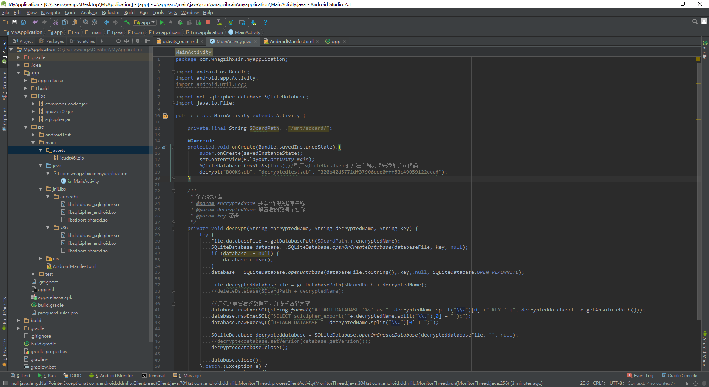
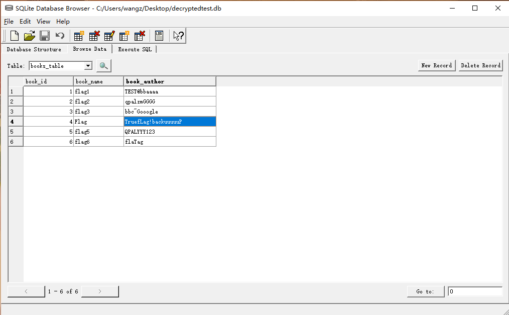

# 2015XCTF-RCTF

**Author：wnagzihxain
Mail：wnagzihxa1n@gmail.com**

## 0x00 前言
2015XCTF福州站的第一道Mobile题，同时也是RCTF的题目，100分

## 0x01 分析
第一个坑，先判断这是个啥玩意，file没看出来，但是应该是有的
```
wnagzihxain@toT0C:~$ file 2e204fe0ec33b1689f1c47bd60a9770c
2e204fe0ec33b1689f1c47bd60a9770c: data
```

后来查看16进制格式，才发现这是个Android Backup文件

能搜到搞这玩意的文章确实是不多，这里根据外国网友提供的方法，我们来一发
```
wnagzihxain@toT0C:~$ dd if=2e204fe0ec33b1689f1c47bd60a9770c.ab bs=1 skip=24 of=compressed
记录了8977280+0 的读入
记录了8977280+0 的写出
8977280 bytes (9.0 MB, 8.6 MiB) copied, 96.922 s, 92.6 kB/s
wnagzihxain@toT0C:~$ printf "\x1f\x8b\x08\x00\x00\x00\x00\x00" | cat - compressed | gunzip -c > decompressed.tar
gzip: stdin: unexpected end of file
wnagzihxain@toT0C:~$ tar xf decompressed.tar 
```

解压生成一个`apps`文件夹，查看一下文件树，发现有一个`BOOKS.db`，这一定是个关键文件
```
wnagzihxain@toT0C:~$ tree apps
apps
├── com.example.mybackup
│   ├── a
│   │   └── com.example.mybackup-1.apk
│   ├── db
│   │   └── BOOKS.db
│   ├── f
│   │   └── icu
│   │       └── icudt46l.dat
│   └── _manifest
└── com.example.zi
    ├── a
    │   └── com.example.zi-2.apk
    └── _manifest

7 directories, 6 files
```

再翻其余文件夹，发现有两个APK文件，在反编译查看代码后，确定`com.example.mybackup`这个比较有用

在简单的分析过后，可以确定的是，这个`BOOKS.db`用了sqlcipher加密了，秘钥的生成方式如下
```
public BooksDB(Context context) {
    super(context, DATABASE_NAME, null, 1);
    this.k = Test.getSign(context);
}
```

`getSign()`方法如下
```
public static String getSign(Context context) {
    for (PackageInfo packageinfo : context.getPackageManager().getInstalledPackages(64)) {
        if (packageinfo.packageName.equals(context.getPackageName())) {
            return SHA1(packageinfo.signatures[0].toCharsString());
        }
    }
    return "";
}
```

然后SHA1加密
```
public static String SHA1(String decript) {
    try {
        MessageDigest digest = MessageDigest.getInstance("SHA-1");
        digest.update(decript.getBytes());
        byte[] messageDigest = digest.digest();
        StringBuffer hexString = new StringBuffer();
        for (byte b : messageDigest) {
            String shaHex = Integer.toHexString(b & MotionEventCompat.ACTION_MASK);
            if (shaHex.length() < 2) {
                hexString.append(0);
            }
            hexString.append(shaHex);
        }
        return hexString.toString();
    } catch (NoSuchAlgorithmException e) {
        e.printStackTrace();
        return "";
    }
}
```

那么我们只需要写个APP去获取即可，只需要把`getSign()`方法中间的`equals()`方法里的参数换成样本的包名即可

然后获取到加密秘钥
```
320b42d5771df37906eee0fff53c49059122eeaf
```

获取到秘钥，接下来写个APP去解密

首先将样本里的lib文件拷贝到工程的jniLibs文件夹里，再从下面的地址下载对应的jar包，解压后将三个jar包放到libs文件夹下
```
https://www.zetetic.net/sqlcipher/
```

各种搞定文件的结构应该是这样的



然后写代码
```
package com.wnagzihxain.myapplication;

import android.os.Bundle;
import android.app.Activity;
import android.util.Log;

import net.sqlcipher.database.SQLiteDatabase;
import java.io.File;

public class MainActivity extends Activity {

    private final String SDcardPath = "/mnt/sdcard/";

    @Override
    protected void onCreate(Bundle savedInstanceState) {
        super.onCreate(savedInstanceState);
        setContentView(R.layout.activity_main);
        SQLiteDatabase.loadLibs(this);//引用SQLiteDatabase的方法之前必须先添加这句代码
        decrypt("BOOKS.db", "decryptedtest.db", "320b42d5771df37906eee0fff53c49059122eeaf");
    }

    /**
     * 解密数据库
     * @param encryptedName 要解密的数据库名称
     * @param decryptedName 解密后的数据库名称
     * @param key 密码
     */
    private void decrypt(String encryptedName, String decryptedName, String key) {
        try {
            File databaseFile = getDatabasePath(SDcardPath + encryptedName);
            SQLiteDatabase database = SQLiteDatabase.openOrCreateDatabase(databaseFile, key, null);
            if (database != null) {
                database.close();
            }
            database = SQLiteDatabase.openDatabase(databaseFile.toString(), key, null, SQLiteDatabase.OPEN_READWRITE);
            File decrypteddatabaseFile = getDatabasePath(SDcardPath + decryptedName);
            //连接到解密后的数据库，并设置密码为空
            database.rawExecSQL(String.format("ATTACH DATABASE '%s' as "+ decryptedName.split("\\.")[0] +" KEY '';", decrypteddatabaseFile.getAbsolutePath()));
            database.rawExecSQL("SELECT sqlcipher_export('"+ decryptedName.split("\\.")[0] + "');");
            database.rawExecSQL("DETACH DATABASE "+ decryptedName.split("\\.")[0] + ";");
            SQLiteDatabase decrypteddatabase = SQLiteDatabase.openOrCreateDatabase(decrypteddatabaseFile, "", null);
            decrypteddatabase.close();
            database.close();
        } catch (Exception e) {
            e.printStackTrace();
        }
    }
}
```

添加权限
```
<uses-permission android:name="android.permission.WRITE_EXTERNAL_STORAGE" />
<uses-permission android:name="android.permission.READ_EXTERNAL_STORAGE" />
<uses-permission android:name="android.permission.INTERNET" />
```

先把`BOOKS.db`文件push到`/sdcard/`路径下，然后运行APP，即可在`/sdcard/`下看到解密后的数据库文件，最后pull到本地
```
root@jflte:/sdcard # ls | grep ".db"
BOOKS.db
root@jflte:/sdcard # ls | grep ".db"
BOOKS.db
decryptedtest.db
root@jflte:/sdcard # exit
C:\Users\wangz>adb pull /sdcard/decryptedtest.db C:\Users\wangz\Desktop
[100%] /sdcard/decryptedtest.db
```

使用sqlcipher.exe可视化工具打开



再结合要求，Flag：RCTF{backuuuuuP}

## 0x02 小结
老铁，真的就这么简单吗？

按理说到这里瞎扯两句`有兴趣的同学可以跟着玩玩`就行了，但我不！！！！！！

我要把我的扎心经历讲粗来！！！！！！

上面那么顺畅的解题过程问人间哪里有？？？？？？

首先知道这是Android BackUp文件倒不是很难，因为十六进制看Magic Number一下子就看出来了

难的地方在哪里，如何解压是个问题，一开始我并不熟悉这个文件的格式，所以在Github上找了个工具来解压
```
https://github.com/nelenkov/android-backup-extractor
```

然而这玩意并不能解压给的`BOOKS.db`，问了某老铁才知道，因为只支持到v3，然而作者把这个字段改了一下。。。。。。

改成3，继续解压，依旧不行，后来才知道，Compressed那个字段要改成1，作者也改了。。。。。。

后来直接在Google上找了老外写的方法，一下子就搞出来了

也就是上面写的方法

解压出了文件之后，解密`BOOKS.db`是一个大问题

作为一个开发者，第一想法是写个APP，用sqlcipher库去解密给的`BOOKS.db`

但是莫名不想写

于是想着，网上应该有对这种数据库加密的解密工具吧，于是找啊找

还真的找到了，凭借着神一般的记忆力，我给列一下
- CSDN---某命令行工具2.0版本，解密出错
- CSDN---某命令行工具3.0版本，解密出错
- Github---某需要自行编译的工具
	- 32位Ubuntu编译出错，一直以为是编译环境问题
	- 64位Ubuntu编译成功，解密出错
- 某可视化数据库查看工具---解密出错
- 还有好几个需要自己编译的。。。。。。

两天就这么过去了。。。。。。

想了想，我还是回归开发者吧

东拼西凑，根据别人的代码写了个解密的APP

然而一直`unable to open......`

后来发现，权限没给。。。。。。

然后就搞出来了

## References
- How do you extract an App's data from a full backup made through “adb backup”?: http://android.stackexchange.com/questions/28481/how-do-you-extract-an-apps-data-from-a-full-backup-made-through-adb-backup
- 安卓hacking Part 15: 使用备份技术黑掉安卓应用: http://bobao.360.cn/learning/detail/169.html
- 使用SQLCipher对数据库加密: http://blog.csdn.net/small_lee/article/details/50971132
- sqlcipher: https://github.com/sqlcipher/sqlcipher
- 利用SQLCipher加解密数据库（包括加解密已有的数据库）: http://blog.csdn.net/wjk343977868/article/details/53410738