# 2015XCTF&RCTF-where

**Author：wnagzihxain
Mail：tudouboom@163.com**

## 0x00 前言
2015XCTF福州站的第二道Mobile题，分值200

## 0x01 分析
想到第一题才100分就那么折腾，这题估计好不到哪里去

使用JEB反编译，发现逻辑很是简单

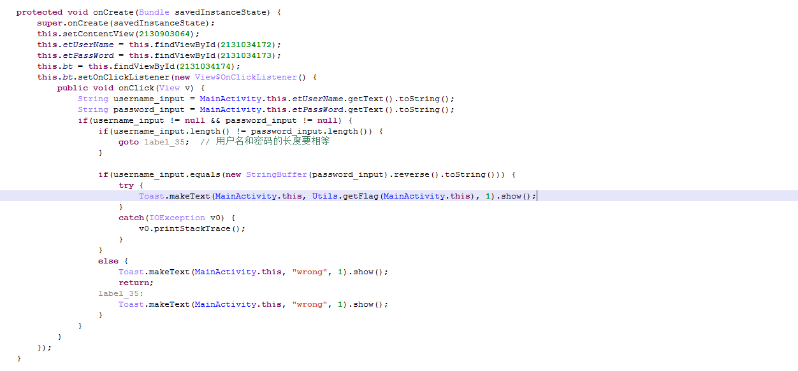

输入用户名和密码，长度要想等，用户名和密码的逆序串相等则输出字符串

返回Flag


Oops，出题的大佬良心发现故意来个简单的？？？？？？

**Too simple sometimes naive**

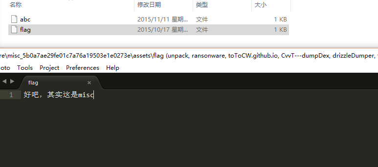

看文件夹结构
```
│  AndroidManifest.xml
│  classes.dex
│  resources.arsc
│  
├─assets
│      abc
│      flag
│      
├─META-INF
│      CERT.RSA
│      CERT.SF
│      MANIFEST.MF
│      y
│      
└─res
......
    │      
    └─menu
            main.xml
```

删了一些布局文件，不然长的没天理了

发现有两处看起来值得注意的，一个是`assets`文件夹，一个是签名文件夹下的`y`

熟悉Dex文件结构的同学应该很清楚这是`abc`文件其实就是Dex的Dex Header，从长度来看很清楚的`0x70`

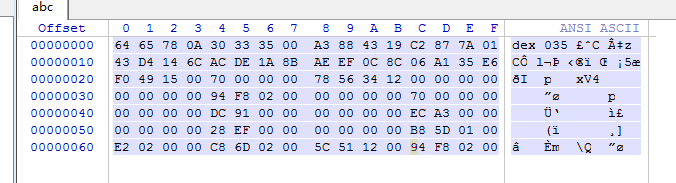

再看`y`，看不出是什么，我就想："`y`会不会是Dex后面的数据，出题人把它拆分了"，但是怎么都合不上

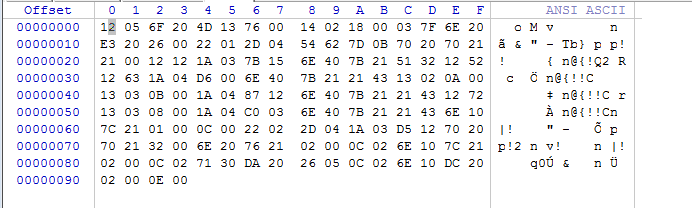

到这里，思路真的就断了

期间喝了四杯香飘飘

本以为一杯草莓味的就可以有思路

一杯又一杯

四杯就喝完了

晚上又啃了一只脆皮鸡

外脆里嫩，一口咬下去还有油滋出来

就在吃完的时候，想到了一个思路

y会不会是加密了

就这几个字节还加密？？？？？？

当我看着`y`发呆的时候，突然。。。。。。


按照常理，这个应该只有1kb左右

这个为什么这么大？？？？？？

由于一直对前面的Dex Header念念不忘，**抱着打死出题人也要找出Dex后面数据的决心**，做了一个大胆的猜测，Dex后面的数据肯定在这里！！！！！！

找到1kb左右偏移的地方，左边偏移是十进制形式

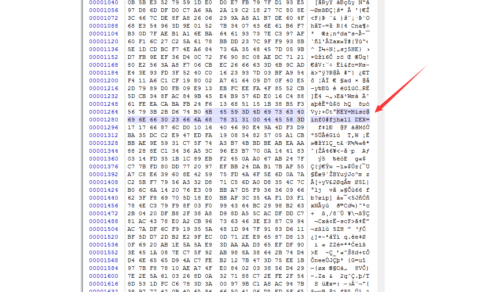

看到了关键的字眼`KEY=Misc@inf0#fjhx11`，这可能是在告诉我们秘钥

接下来进入高潮`DEX=`，这个意味着后面的数据就是Dex Header以后的数据，再结合前面的KEY，说明这一片数据应该是被加密了，熟悉Dex格式的同学应该清楚Dex Header后面是String Ids，是一片很整齐的数据，而这里乱七八糟的，明显是加密了

我们把它拷贝出来，就在看最后的数据长度的时候，发现另一个关键信息`aes-128-cbc`

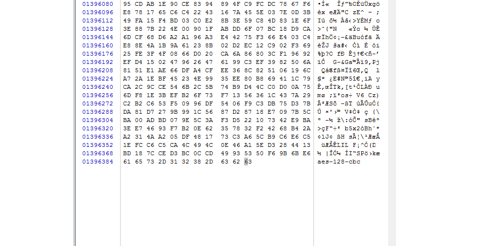

这是在告诉我们加密方式

接下去这一步就看个人了，搞过openssl的同学肯定记得这个，虽然到现在我也不知道到底`help`是哪个命令
```
[root@tot0c /home/wnagzihxain]# openssl -h
openssl:Error: '-h' is an invalid command.

Standard commands
asn1parse         ca                ciphers           cms               
crl               crl2pkcs7         dgst              dh                
dhparam           dsa               dsaparam          ec                
ecparam           enc               engine            errstr            
gendh             gendsa            genpkey           genrsa            
nseq              ocsp              passwd            pkcs12            
pkcs7             pkcs8             pkey              pkeyparam         
pkeyutl           prime             rand              req               
rsa               rsautl            s_client          s_server          
s_time            sess_id           smime             speed             
spkac             srp               ts                verify            
version           x509              

Message Digest commands (see the `dgst' command for more details)
md4               md5               rmd160            sha               
sha1              

Cipher commands (see the `enc' command for more details)
aes-128-cbc       aes-128-ecb       aes-192-cbc       aes-192-ecb       
aes-256-cbc       aes-256-ecb       base64            bf                
bf-cbc            bf-cfb            bf-ecb            bf-ofb            
camellia-128-cbc  camellia-128-ecb  camellia-192-cbc  camellia-192-ecb  
camellia-256-cbc  camellia-256-ecb  cast              cast-cbc          
cast5-cbc         cast5-cfb         cast5-ecb         cast5-ofb         
des               des-cbc           des-cfb           des-ecb           
des-ede           des-ede-cbc       des-ede-cfb       des-ede-ofb       
des-ede3          des-ede3-cbc      des-ede3-cfb      des-ede3-ofb      
des-ofb           des3              desx              rc2               
rc2-40-cbc        rc2-64-cbc        rc2-cbc           rc2-cfb           
rc2-ecb           rc2-ofb           rc4               rc4-40            
seed              seed-cbc          seed-cfb          seed-ecb          
seed-ofb        
```

所以看到`aes-128-cbc`我的第一想法就是openssl

我们把最后面的`aes-128-cbc`删掉，使用openssl解密
```
[root@tot0c /home/wnagzihxain]# openssl enc -aes-128-cbc -d -k "Misc@inf0#fjhx11" -nosalt -in encDexBody -out decDexBody
```

解密后的数据就很漂亮了


将解密后的的数据拼接到abc文件后面，使用JEB打开，提示不是有效Dex文件

其它工具解析也是类似错误

使用010Editor的模板功能分析

红框内全是0，需要我们手动修复一下

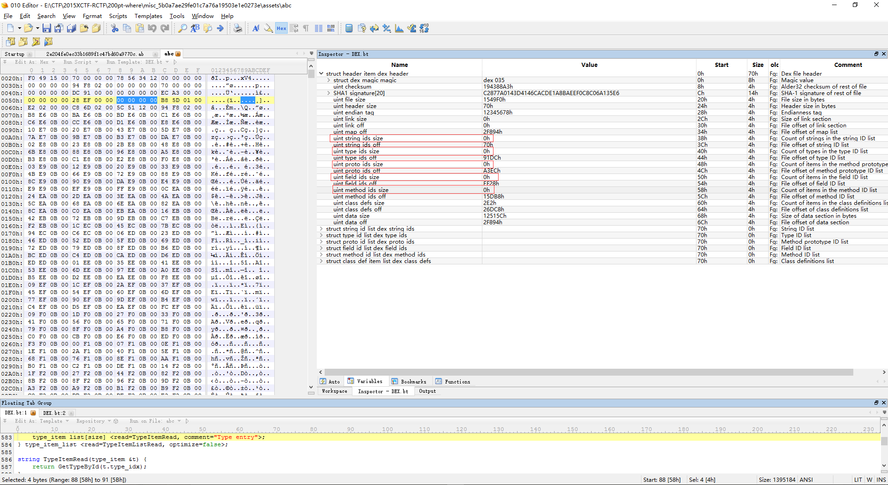

首先我们找一个正常的dex.classes文件，用010Editor解析一下

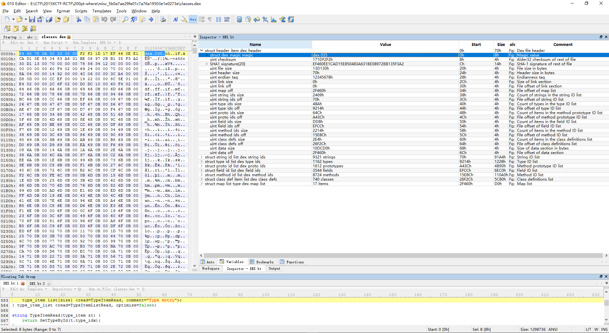

列一下Dex Header的数据，因为是小端序，所以真实的数据应该是后面这种形式
```
Magic Number   : 6465780A30333500
checksum       : F2F21D17--->0x171DF2F2
signature      : EF460EE1CAD15E850483A631BE08972BB135F3A2
file size      : 30D11300--->0x0013D130
header size    : 70000000--->0x00000070
endian tag     : 78563412--->0x12345678
link size      : 00000000--->0x00000000
link off       : 00000000--->0x00000000
map off        : 60F40200--->0x0002F460
string_ids size: 69240000--->0x00002469
string_ids off : 70000000--->0x00000070
type_ids size  : 8A040000--->0x0000048A
type_ids off   : 14920000--->0x00009214
proto_ids size : 4C060000--->0x0000064C
proto_ids off  : 3CA40000--->0x0000A43C
field_ids size : D80D0000--->0x00000DD8
field_ids off  : CCEF0000--->0x0000EFCC
method_ids size: 14220000--->0x00002214
method_ids off : 8C5E0100--->0x00015E8C
class_defs size: E4020000--->0x000002E4
class_defs off : 2C6F0200--->0x00026F2C
data size      : D0DC1000--->0x0010DCD0
data off       : 60F40200--->0x0002F460
```

前面那些可以不在意，我们关注`_ids size`和`_ids off`这种数据

首先是`string_ids`，起始偏移为`0x00000070`，紧跟着Dex Header，长度是`0x00002469 * 4`字节
```
string_ids size: 69240000--->0x00002469
string_ids off : 70000000--->0x00000070
```

再看`type_ids`，起始偏移为`0x00009214`，`(0x00009214 - 0x00000070) / 4`刚好是`0x00002469`
```
type_ids size  : 8A040000--->0x0000048A
type_ids off   : 14920000--->0x00009214
```

再来看一组`proto_ids`，`(0x0000A43C - 0x00009214) / 4`是`0x0000048A`
```
proto_ids size : 4C060000--->0x0000064C
proto_ids off  : 3CA40000--->0x0000A43C
```

我们正向算一次，`(0x0000A43C + 0x0000064C * 12)`是`0x0000EFCC`，这里长度是12是因为它的结构数据长度是12个字节
```
field_ids size : D80D0000--->0x00000DD8
field_ids off  : CCEF0000--->0x0000EFCC
```

对照着这种方法来修复一下刚才合成Dex文件
```
Magic Number   : 6465780A30333500
checksum       : A3884319--->0x194388A3
signature      : C2877A0143D4146CACDE1A8BAEEF0C8C06A135E6
file size      : F0491500--->0x001549F0
header size    : 70000000--->0x00000070
endian tag     : 78563412--->0x12345678
link size      : 00000000--->0x00000000
link off       : 00000000--->0x00000000
map off        : 94F80200--->0x0002F894
string_ids size: 00000000--->0x00000000
string_ids off : 70000000--->0x00000070
type_ids size  : 00000000--->0x00000000
type_ids off   : DC910000--->0x000091DC
proto_ids size : 00000000--->0x00000000
proto_ids off  : ECA30000--->0x0000A3EC
field_ids size : 00000000--->0x00000000
field_ids off  : 28EF0000--->0x0000EF28
method_ids size: 00000000--->0x00000000
method_ids off : B85D0100--->0x00015DB8
class_defs size: E2020000--->0x000002E2
class_defs off : C86D0200--->0x00026DC8
data size      : 5C511200--->0x001251C5
data off       : 94F80200--->0x0002F894
```

然后我们噼里啪啦一通啪啪啪(此处是按计算器的拟声词)算
```
string_ids size = (0x000091DC - 0x00000070) / 4  = 0x0000245B
type_ids size   = (0x0000A3EC - 0x000091DC) / 4  = 0x00000484
proto_ids size  = (0x0000EF28 - 0x0000A3EC) / 12 = 0x00000645
field_ids size  = (0x00015DB8 - 0x0000EF28) / 8  = 0x00000DD2
method_ids size = (0x00026DC8 - 0x00015DB8) / 8  = 0x00002202
```

现在就已经计算完所有需要计算的数据了

如果不想算，还有一个办法，就是maps数据

正常的Dex文件maps数据，12个字节为一个item

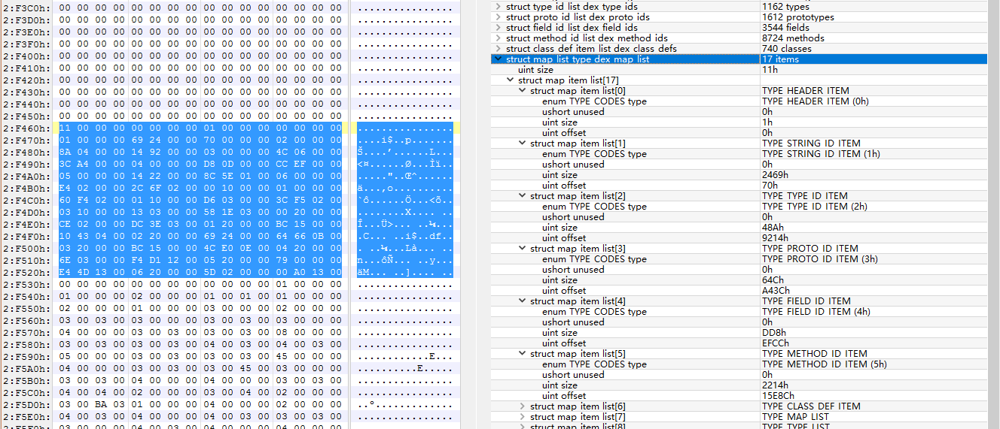

把合成的Dex文件maps段数据拷贝出来，整理一下
```
11000000--->0x00000011
0000-0000-01000000-00000000
0100-0000-5B240000-70000000
0200-0000-84040000-DC910000
0300-0000-45060000-ECA30000
0400-0000-D20D0000-28EF0000
0500-0000-02220000-B85D0100
0600-0000-E2020000-C86D0200
0010-0000-01000000-94F80200
0110-0000-D3030000-70F90200
0310-0000-11030000-60220300
0020-0000-CC020000-D0420300
0120-0000-B6150000-9C5C0400
0220-0000-5B240000-B8E60B00
0320-0000-B6150000-745E0F00
0420-0000-6D030000-E4141400
0520-0000-7A000000-F4C01400
0620-0000-5B020000-E8181500
```

对比就可以发现其实这里就有我们需要的数据，而且已经计算好了

将计算出来的偏移填充进去，注意是小端序

修复完如下，可以直接修改010Editor右边窗口的数据，左边会自动修改为小端序


使用JEB打开修复后的Dex文件

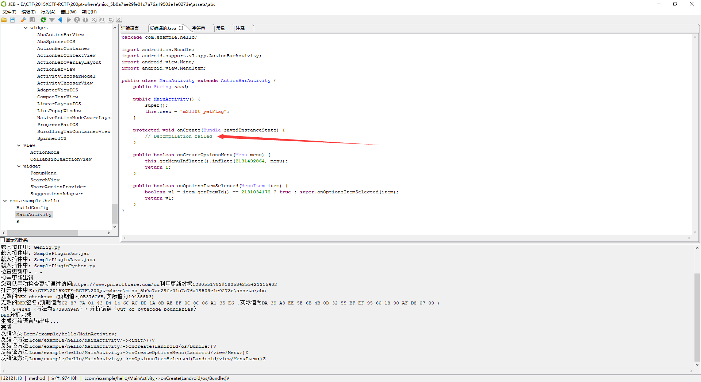

发现`onCreate()`方法反编译失败

查看对应的smali代码


发现`onCreate()`方法的代码是`nop`，鉴于其它方法都是正常的，那么这里明显是被抽走了，搞过加固的同学肯定眼熟这种形式，运行时动态恢复指令，但是这里没有so，明显不是

踌躇之际，我突然想到还有一个`y`，长度是`0x94`

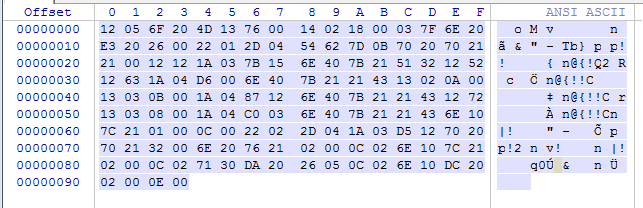

再看这里`nop`指令长度
```
.method protected onCreate(Bundle)V
          .registers 8
          .param p1, "savedInstanceState"
00000000  nop
          .prologue
00000002  nop
00000004  nop
00000006  nop
00000008  nop
0000000A  nop
0000000C  nop
0000000E  nop
00000010  nop
00000012  nop
00000014  nop
00000016  nop
00000018  nop
0000001A  nop
0000001C  nop
0000001E  nop
00000020  nop
          .local v1, "strb":Ljava/lang/StringBuilder;
00000022  nop
00000024  nop
00000026  nop
00000028  nop
0000002A  nop
0000002C  nop
0000002E  nop
00000030  nop
00000032  nop
00000034  nop
00000036  nop
00000038  nop
0000003A  nop
0000003C  nop
0000003E  nop
00000040  nop
00000042  nop
00000044  nop
00000046  nop
00000048  nop
0000004A  nop
0000004C  nop
0000004E  nop
00000050  nop
00000052  nop
00000054  nop
00000056  nop
00000058  nop
0000005A  nop
0000005C  nop
0000005E  nop
00000060  nop
00000062  nop
00000064  nop
          .local v0, "flag":Ljava/lang/String;
00000066  nop
00000068  nop
0000006A  nop
0000006C  nop
0000006E  nop
00000070  nop
00000072  nop
00000074  nop
00000076  nop
00000078  nop
0000007A  nop
0000007C  nop
0000007E  nop
00000080  nop
00000082  nop
00000084  nop
00000086  nop
00000088  nop
0000008A  nop
0000008C  nop
0000008E  nop
00000090  nop
00000092  nop
.end method
```

长度也是`0x94`，一条指令2字节长度，最后`0x92 + 2`

那么`y`就应该是被抽走的`onCreate()`方法的指令

使用IDA打开Dex，找到对应的偏移`0x00097390`


找到偏移后，使用Winhex找到Dex文件对应的偏移

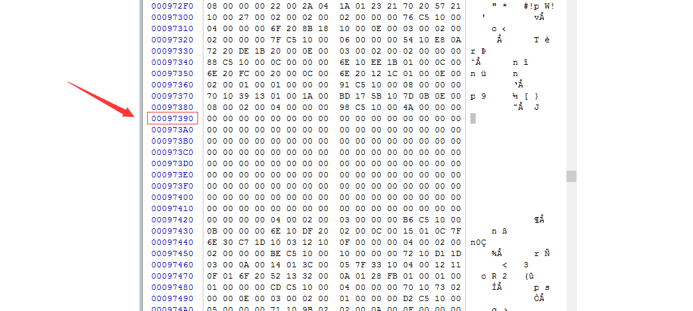

一大片空白，将`y`的数据拷贝进去


保存之后使用JEB打开最终的Dex文件

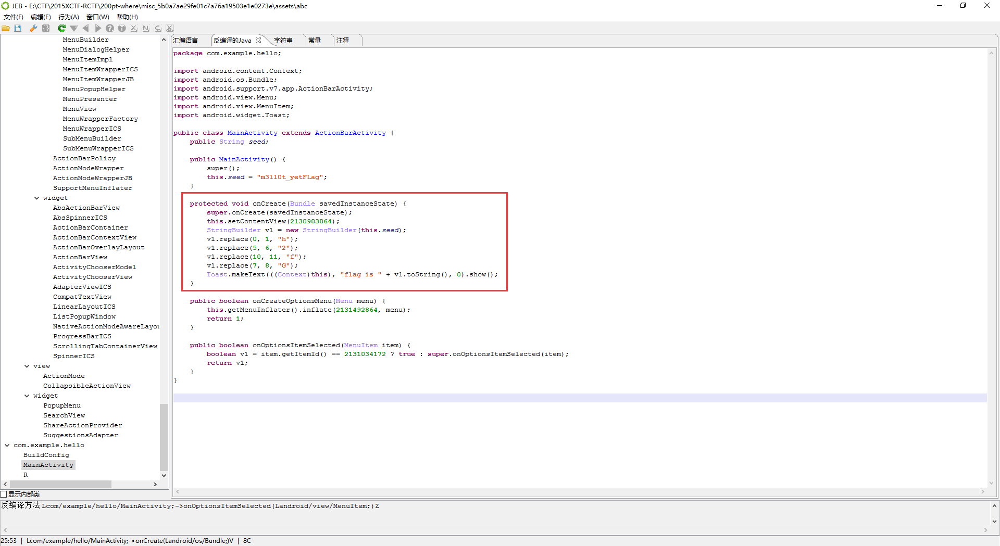

写下代码跑出Flag
```
public class Main {
	public static void main(String[] args) throws Exception{
		String seed = "m3ll0t_yetFLag";
		StringBuilder v1 = new StringBuilder(seed);
        v1.replace(0, 1, "h");
        v1.replace(5, 6, "2");
        v1.replace(10, 11, "f");
        v1.replace(7, 8, "G");
		System.out.println(v1.toString());
	}
}
```

输出
```
h3ll02_GetfLag
```

## 0x02 小结
这题我喜欢！！！！！！

做出这题的成本 = 四杯奶茶 + 一只脆皮鸡 = 32(元)

泡奶茶的五毛钱开水就不算了