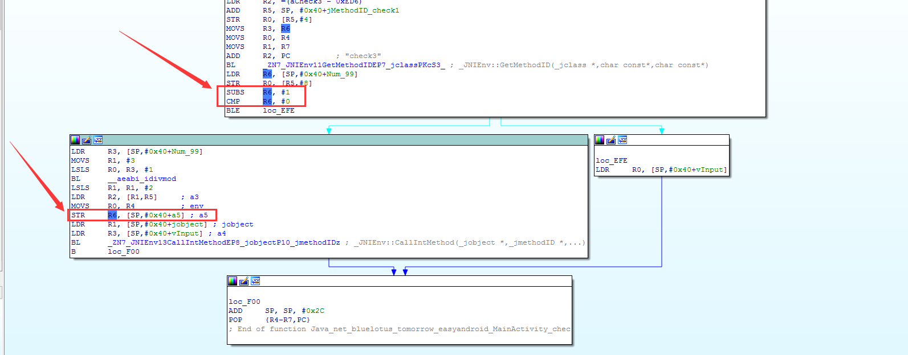

# 2016AliCTF-LoopAndLoop

**Author：wnagzihxain
Mail：tudouboom@163.com**

## 0x00 前言
2016年阿里CTF的第二道Mobile题，分值100

## 0x01 分析
Jadx打开，发现关键的代码在这里


`check()`函数的定义
```
public int check(int input, int s) {
    return chec(input, s);
}
```

`chec()`函数为native函数
```
public native int chec(int i, int i2);
```

IDA载入对应so，修复一些类型并且重命名一些变量


逻辑很简单，我们输入数据，然后通过`check()`各种调用，在native中判断第二个参数，第二个参数传入的是99，并且获取了Java层的三个函数`check1()`，`check2()`，`check3()`的`MethodID`

接下来进行判断，通过`Num_99`的值调用不同的`check*()`函数
```
if ( Num_99 - 1 <= 0 )
    result = vInput;
else
    result = _JNIEnv::CallIntMethod(vEnv, jobject, (int)*(&jMethodID_check1 + 2 * Num_99 % 3), vInput);
```

我们回过头看Java层的三个`check*()`函数，它们其实这只是做了加加减减的操作而已，然后再回头调用naive层的`chec()`，或者说，这其实就是个等差数列的求和

`check1()`
```
public int check1(int input, int s) {
    int t = input;
    for (int i = 1; i < 100; i++) {
        t += i;
    }
    return chec(t, s);
}
```

`check2()`
```
public int check2(int input, int s) {
    int t = input;
    int i;
    if (s % 2 == 0) {
        for (i = 1; i < 1000; i++) {
            t += i;
        }
        return chec(t, s);
    }
    for (i = 1; i < 1000; i++) {
        t -= i;
    }
    return chec(t, s);
}
```

`check3()`
```
public int check3(int input, int s) {
    int t = input;
    for (int i = 1; i < 10000; i++) {
        t += i;
    }
    return chec(t, s);
}
```

有一点奇怪的是，在所有代码中，我们并没有发现`Num_99`参数的对应操作，比如减1，减2等，如果这个参数不变化，递归过程就要爆栈了

再次回过头看native代码，这个函数调用了`check*()`，但是每个`check*()`函数都是有2个参数的，加上默认的3个应该是5个，但是这里只是显示了四个
```
int __fastcall _JNIEnv::CallIntMethod(JNIEnv *env, jobject jobject, int a3, int a4)
{
    int varg_r3; // [sp+14h] [bp-4h]@1

    varg_r3 = a4;
    return (*env)->CallIntMethodV(env, jobject, (jmethodID)a3, (int **__attribute__((__org_typedef(va_list))) )&varg_r3);
}
```

我们知道，ARM传递参数会使用`R0-R4`，如果多的参数则使用栈传递，那么这里第5个参数是必然要使用栈传递了，我们观察最后一个压栈操作即可，最后一个压栈的操作是对R6寄存器进行处理，先减1，然后判断小于等于0，最后压栈进行参数传递，有一点要注意的是，R3是第三个参数，这个参数保存在栈中，为减1前的数据



也就是说，在`2 * Num_99 % 3`的时候，还未减一，而传递的参数为`Num_99 - 1`

相当于
```
result = _JNIEnv::CallIntMethod(vEnv, jobject, (int)*(&jMethodID_check1 + 2 * Num_99 % 3), vInput, Num99 - 1);
```

那么接下来就看高中数列学的好不好了
```
package test;

import java.awt.geom.Ellipse2D;

public class Main {
	
	public static void main(String[] args) throws Exception{
		int output = 1835996258;
		for(int i = 2; i <= 99; i++) {
			if((2 * i % 3) == 0) {
				output = check1(output, i - 1);
			} else if((2 * i % 3) == 1) {
				output = check2(output, i - 1);
			} else {
				output = check3(output, i - 1);
			}
		}
		System.out.println(Integer.toString(output));
	}

    public static int check1(int input, int s) {
        int t = input;
        for (int i = 1; i < 100; i++) {
            t -= i;
        }
        return t;
    }

    public static int check2(int input, int s) {
        int t = input;
        int i;
        if (s % 2 == 0) {
            for (i = 1; i < 1000; i++) {
                t -= i;
            }
            return t;
        }
        for (i = 1; i < 1000; i++) {
            t += i;
        }
        return t;
    }

    public static int check3(int input, int s) {
        int t = input;
        for (int i = 1; i < 10000; i++) {
            t -= i;
        }
        return t;
    }
}
```

我知道等差数列可以求和，我懒

输出
```
236492408
```

在APP中输入这串数字


Flag：alictf{Jan6N100p3r}

## 小结
如果有看过FlappyPig战队WriteUp的同学应该看到了先算再减的解法，我只是比他们更懒一点而已