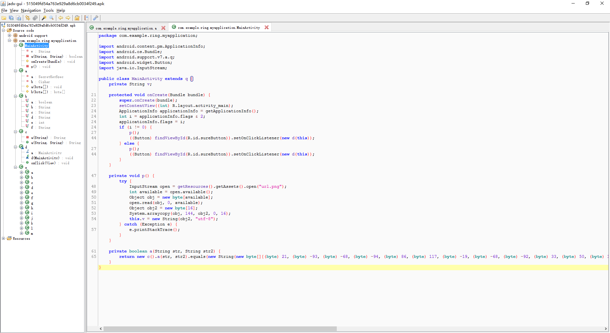
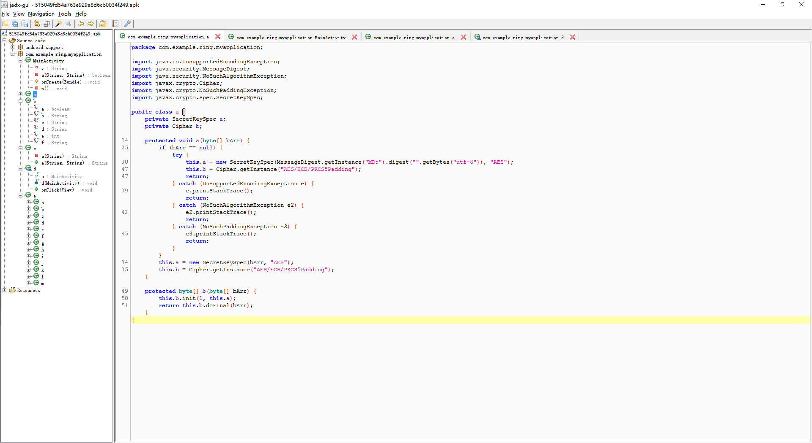
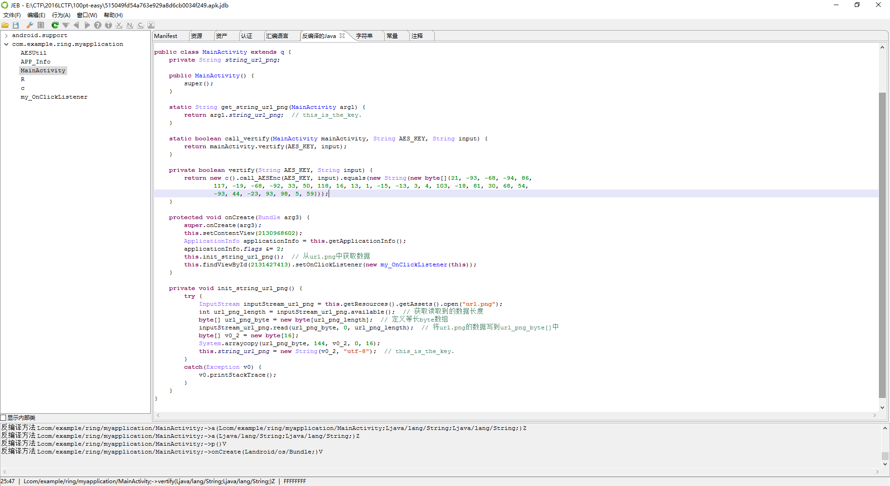
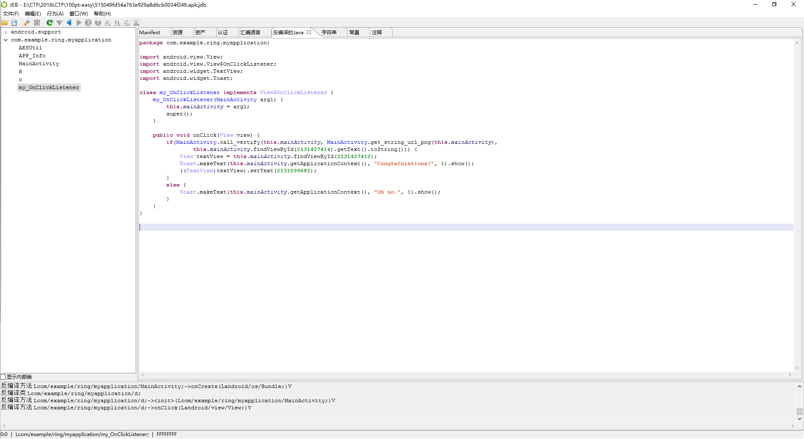
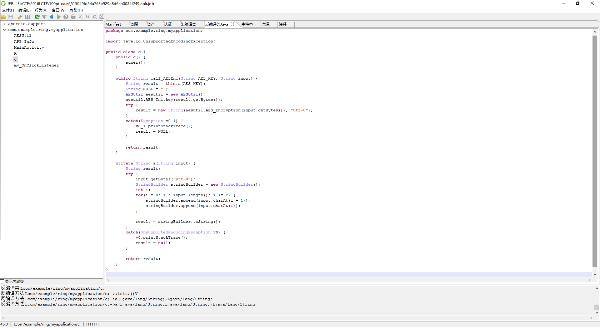
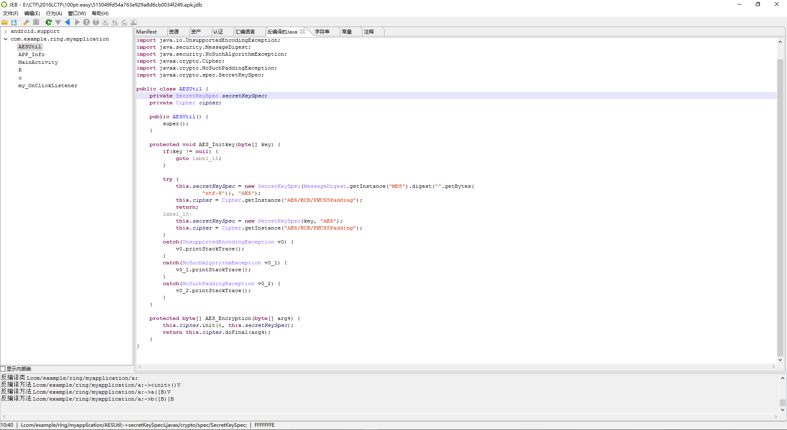

# 2016LCTF-easy

**Author：wnagzihxain
Mail：tudouboom@163.com**

## 0x00 前言
2016年LCTF的第一道Mobile题，分值100

## 0x01 分析
使用Jadx载入，用了混淆，没有so，也就是说纯Java层，到处翻一翻



找到最开始进行校验的地方，这里是一个Button的监听类


里面调用了AES加密



可能这样不是很容易理清校验顺序，我们使用JEB来分析，JEB有重命名变量的功能，非常好用

首先来看MainActivity，在`onCreate()`函数中调用了一个`init_string_url_png()`函数，将`assets`文件夹下的`url.png`文件读取出来，然后获取其中16字节，并转换为String类型



写个代码进行计算
```
package test;

import java.io.File;
import java.io.FileInputStream;
import java.io.InputStream;

public class Main {
	
	public static void main(String[] args) throws Exception{
		getKeyfromURLPNG();//从url.png中获取16字节的数据作为AES加密的key
	}
	
	public static void getKeyfromURLPNG() {
		try {
            File file = new File("url.png");
            FileInputStream inputStream_url_png = new FileInputStream(file);
            int url_png_length = inputStream_url_png.available();  // 获取读取到的数据长度
            byte[] url_png_byte = new byte[url_png_length];  // 定义等长byte数组
            inputStream_url_png.read(url_png_byte, 0, url_png_length);  // 将url.png的数据写到url_png_byte[]中
            byte[] v0_2 = new byte[16];
            System.arraycopy(url_png_byte, 144, v0_2, 0, 16);
            String string_url_png = new String(v0_2, "utf-8");
            System.out.println(string_url_png);
        }
        catch(Exception v0) {
            v0.printStackTrace();
        }
	}
}
```

输出，需要注意后面那个`.`也是属于这个字符串的一部分
```
this_is_the_key.
```

然后设置了按钮的点击事件



其中关键判断逻辑
```
if(MainActivity.call_vertify(this.mainActivity, 
							MainActivity.get_string_url_png(this.mainActivity), 
							this.mainActivity.findViewById(2131427414).getText().toString())) {
```

`call_vertify()`函数会调用`vertify()`函数，然后调用`c`类的`call_AESEnc()`函数，最后将返回结果与后面那个字符串对比
```
static String get_string_url_png(MainActivity arg1) {
    return arg1.string_url_png;  // this_is_the_key.
}

static boolean call_vertify(MainActivity mainActivity, String AES_KEY, String input) {
    return mainActivity.vertify(AES_KEY, input);
}

private boolean vertify(String AES_KEY, String input) {
    return new c().call_AESEnc(AES_KEY, input).equals(new String(new byte[]{21, -93, -68, -94, 86, 
            117, -19, -68, -92, 33, 50, 118, 16, 13, 1, -15, -13, 3, 4, 103, -18, 81, 30, 68, 54, 
            -93, 44, -23, 93, 98, 5, 59}));
}
```

前面说这里会有AES的加密操作，这里并不进行AES加密以及秘钥处理的的操作，仅仅是做一个调用，但是从我的命名可以看出来，在进行秘钥初始化之前，这里会调用一个`a()`函数对密码进行处理



这里非常明显的是AES加密



那么现在就可以写代码进行还原了，由于加密后的数据知道，秘钥也知道，所以用Java还原
```
package test;

import java.io.File;
import java.io.FileInputStream;
import java.io.InputStream;
import java.security.SecureRandom;

import javax.crypto.Cipher;
import javax.crypto.KeyGenerator;
import javax.crypto.SecretKey;
import javax.crypto.spec.SecretKeySpec;

import org.omg.CORBA.StringHolder;

public class Main {
	
	public static void main(String[] args) throws Exception{
		getKeyfromURLPNG();//从url.png中获取16字节的数据作为AES加密的key
		Deryption();
	}
	
	public static void getKeyfromURLPNG() {
		try {
            File file = new File("url.png");
            FileInputStream inputStream_url_png = new FileInputStream(file);
            int url_png_length = inputStream_url_png.available();  // 获取读取到的数据长度
            byte[] url_png_byte = new byte[url_png_length];  // 定义等长byte数组
            inputStream_url_png.read(url_png_byte, 0, url_png_length);  // 将url.png的数据写到url_png_byte[]中
            byte[] v0_2 = new byte[16];
            System.arraycopy(url_png_byte, 144, v0_2, 0, 16);
            String string_url_png = new String(v0_2, "utf-8");
            System.out.println(string_url_png);
        }
        catch(Exception v0) {
            v0.printStackTrace();
        }
	}
	
	public static void Deryption() {
		byte[] content = new byte[]{21, -93, -68, -94, 86, 117, -19, -68, -92, 33, 50, 118, 16, 13, 
			1, -15, -13, 3, 4, 103, -18, 81, 30, 68, 54, -93, 44, -23, 93, 98, 5, 59};
		String password = a("this_is_the_key.");
		System.out.println(password);
		try {  
            SecretKeySpec secretKeySpec = new SecretKeySpec(password.getBytes(), "AES");
            Cipher cipher = Cipher.getInstance("AES/ECB/PKCS5Padding");
            cipher.init(Cipher.DECRYPT_MODE, secretKeySpec);
            byte[] result = cipher.doFinal(content);
            System.out.println(new String(result));
		} catch (Exception e) {  
			e.printStackTrace();  
		}  
	}	
	
	public static String a(String input) {
        String result;
        try {
            input.getBytes("utf-8");
            StringBuilder stringBuilder = new StringBuilder();
            int i;
            for(i = 0; i < input.length(); i += 2) {
                stringBuilder.append(input.charAt(i + 1));
                stringBuilder.append(input.charAt(i));
            }
            result = stringBuilder.toString();
        }
        catch(Exception e) {
            e.printStackTrace();
            result = null;
        }
        return result;
    }
}
```

输出
```
this_is_the_key.
htsii__sht_eek.y
LCTF{1t's_rea1ly_an_ea3y_ap4}
```

Flag：LCTF{1t's_rea1ly_an_ea3y_ap4}

## 0x02 小结
虽然没有so，但是面对这样的混淆，没有经验的新手或者说对AES算法不熟悉的新手足够被拦在一个小时外