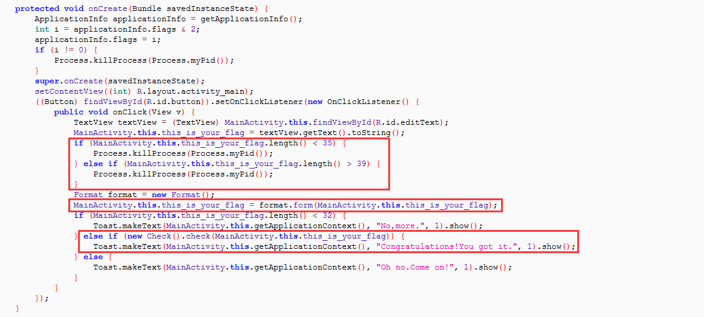
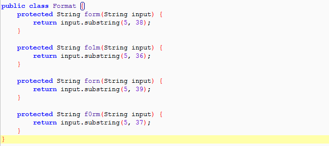
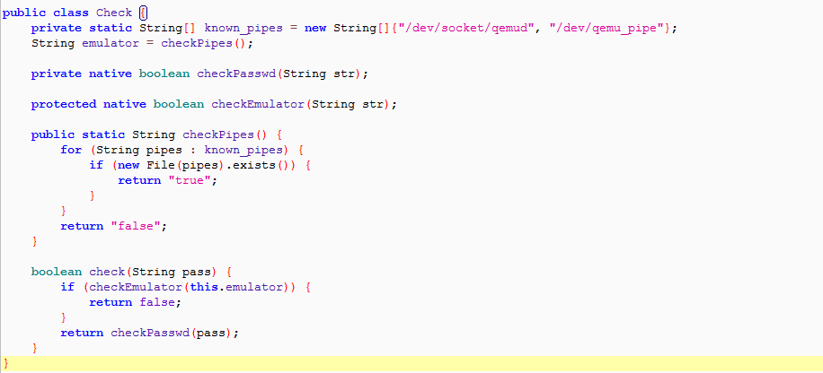
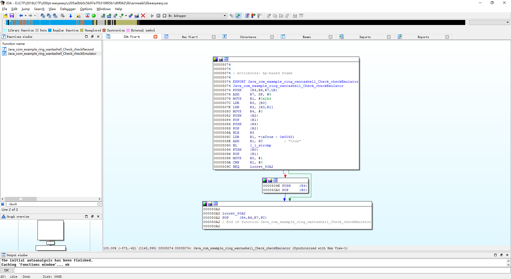
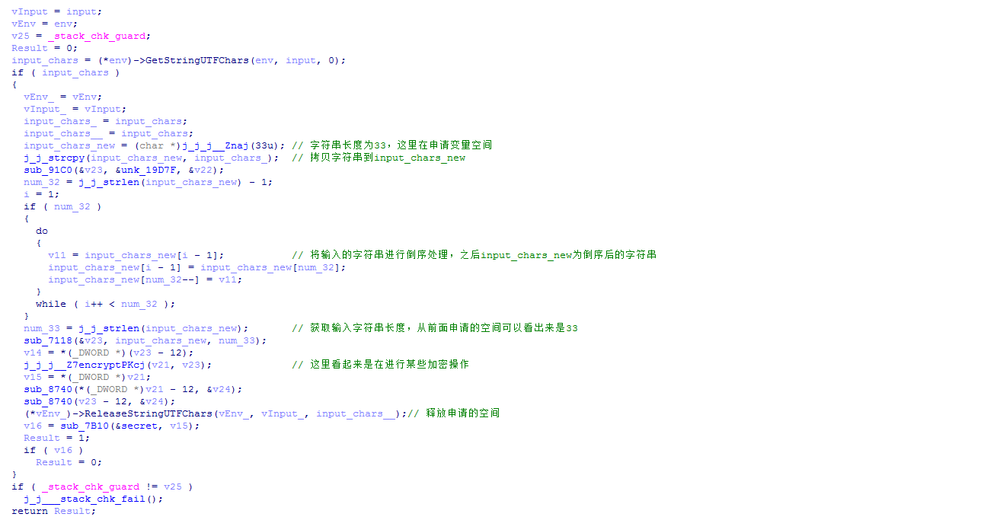
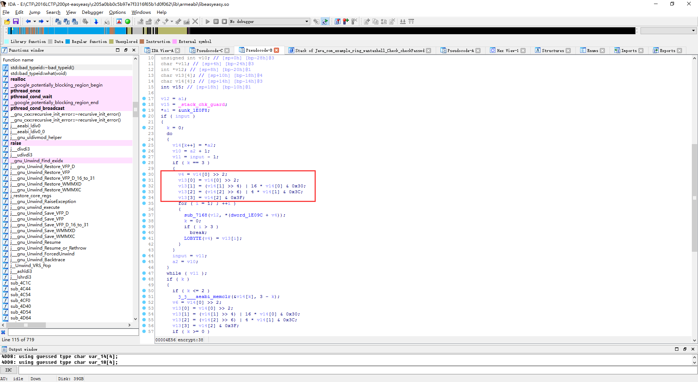
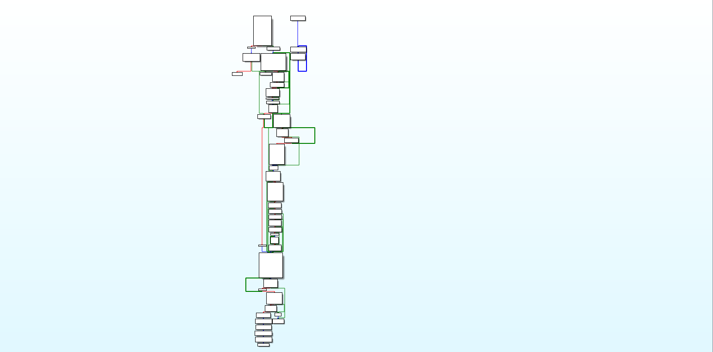
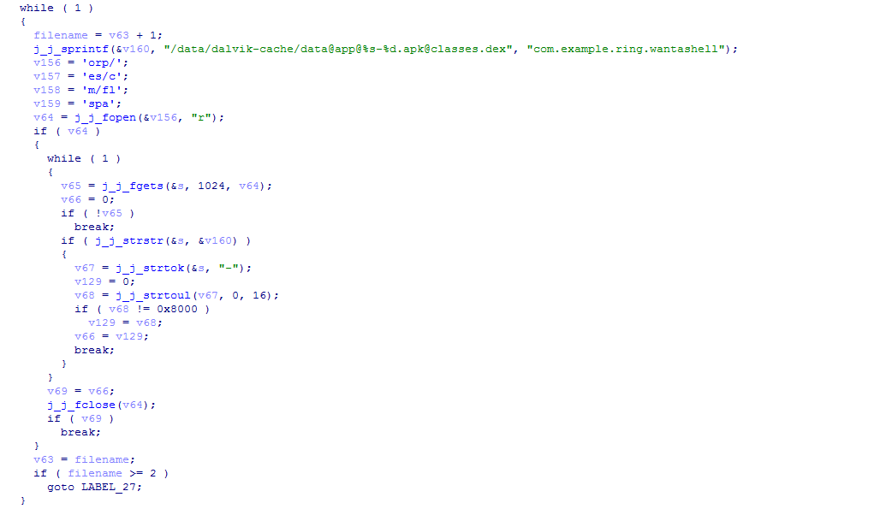
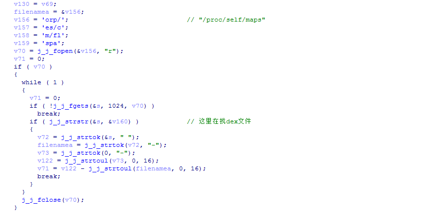
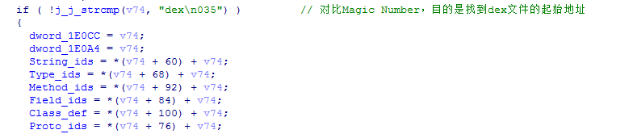

# 2016LCTF-easyeasy

**Author: wnagzihxa1n
E-Mail: wnagzihxa1n@gmail.com**

## 0x00 前言
2016年LCTF的第二道Mobile题，分值200，有言在先，本百分之九十九靠着自己多年酱油选手的灵感

## 0x01 分析
Jadx载入样本，先判断了输入字符串的长度，然后对字符串进行处理，最后调用函数进行校验



调用`Format类`的函数进行处理，这里写了这么多个，肯定在后面会用到，不然出题人吃饱撑着写这么多



`check()`函数里显示检测了模拟器，所以直接运行在真机上，然后调用native函数进行校验



IDA载入so，先看`checkEmulator()`函数，这个函数并没有做其它操作，只是根据传入的值返回



同时，我们看到还有一个`checkPasswd()`函数

我们进行简单的分析，可以看出来中间用到了某种加密操作



在对整个校验函数有了简单的认识后，进行深入分析
```
sub_91C0(&v23, &unk_19D7F, &v22);
sub_7118(&v23, input_chars_new, num_33);
sub_8740(*v21 - 12);
sub_8740(v23 - 12);
```

在翻了几下之后，发现这几个函数并没有太大关系，我们需要关注的是
```
j_j_j__Z7encryptPKcj(v20, v22, *(v22 - 12));
```

找到`v22 - 12`的定义就是`vInput_`，v20在后面会有操作，所以应该是输出
```
-00000028 vInput_         DCD ?
-00000024 var_24          DCB 4 dup(?)
-00000020 var_20          DCB ?
-0000001F                 DCB ? ; undefined
-0000001E                 DCB ? ; undefined
-0000001D                 DCB ? ; undefined
-0000001C var_1C 
```

跟进去



这明显的Base64算法，那么分析到这里就可以回去了

最后的对比
```
v14 = *v20;
v15 = sub_7B10(&secret, v14);
```

这里调用`sub_7B10`，可以跟进去
```
int __fastcall sub_7B10(const void **a1, const char *a2)
{
    const void *v2; // r7@1
    const char *v3; // r6@1
    size_t v4; // r5@1
    size_t v5; // r4@1
    size_t v6; // r2@1
    int result; // r0@3

    v2 = *a1;
    v3 = a2;
    v4 = *(*a1 - 3);
    v5 = j_j_strlen(a2);
    v6 = v5;
    if ( v5 > v4 )
        v6 = v4;
    result = j_j_memcmp(v2, v3, v6);
    if ( !result )
        result = v4 - v5;
    return result;
}
```

调用`memcpy()`函数进行对比，那么现在关键的就是`secret`

使用交叉引用，找到一处对`secret`的调用
```
int sub_4C54()
{
    int result; // r0@1
    int v1; // [sp+0h] [bp-18h]@1
    char v2; // [sp+4h] [bp-14h]@1
    int v3; // [sp+8h] [bp-10h]@1

    v3 = _stack_chk_guard;
    My_create(&secret, "dHR0dGlldmFodG5vZGllc3VhY2VibGxlaHNhdG5hd2k.", &v1);
    j_j___cxa_atexit(sub_6BE4, &secret, &unk_1E000);
    My_create(&dword_1E09C, "ABCDEFGHIJKLMNOPQRSTUVWXYZabcdefghijklmnopqrstuvwxyz0123456789+/", &v2);
    j_j___cxa_atexit(sub_6BE4, &dword_1E09C, &unk_1E000);
    result = _stack_chk_guard - v3;
    if ( _stack_chk_guard != v3 )
      j_j___stack_chk_fail();
    return result;
}
```

从第二个字符串来看，这是Base64算法无误了

那么分析到这，我们可以逆推一下，首先将`dHR0dGlldmFodG5vZGllc3VhY2VibGxlaHNhdG5hd2k.`用Base64还原，然后倒序
```
>>> temp = "ttttievahtnodiesuacebllehsatnawi!"
>>> temp[::-1]
'!iwantashellbecauseidonthaveitttt'
```

鉴于没有参赛我也不知道Flag到底是什么

网上流传的Flag：iwantashellbecauseidonthaveitttt

可是我记得前面是有调用一个`Format`类的一个函数做`substring()`操作	，应该是补上固定长度的任意字符串

不过还有一点点其它的东西可以跟大家聊一聊

我们注意到
```
>>> temp = "iwantashellbecauseidonthaveitttt"
>>> print len(temp)
32
```

而我们Java层传进来的字符串应该是33位，再来翻so文件，蓦然发现有一个`JNI_OnLoad()`函数



粗略一看，这里面的东西还是很多的，先是做初始化，猜测这里是要获取dex文件



通过`/proc/self/maps`找dex文件



寻找dex的Magic Number



接下来看到了比较关键的代码，这通常用于Dex文件自篡改，一大堆乱七八糟的东西没看懂是啥
```
if(v91)
{
    if(!j_j_mprotect(v75, v71, 7))
    {
        *v86 = *filenamed;
        v92 = *(filenamed + 3);
        if (v92)
        {
            v93 = filenamed + 16;
            v94 = v86 + 8;
            do
            {
                *v94 = *v93;
                ++v93;
                ++v94;
                --v92;
            }while(v92);
        }
        j_j_mprotect(v75, v71, 5);
    }
}
```

这时候开始瞎猜，一定有篡改，而且截取的长度由33变成32，获取的是`Lcom/example/ring/wantashell/Format;`类

再回头看该类的四个函数，主办方还是很仁慈的，并没有换三个长度都是32的函数
```
public class Format {
    protected String form(String input) {
        return input.substring(5, 38);
    }

    protected String fo1m(String input) {
        return input.substring(5, 36);
    }

    protected String forn(String input) {
        return input.substring(5, 39);
    }

    protected String f0rm(String input) {
        return input.substring(5, 37);
    }
}
```

大胆的猜测这里是将`form()`自篡改成`f0rm()`

那么现在Flag是`iwantashellbecauseidonthaveitttt`就没什么问题了

至于反调试，可以直接patch so的调用反调试函数指令，也可以动态调试的时候下断点，patch一下内存

## 0x02 小结
如果有同学感觉好的，在看`secret`赋值那里，就应该猜到这是Base64算法，感觉再好一点的，直接就解出了Flag

今天2017 Pwn2Own结束，数字获得了2017 Master of Pwn，膜拜各位大佬！！！！！！


