# 2016ZCTF-android1-200题解

**Author：wnagzihxa1n
Mail：wnagzihxa1n@gmail.com**

Java层的代码比常规的CM多了不少

关键的就在点击事件里
```
public void attemptLogin() {
	String username = this.mEmailView.getText().toString();
	String password = this.mPasswordView.getText().toString();
	View focusView;
	if (!TextUtils.isEmpty(password) && !isPasswordValid(password)) {
		this.mPasswordView.setError("Password Too Short");
		focusView = this.mPasswordView;
	} else if (TextUtils.isEmpty(username)) {
		this.mEmailView.setError("User name is NULL");
		focusView = this.mEmailView;
	} else if (!isEmailValid(username)) {
		this.mEmailView.setError("Error");
		focusView = this.mEmailView;
	} else if (new Auth().auth(this, username + password, databaseopt()) == 1) {
		Toast.makeText(getApplicationContext(), getString(R.string.Auth_Success), 0).show();
		OpenNewActivity(password);
	} else {
		Toast.makeText(getApplicationContext(), getString(R.string.Auth_Fail), 0).show();
	}
}
```

用户名和密码长度合法性校验
```
private boolean isEmailValid(String email) {
	return true;
}

private boolean isPasswordValid(String password) {
	return password.length() > 4;
}
```

校验函数`auth()`里移动有三个参数，第二个参数是用户名和密码的结合，第三个参数由下面这个函数计算而出
```
public String databaseopt() {
	String DB_PATH = getString(R.string.DB_PATH);
	String DB_NAME = getString(R.string.DB_NAME);
	File f = new File(DB_PATH);
	if (!f.exists()) {
		f.mkdir();
	}
	try {
		InputStream is = getBaseContext().getAssets().open(DB_NAME);
		OutputStream os = new FileOutputStream(DB_PATH + DB_NAME);
		byte[] buffer = new byte[1024];
		while (true) {
			int length = is.read(buffer);
			if (length <= 0) {
				break;
			}
			os.write(buffer, 0, length);
		}
		os.flush();
		os.close();
		is.close();
	} catch (Exception e) {
		e.printStackTrace();
	}
	Cursor cursor = SQLiteDatabase.openOrCreateDatabase(DB_PATH + DB_NAME, null).rawQuery(getString(R.string.rawQuery), null);
	String strtest = "abcdefgh";
	if (cursor.getCount() > 0) {
		cursor.moveToFirst();
		try {
			strtest = new String(cursor.getBlob(0), "utf-8").trim();
		} catch (Exception e2) {
			e2.printStackTrace();
		}
	}
	cursor.close();
	return strtest;
}
```

找到路径
```
<string name="DB_NAME">key.db</string>
<string name="DB_PATH">/data/data/com.zctf.app/databases/</string>
```

前面先将`key.db`文件拷贝到目标路径，然后读取，读取的SQL语句如下
```
<string name="rawQuery">select key from key where id=0</string>
```

直接用工具读取出数据库的值

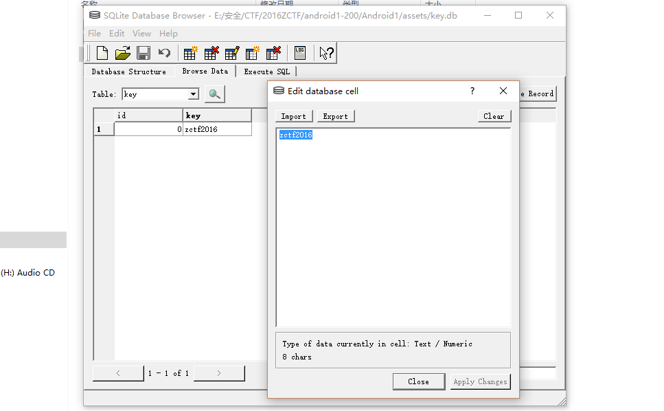

调用验证函数，先获取`username + password`字符串逆序的字节数组，调用了`encrypt()`函数进行加密，然后读取`flag_bin`文件和加密后的数据进行对比
```
public int auth(Context context, String input, String password1) {
	byte[] result = encrypt(new StringBuffer(input).reverse().toString().getBytes(), password1);
	try {
		InputStream is = context.getAssets().open(context.getString(R.string.flag_bin));
		byte[] buffer = new byte[64];
		do {
		} while (is.read(buffer) > 0);
		is.close();
		int i = 0;
		while (i < buffer.length && i < result.length) {
			if (i < buffer.length && i < result.length && buffer[i] != result[i]) {
				return 0;
			}
			i++;
		}
	} catch (IOException e) {
		e.printStackTrace();
	}
	return 1;
}
```

这个加密函数使用了DES加密算法
```
public static byte[] encrypt(byte[] datasource, String password) {
	try {
		SecureRandom random = new SecureRandom();
		SecretKey securekey = SecretKeyFactory.getInstance("DES").generateSecret(new DESKeySpec(password.getBytes()));
		Cipher cipher = Cipher.getInstance("DES");
		cipher.init(1, securekey, random);
		return cipher.doFinal(datasource);
	} catch (Throwable e) {
		e.printStackTrace();
		return null;
	}
}
```

那么我们可以直接读取`flag_bin`文件，使用秘钥`zctf2016`进行解密，从而查看密码是多少
```
package com.wnagzihxain.demo;

import javax.crypto.Cipher;
import javax.crypto.SecretKey;
import javax.crypto.SecretKeyFactory;
import javax.crypto.spec.DESKeySpec;
import java.io.File;
import java.io.FileInputStream;
import java.security.SecureRandom;

public class Demo {

    public static void main(String[] args) throws Exception{
        FileInputStream fileInputStream = null;
        byte[] buffer = new byte[16];
        try {
            fileInputStream = new FileInputStream(new File("flag.bin"));
            System.out.println(fileInputStream.available());
            do {
            } while (fileInputStream.read(buffer) > 0);
        } catch (Exception e) {
            e.printStackTrace();
        } finally {
            try {
                fileInputStream.close();
            } catch (Exception e) {
                e.printStackTrace();
            }
        }
        StringBuilder stringBuilder = new StringBuilder(new String(decrypt(buffer, "zctf2016"))).reverse();
        System.out.println(stringBuilder);
    }

    public static byte[] decrypt(byte[] src, String password) throws Exception {
        SecureRandom random = new SecureRandom();
        SecretKey securekey = SecretKeyFactory.getInstance("DES").generateSecret(new DESKeySpec(password.getBytes()));
        Cipher cipher = Cipher.getInstance("DES");
        cipher.init(Cipher.DECRYPT_MODE, securekey, random);
        return cipher.doFinal(src);
    }
}
```

由于密文长度的问题，一共只有16字节，但是分配了64字节的空间，解密会报错，所以我手动改成了16，或者定义数组的时候使用读取的长度作为参数传进去

输出
```
zctf{Notthis}
```

因吹斯听~~~

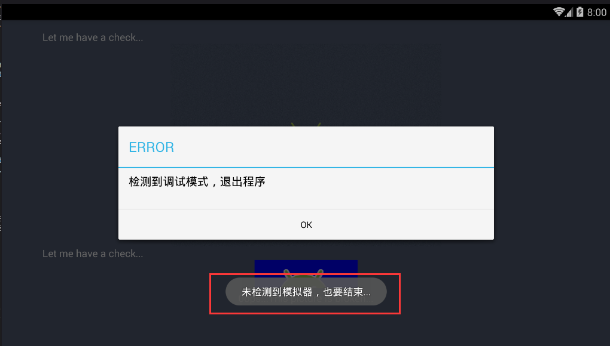

喵喵喵~~~

看来是要继续看代码

我们发现它在校验完密码后，会跳转到另一个Activity，在经过分析后，这个Activity里的东西貌似才是关键

横竖都退出，喵喵喵？
```
public boolean CheckOperatorNameAndroid(Context context) throws InterruptedException {
	if (((TelephonyManager) context.getSystemService("phone")).getNetworkOperatorName().toLowerCase().equals(getString(R.string.android))) {
		Toast.makeText(getApplicationContext(), getString(R.string.detect_quit), 1).show();
		new Timer().schedule(this.task, 3500);
	} else {
		Toast.makeText(getApplicationContext(), getString(R.string.no_detect_quit), 1).show();
		new Timer().schedule(this.task, 3500);
	}
	return false;
}
```

接下来是一个Native函数，目测是反调试
```
if (this.dataProvider.add(1, 2) == 1) {
	AlertDialog alertDialog = new Builder(this).create();
	alertDialog.setTitle(getString(R.string.alert_title));
	alertDialog.setMessage(getString(R.string.alert_contain));
	alertDialog.setButton(getString(R.string.alert_button), new OnClickListener() {
		public void onClick(DialogInterface dialog, int which) {
			System.exit(0);
		}
	});
	alertDialog.show();
	return;
}
```

跟到so，符号都没混淆，程序猿编程习惯不错
```
.text:00001AD8 ; int __fastcall Java_com_zctf_app_JNIclass_add(JNIEnv *a1)
.text:00001AD8 EXPORT Java_com_zctf_app_JNIclass_add
.text:00001AD8 Java_com_zctf_app_JNIclass_add
.text:00001AD8 PUSH    {R3,LR}
.text:00001ADA BL      AntiDebug_TracerPid
.text:00001ADE POP     {R3,PC}
.text:00001ADE ; End of function Java_com_zctf_app_JNIclass_add
```

大概是在进行TracerPid检测反调试

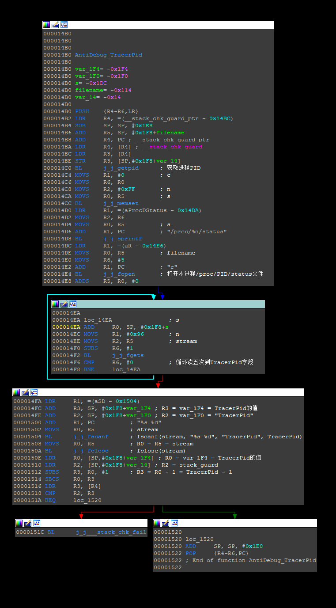

再将一个文件读到目标文件夹下
```
public void pushthebottom() {
	String BM_PATH = getString(R.string.BM_PATH);
	String BM_NAME = getString(R.string.bottom);
	File f = new File(BM_PATH);
	if (!f.exists()) {
		f.mkdir();
	}
	try {
		InputStream is = getBaseContext().getAssets().open(BM_NAME);
		OutputStream os = new FileOutputStream(BM_PATH + BM_NAME);
		byte[] buffer = new byte[1024];
		while (true) {
			int length = is.read(buffer);
			if (length > 0) {
				os.write(buffer, 0, length);
			} else {
				os.flush();
				os.close();
				is.close();
				return;
			}
		}
	} catch (Exception e) {
		e.printStackTrace();
	}
}
```

最后调用另一个Native函数进行处理，传入的是刚才计算出来的密码`{Notthis}`
```
this.tv.setText(this.dataProvider.sayHelloInc(passwd));
```

该函数不复杂，简单看一下函数调用，目测是进行DES加解密的计算，入口处理了传入的密码，存储为字节数组
```
.text:00001AE0 ; int __fastcall Java_com_zctf_app_JNIclass_sayHelloInc(JNIEnv *a1, int a2, int a3)
.text:00001AE0 EXPORT Java_com_zctf_app_JNIclass_sayHelloInc
.text:00001AE0 Java_com_zctf_app_JNIclass_sayHelloInc
.text:00001AE0
.text:00001AE0 src= -0x40
.text:00001AE0 var_3C= -0x3C
.text:00001AE0 var_38= -0x38
.text:00001AE0 var_34= -0x34
.text:00001AE0 var_2C= -0x2C
.text:00001AE0 var_1C= -0x1C
.text:00001AE0
.text:00001AE0 PUSH    {R4-R7,LR}
.text:00001AE2 LDR     R5, =(__stack_chk_guard_ptr - 0x1AEC)
.text:00001AE4 SUB     SP, SP, #0x2C
.text:00001AE6 ; 32:   v5 = (*a1)->FindClass(a1, "java/lang/String");
.text:00001AE6 LDR     R1, =(aJavaLangString - 0x1AF0)
.text:00001AE8 ADD     R5, PC ; __stack_chk_guard_ptr
.text:00001AEA LDR     R5, [R5] ; __stack_chk_guard
.text:00001AEC ADD     R1, PC          ; R1 = "java/lang/String"
.text:00001AEE ; 29:   v3 = a1;
.text:00001AEE MOVS    R4, R0          ; R4 = R0 = env
.text:00001AF0 ; 30:   v4 = (void *)a3;
.text:00001AF0 LDR     R3, [R5]        ; R3 = 栈保护
.text:00001AF2 MOVS    R6, R2          ; R6 = R2 = password
.text:00001AF4 ; 31:   v28 = _stack_chk_guard;
.text:00001AF4 STR     R3, [SP,#0x40+var_1C] ; 栈保护
.text:00001AF6 LDR     R3, [R0]        ; R3 = (*env)
.text:00001AF8 LDR     R3, [R3,#JNINativeInterface.FindClass] ; (*env)->FindClass
.text:00001AFA BLX     R3              ; R0 = (*env)->FindClass(env, "java/lang/String")
.text:00001AFC ; 33:   v6 = (*v3)->NewStringUTF(v3, "GB2312");
.text:00001AFC LDR     R1, [R4]        ; R1 = (*env)
.text:00001AFE MOVS    R2, #JNINativeInterface.NewStringUTF ; R2 = 0x29C
.text:00001B02 LDR     R3, [R1,R2]     ; (*env)->NewStringUTF
.text:00001B04 LDR     R1, =(aGb2312 - 0x1B0E)
.text:00001B06 MOVS    R7, R0          ; R7 = R0 = jclass_String
.text:00001B08 MOVS    R0, R4          ; R0 = R4 = env
.text:00001B0A ADD     R1, PC          ; R1 = "GB2312"
.text:00001B0C BLX     R3              ; R0 = (*env)->NewStringUTF(env, "GB2312");
.text:00001B0E ; 34:   v7 = (*v3)->GetMethodID(v3, v5, "getBytes", "(Ljava/lang/String;)[B");
.text:00001B0E LDR     R3, [R4]        ; R3 = (*env)
.text:00001B10 LDR     R2, =(aGetbytes - 0x1B1E)
.text:00001B12 MOVS    R1, R7          ; R1 = R7 = jclass_String
.text:00001B14 ADDS    R3, #8
.text:00001B16 LDR     R3, [R3,#0x7C]  ; (*env)->GetMethodID
.text:00001B18 STR     R0, [SP,#0x40+src] ; src = "GB2312"
.text:00001B1A ADD     R2, PC          ; R2 = "getBytes"
.text:00001B1C MOV     R12, R3         ; R3 = R12 = (*env)->GetMethodID
.text:00001B1E LDR     R3, =(aLjavaLangStrin - 0x1B26)
.text:00001B20 MOVS    R0, R4          ; R0 = env
.text:00001B22 ADD     R3, PC          ; R3 = "(Ljava/lang/String;)[B"
.text:00001B24 BLX     R12             ; R0 = (*env)->GetMethodID(env, jclass_String, "getBytes", "(Ljava/lang/String;)[B"
.text:00001B26 ; 35:   v8 = (*v3)->CallObjectMethod(v3, v4, v7, v6, v6);
.text:00001B26 LDR     R3, [R4]        ; R3 = (*env)
.text:00001B28 MOVS    R2, R0          ; R2 = R0 = jmethodID_getBytes
.text:00001B2A MOVS    R1, R6          ; R1 = R6 = password
.text:00001B2C ADDS    R3, #JNINativeInterface.CallObjectMethod ; R3 = p_(*env)->CallObjectMethod
.text:00001B2E LDR     R7, [R3]        ; R7 = (*env)->CallObjectMethod
.text:00001B30 MOVS    R0, R4          ; R0 = R4 = env
.text:00001B32 LDR     R3, [SP,#0x40+src] ; R3 = "GB2312"
.text:00001B34 BLX     R7              ; R0 = (*env)->CallObjectMethod(env, password, jmethodID_getBytes, "GB2312");
.text:00001B36 LDR     R1, [R4]        ; R1 = (*env)
.text:00001B38 MOVS    R3, #0xAB       ; R3 = 0xAB
.text:00001B3A MOVS    R7, R0          ; R7 = R0 = bytearray_password
.text:00001B3C ; 36:   v9 = (*v3)->GetArrayLength(v3, v8);
.text:00001B3C LSLS    R3, R3, #2      ; R3 = 0xAB << 2
.text:00001B3E LDR     R3, [R1,R3]     ; R3 = (*env)->GetArrayLength
.text:00001B40 MOVS    R0, R4          ; R0 = R4 = env
.text:00001B42 MOVS    R1, R7          ; R0 = R7 = bytearray_password
.text:00001B44 BLX     R3              ; R0 = (*env)->GetArrayLength(env, bytearray_password);
.text:00001B46 ; 37:   src = (*v3)->GetByteArrayElements(v3, v8, 0);
.text:00001B46 LDR     R2, [R4]        ; R2 = (*env)
.text:00001B48 MOVS    R3, #JNINativeInterface.GetByteArrayElements ; R3 = p_(*env)->GetByteArrayElements
.text:00001B4C LDR     R3, [R2,R3]     ; R3 = (*env)->GetByteArrayElements
.text:00001B4E MOVS    R6, R0          ; R6 = R0 = 密码字节数组长度
.text:00001B50 MOVS    R1, R7          ; R1 = R7 = bytearray_password
.text:00001B52 MOVS    R0, R4          ; R0 = env
.text:00001B54 MOVS    R2, #0          ; R2 = 0
.text:00001B56 BLX     R3              ; R0 = (*env)->GetByteArrayElements(env, bytearray_password, 0);
.text:00001B58 STR     R5, [SP,#0x40+var_34]
.text:00001B5A STR     R0, [SP,#0x40+src] ; src指向密码的byte数组
.text:00001B5C ; 38:   if ( v9 <= 0 )
.text:00001B5C CMP     R6, #0          ; 判断密码长度
.text:00001B5E BLE     loc_1B76
```

申请堆空间，将前面获取的密码字节数组存储到堆中
```
.text:00001B60 ; 44:     v10 = j_j_malloc(v9 + 1);
.text:00001B60 ADDS    R0, R6, #1      ; R0 = len + 1
.text:00001B62 BL      j_j_malloc      ; R0 = malloc(len + 1)
.text:00001B66 ; 45:     j_j_memcpy(v10, src, v9);
.text:00001B66 LDR     R1, [SP,#0x40+src] ; src
.text:00001B68 MOVS    R2, R6          ; n
.text:00001B6A MOVS    R5, R0          ; R5 = R0 = 新申请的堆空间
.text:00001B6C BL      j_j_memcpy      ; memcpy(R0, src, len)
.text:00001B70 ; 46:     *((_BYTE *)v10 + v9) = 0;
.text:00001B70 MOVS    R3, #0          ; R3 = 0
.text:00001B72 STRB    R3, [R5,R6]     ; heap_passwd[len] = 0
.text:00001B74 B       loc_1B78
```

释放掉临时密码数组的内存，同时再次调用TracerPid检测反调试函数
```
.text:00001B78 loc_1B78                ;
.text:00001B78 LDR     R1, [R4]        ; R1 = (*env)
.text:00001B7A MOVS    R3, #JNINativeInterface.ReleaseByteArrayElements
.text:00001B7E LDR     R6, [R1,R3]     ; R6 = (*env)->ReleaseByteArrayElements
.text:00001B80 MOVS    R0, R4          ; R0 = R4 = env
.text:00001B82 MOVS    R1, R7          ; R1 = R7 = bytearray_password
.text:00001B84 LDR     R2, [SP,#0x40+src] ; R2 = src
.text:00001B86 MOVS    R3, #0          ; R3 = 0
.text:00001B88 BLX     R6              ; R0 = (*env)->ReleaseByteArrayElements(env, bytearray_password, src, 0);
.text:00001B8A ; 49:   if ( AntiDebug_TracerPid() )
.text:00001B8A BL      AntiDebug_TracerPid ; R0 = AntiDebug_TracerPid()
.text:00001B8E STR     R0, [SP,#0x40+src] ; src = 反调试结果
.text:00001B90 CMP     R0, #0
.text:00001B92 BEQ     loc_1BA4
```

这log输出的是啥玩意？？？，后面申请了一个比较大的堆空间
```
.text:00001BA4 ; 57:     j_j___android_log_print(4, "System.out", "銈傘亞銇欍亾銇椼€€闋戝嫉銇ｃ仸");
.text:00001BA4
.text:00001BA4 loc_1BA4
.text:00001BA4 LDR     R2, =(aSystem_out - 0x1BAC)
.text:00001BA6 MOVS    R0, #4          ; R0 = 4
.text:00001BA8 ADD     R2, PC          ; R2 = "System.out"
.text:00001BAA MOVS    R1, R2          ; R1 = R2 = "System.out"
.text:00001BAC STR     R2, [SP,#0x40+var_3C] ; var_3C = "System.out"
.text:00001BAE LDR     R2, =(aUvvubjubsubuub - 0x1BB4)
.text:00001BB0 ADD     R2, PC          ; "銈傘亞銇欍亾銇椼€€闋戝嫉銇ｃ仸"
.text:00001BB2 BL      j_j___android_log_print
.text:00001BB6 ; 58:     v14 = j_j_malloc(0x1460u);
.text:00001BB6 MOVS    R0, #0x1460     ; R0 = 0x1460
.text:00001BBA BL      j_j_malloc      ; R0 = malloc(0x1460)
.text:00001BBE ; 59:     v15 = (int)v14;
.text:00001BBE SUBS    R6, R0, #0      ; 判断堆空间是否申请成功
.text:00001BC0 ; 60:     if ( v14 )
.text:00001BC0 BEQ     loc_1C5E
```

申请堆空间成功后，进行堆的初始化，拷贝了一个256字节的Table过去，同时打开文件`/data/data/com.zctf.app/files/bottom`，这个文件在Java层做了拷贝操作
```
.text:00001BC2 ; 62:       j_j_memset(v14, 0, 0x1460u);
.text:00001BC2 MOVS    R2, #0xA3       ; R2 = 0xA3
.text:00001BC4 LDR     R1, [SP,#0x40+src] ; R1 = 0 //借用反调试结果，为0才能走到该分支
.text:00001BC6 LSLS    R2, R2, #5      ; R2 = 0x1460
.text:00001BC8 BL      j_j_memset      ; R0 = memset(申请的堆空间, 0, 0x1460)
.text:00001BCC ; 63:       j_j_memcpy((void *)v15, &top, 0x100u);
.text:00001BCC LDR     R1, =(top_ptr - 0x1BD6)
.text:00001BCE MOVS    R2, #0x100      ; n
.text:00001BD2 ADD     R1, PC ; top_ptr
.text:00001BD4 LDR     R1, [R1] ; top  ; src
.text:00001BD6 MOVS    R0, R6          ; R6 = R0 = 堆空间
.text:00001BD8 BL      j_j_memcpy      ; R0 = memcpy(堆空间, top, 0x100)
.text:00001BDC ; 64:       v16 = j_j_fopen("/data/data/com.zctf.app/files/bottom", "rb");
.text:00001BDC LDR     R0, =(aDataDataCom_zc - 0x1BE4)
.text:00001BDE LDR     R1, =(aRb - 0x1BE6)
.text:00001BE0 ADD     R0, PC          ; "/data/data/com.zctf.app/files/bottom"
.text:00001BE2 ADD     R1, PC          ; "rb"
.text:00001BE4 BL      j_j_fopen       ; R0 = fopen("/data/data/com.zctf.app/files/bottom", "rb")
.text:00001BE8 ; 65:       v17 = v16;
.text:00001BE8 SUBS    R7, R0, #0      ; R7 = R0 //判断读取的数据是否成功
.text:00001BEA ; 66:       if ( v16 )
.text:00001BEA BNE     loc_1BF6
```

在做完准备工作后，进行DES解密，密文前256字节存储在so中，秘钥是传入的密码前8字节
```
.text:00001BF6 loc_1BF6                ;
.text:00001BF6 ADDS    R0, R6, #1      ; R0 = R6 + 1 = 申请堆空间偏移1
.text:00001BF8 MOVS    R2, #0x9B       ; R2 = 0x9B
.text:00001BFA MOVS    R3, R7          ; R3 = R7 = stream
.text:00001BFC MOVS    R1, #1          ; R1 = 1
.text:00001BFE LSLS    R2, R2, #5      ; R2 = 0x1360
.text:00001C00 ADDS    R0, #0xFF       ; R0 = 堆空间地址 + 256 = ptr
.text:00001C02 BL      j_j_fread       ; R0 = fread((byte *)堆地址 + 256, 1, 0x1360, stream)
.text:00001C06 STR     R0, [SP,#0x40+var_38] ; var_38 = R0 = 读取的字节数
.text:00001C08 ; 69:         j_j_fclose(v17);
.text:00001C08 MOVS    R0, R7          ; stream
.text:00001C0A ADD     R7, SP, #0x40+var_2C
.text:00001C0C BL      j_j_fclose      ; close(stream)
.text:00001C10 ; 70:         j_j_memset(&v26, 0, 0x10u);
.text:00001C10 LDR     R1, [SP,#0x40+src] ; R1 = 0
.text:00001C12 MOVS    R2, #0x10       ; R2 = 0x10
.text:00001C14 MOVS    R0, R7          ; R0 = var_2C
.text:00001C16 BL      j_j_memset      ; memset(var_2C, 0, 0x10)
.text:00001C1A ; 71:         v21 = *(_DWORD *)v10;
.text:00001C1A LDR     R3, [R5]        ; R3 = heap_passwd[0]
.text:00001C1C ; 72:         v22 = *((_DWORD *)v10 + 1);
.text:00001C1C LDR     R5, [R5,#4]     ; R5 = heap_passwd[1]
.text:00001C1E ; 73:         v26 = v21;
.text:00001C1E MOVS    R0, #0xA3       ; R0 = 0xA3
.text:00001C20 STR     R3, [SP,#0x40+var_2C] ; var_2C = heap_passwd[0]
.text:00001C22 ; 74:         v27 = v22;
.text:00001C22 LSLS    R0, R0, #5      ; R0 = 0x1460
.text:00001C24 STR     R5, [R7,#4]     ; var_2C+4 = heap_passwd[1]
.text:00001C26 ; 75:         v23 = j_j_malloc(0x1460u);
.text:00001C26 BL      j_j_malloc      ; R0 = malloc(0x1460)
.text:00001C2A MOVS    R2, #0xA3       ; R2 = 0xA3
.text:00001C2C LDR     R1, [SP,#0x40+src] ; R1 = 0
.text:00001C2E LSLS    R2, R2, #5      ; R2 = 0x1460
.text:00001C30 MOVS    R5, R0          ; R0 = R5 = 另一个堆空间
.text:00001C32 ; 76:         j_j_memset(v23, 0, 0x1460u);
.text:00001C32 BL      j_j_memset      ; R0 = memset(另一个堆空间, 0, 0x1460)
.text:00001C36 ; 77:         DES_Decrypt(v15, v20 + 256, &v26, v23);
.text:00001C36 LDR     R1, [SP,#0x40+var_38] ; R1 = 前面读取bottom文件的字节数
.text:00001C38 MOVS    R2, R7          ; R2 = R7 = heap_passwd
.text:00001C3A MOVS    R3, R5          ; R3 = R5 = 堆2首地址
.text:00001C3C ADDS    R1, #1          ; R1 = bottom文件字节数 + 1
.text:00001C3E ADDS    R1, #0xFF       ; R1 = 256
.text:00001C40 MOVS    R0, R6          ; R0 = R6 = 堆1首地址
.text:00001C42 BL      DES_Decrypt
.text:00001C46 ; 78:         j_j_free((void *)v15);
.text:00001C46 MOVS    R0, R6          ; ptr
.text:00001C48 BL      j_j_free        ; 释放堆1
.text:00001C4C ; 79:         j_j_free(v23);
.text:00001C4C MOVS    R0, R5          ; ptr
.text:00001C4E BL      j_j_free        ; 释放堆2
.text:00001C52 ; 80:         v18 = "System.out";
.text:00001C52 LDR     R2, =(aTooLateBoy - 0x1C5C)
.text:00001C54 LDR     R1, [SP,#0x40+var_3C]
.text:00001C56 ; 81:         v19 = "Too late, Boy";
.text:00001C56 MOVS    R0, #4
.text:00001C58 ADD     R2, PC          ; "Too late, Boy"
```

这里提供两种方法查看解密后的数据

第一种是手动模拟计算

以为接下来我会撸一波代码秀一波加解密吗？

呵呵，我是那种喜欢撸代码的人吗？

其实我开始用C撸了一遍解密，然而写挫了，解密的数据有点小问题

直接进入第二种方法，我们可以发现解密完后的数据直接就释放掉了，也就是说，内存中有那么一瞬间存在着解密后的数据

所以，可以通过动态调试，把那片内存撸出来，同时为了可以动态调试，我们需要先过掉反调试

也就是要修改APK，改的方法有很多，组合也非常多种，比我晚上撸串的选择都多

这里提供一种我个人的方案

以修改最少为原则，删删删这种方法我不是很喜欢

退出函数把退出的那句代码删掉

下面TracerPid反调试的代码这里不修改，我们可以修改检测函数的返回值，而不是在调用的时候改
```
if-ne v4, v6, :cond_1
```

这样Java层的反调试就绕过了，如果跑起来，效果大概是这样的

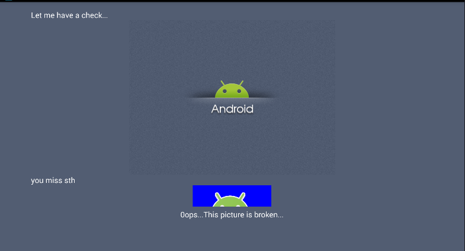

原因我们在前面的代码中分析过，解密后的堆数据直接就释放了

侧面说明，解密后的数据是一张图片

接下来修改Native层，这里需要额外多注意一点，这个so有`JNI_OnLoad`函数
```
.text:00001D28                             EXPORT JNI_OnLoad
.text:00001D28             JNI_OnLoad
.text:00001D28 08 B5                       PUSH    {R3,LR}
.text:00001D2A 00 20                       MOVS    R0, #0          ; request
.text:00001D2C 01 1C                       MOVS    R1, R0
.text:00001D2E 02 1C                       MOVS    R2, R0
.text:00001D30 03 1C                       MOVS    R3, R0
.text:00001D32 00 F0 B7 FF                 BL      j_j_ptrace      ; ptrace(0, 0, 0, 0) //跟踪自己，IDA无法附加
.text:00001D36 01 48                       LDR     R0, =0x10004
.text:00001D38 08 BD                       POP     {R3,PC}
.text:00001D38             ; End of function JNI_OnLoad
```

将`BL j_j_ptrace`patch掉，或者做全套，前面的参数赋值全都patch掉

IDA的`Edit->Patch Program->Change byte`可以实现直接修改so的功能

可以看到这一句是4字节，所以使用`00 00 00 00`来替换，效果如下

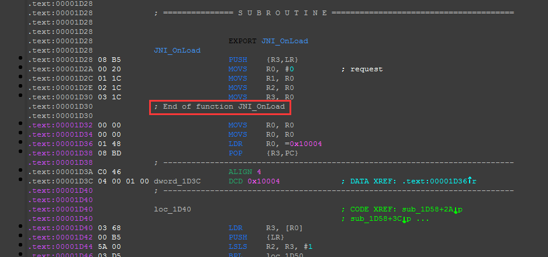

但是这时函数尾识别出错了，需要修复一下函数

使用右键`Edit Function`，修改函数尾部地址

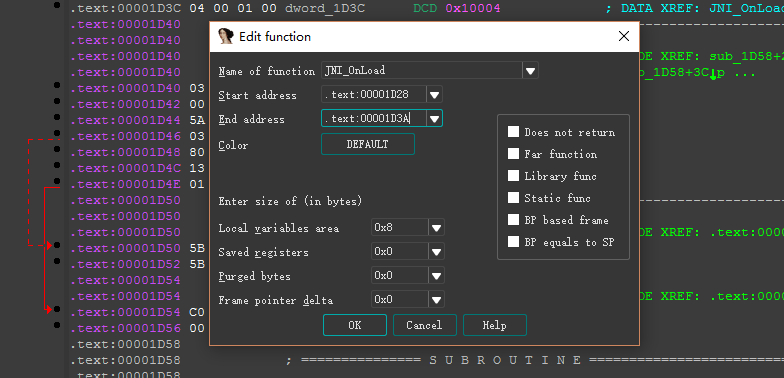

修改完

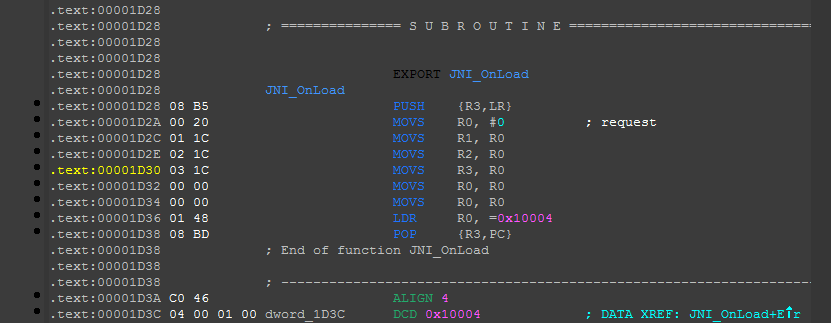

另外一处校验是TracerPid检测反调试，我们使用一种优雅的方式去处理

修改这个函数的返回值就行
```
.text:00001AD8                             EXPORT Java_com_zctf_app_JNIclass_add
.text:00001AD8             Java_com_zctf_app_JNIclass_add
.text:00001AD8 08 B5                       PUSH    {R3,LR}
.text:00001ADA FF F7 E9 FC                 BL      sub_14B0
.text:00001ADE 08 BD                       POP     {R3,PC}
.text:00001ADE             ; End of function Java_com_zctf_app_JNIclass_add
```

接下来记得`apply change`

替换源so文件，重打包签名，进行动态调试

如果碰到动态调试断不下来，可以使用在`libdvm.so`的`dvmJNIUseBridge`函数下断点的方法

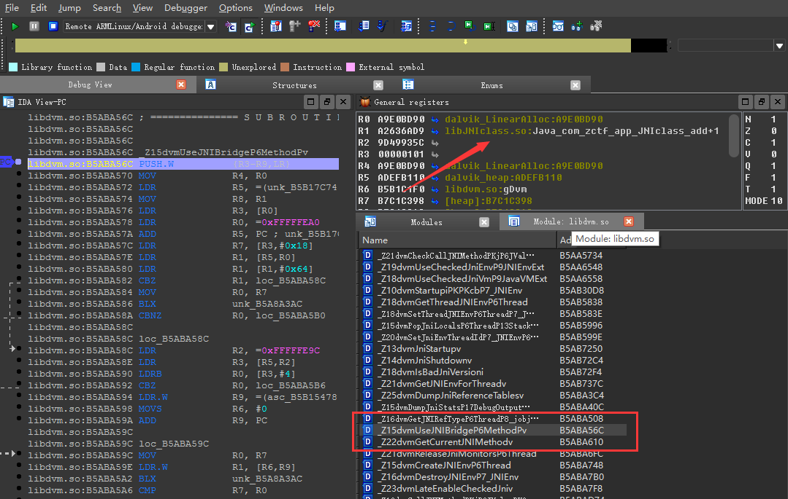


释放前下断，找到`R0`指向的堆空间，可以看到解密出来的是一个PNG文件

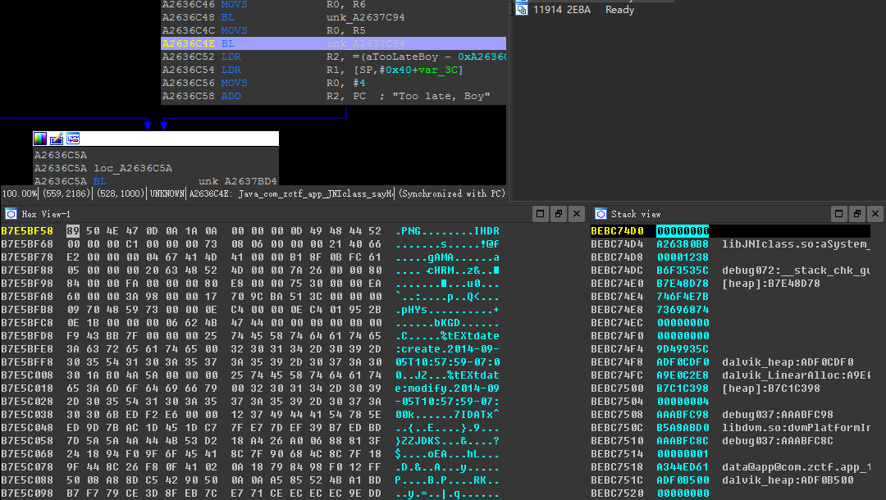

知道起始地址，整个堆空间长度是`0x1460`，我们可以直接用脚本拷贝这片堆数据，走一个
```
auto fp, dex_addr, end_addr;  
fp = fopen("E:\\Picture.png", "wb");  
for(dex_addr = 0xB7E5BF58; dex_addr < 0xB7E5BF58 + 0x1460; dex_addr++)
    fputc(Byte(dex_addr), fp);
```

然后使用StegSolve进行处理

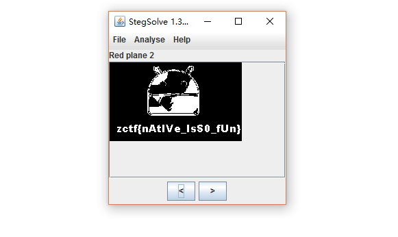

最后，有个很玄学的问题，为了找到为什么一开始写代码解密会出错的原因，我特意看了一下秘钥

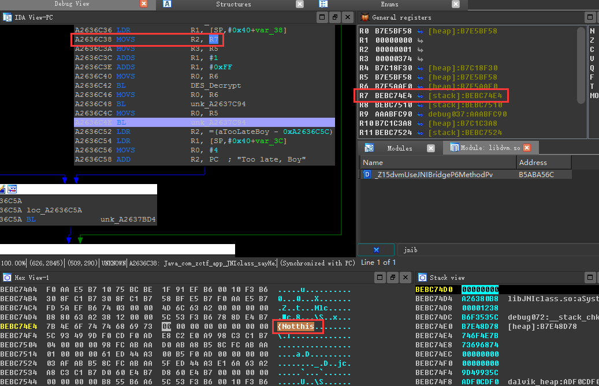

喵喵喵~~~

那看来，是我代码写挫了，到这里告一段落吧，让我休息几天，现在的CTF题WriteUp真难写。。。。。。

师傅们出题能少些套路多些真诚吗？

爱你们

