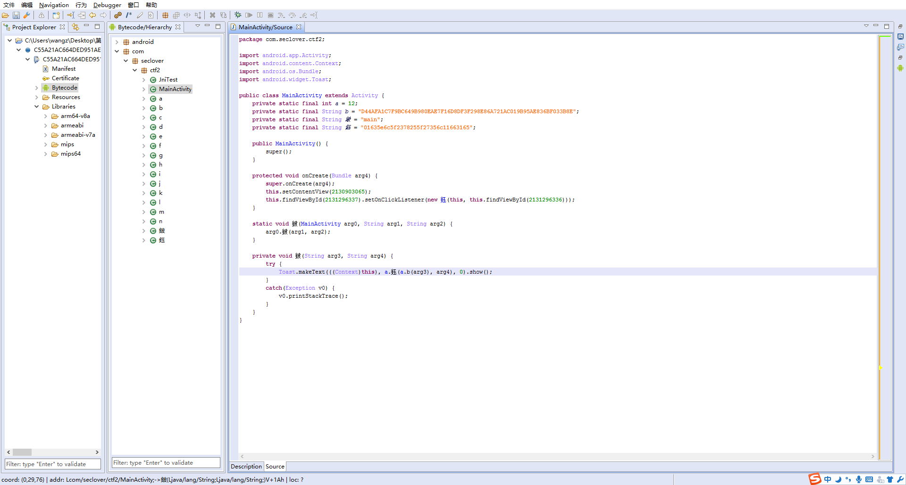
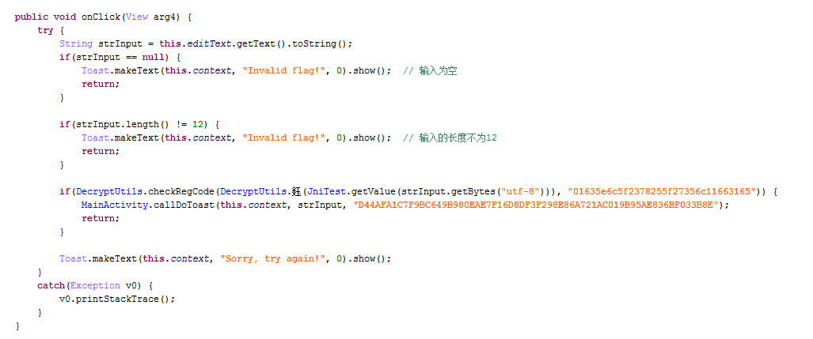
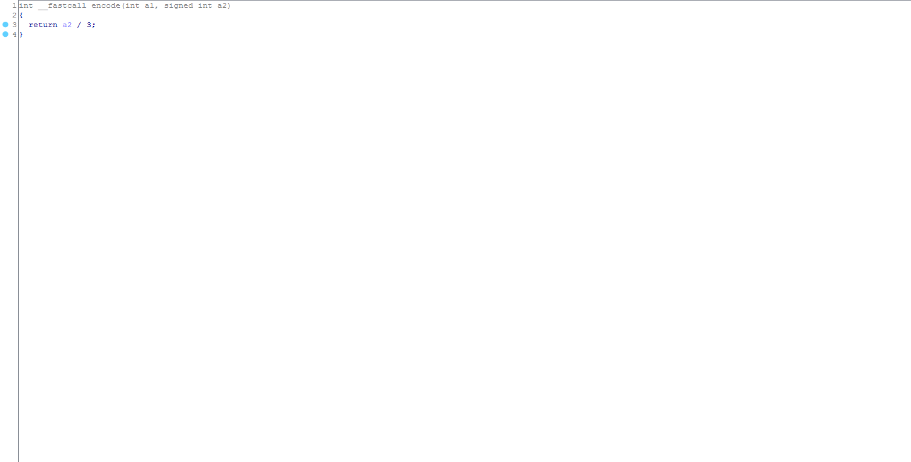
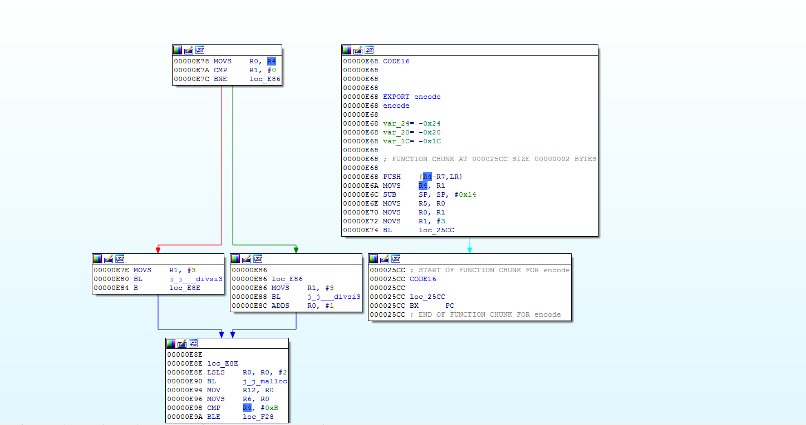
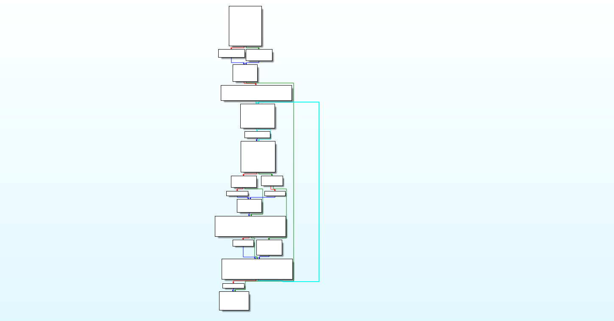
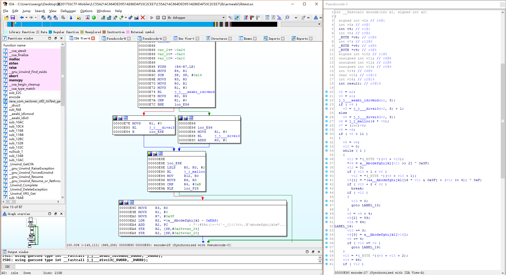
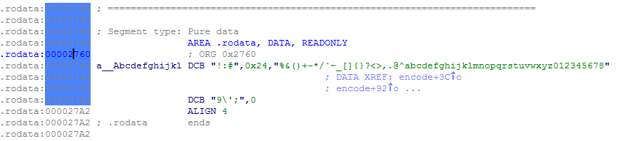
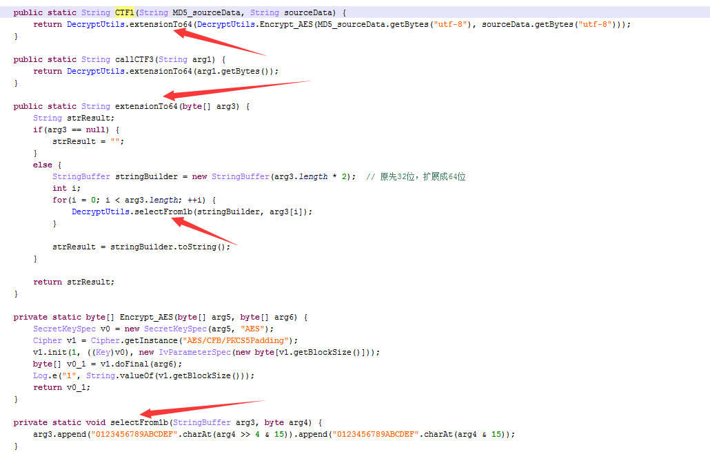
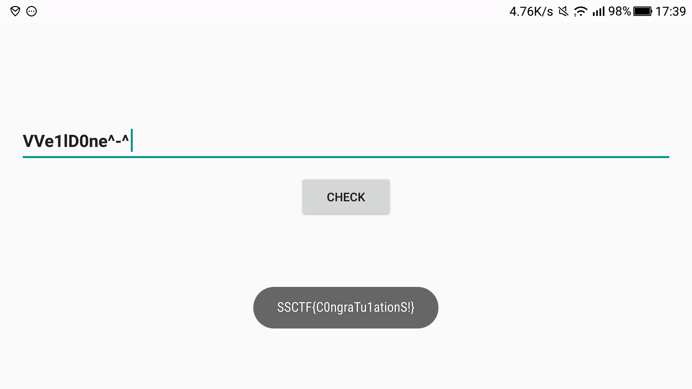

# 2017SSCTF-Login

**Author：wnagzihxain
Mail：tudouboom@163.com**

## 0x01 前言
感谢沐师傅在赛后提供题目

## 0x01 分析
Java层上了一堆中文变量。。。。。。



在一顿修复之后，大概的能梳理出校验过程

校验的地方



一层一层分析，这是一个native函数，需要使用IDA分析
```
JniTest.getValue(strInput.getBytes("utf-8"))
```

使用IDA载入对应的so文件，有一个关键的`encode()`函数


跟入发现白茫茫一片



使用流程图查看，发现调用关系断开



先去掉下面这个块的函数尾
```
.text:000025CC ; START OF FUNCTION CHUNK FOR encode
.text:000025CC CODE16
.text:000025CC
.text:000025CC loc_25CC
.text:000025CC BX      PC
.text:000025CC ; END OF FUNCTION CHUNK FOR 
```

然后`Force BL Call`

即可修复，F5之后的代码也比较正常可读



伪代码



入口处看到了长度由12变为16位，也就是三位扩充成4位，猜测是Base64算法
```
if ( v4 )
    dwDivideJudge = j_j___divsi3(_lenOfbaRegCode, 3) + 1;
else
    dwDivideJudge = j_j___divsi3(_lenOfbaRegCode, 3);// Java层注册码要求12位
lpStringBuffer = j_j_malloc(4 * dwDivideJudge);// 长度由12位扩充为16位
```

找到一个转换表



使用WinHex找到对应偏移，C Source模式拷贝出来
```
unsigned char data[66] = {
    0x21, 0x3A, 0x23, 0x24, 0x25, 0x26, 0x28, 0x29, 0x2B, 0x2D, 0x2A, 0x2F, 0x60, 0x7E, 0x5F, 0x5B, 
    0x5D, 0x7B, 0x7D, 0x3F, 0x3C, 0x3E, 0x2C, 0x2E, 0x40, 0x5E, 0x61, 0x62, 0x63, 0x64, 0x65, 0x66, 
    0x67, 0x68, 0x69, 0x6A, 0x6B, 0x6C, 0x6D, 0x6E, 0x6F, 0x70, 0x71, 0x72, 0x73, 0x74, 0x75, 0x76, 
    0x77, 0x78, 0x79, 0x7A, 0x30, 0x31, 0x32, 0x33, 0x34, 0x35, 0x36, 0x37, 0x38, 0x39, 0x5C, 0x27, 
    0x3B, 0x00
};
```

IDA里没显示完全，其实应该是下面这样的
```
!:#$%&()+-*/`~_[]{}?<>,.@^abcdefghijklmnopqrstuvwxyz0123456789\'; 
```

正常的Base64编码表如下
```
ABCDEFGHIJKLMNOPQRSTUVWXYZabcdefghijklmnopqrstuvwxyz0123456789+/
```

所以在这里写还原代码的时候不能使用下面这种常规编码表的方式
```
static char Base64Table[256] = {
    -1, -1, -1, -1, -1, -1, -1, -1, -1, -1, -1, -1, -1, -1, -1, -1, // 0   - 15
    -1, -1, -1, -1, -1, -1, -1, -1, -1, -1, -1, -1, -1, -1, -1, -1, // 16  - 31
    -1, -1, -1, -1, -1, -1, -1, -1, -1, -1, -1, 62, -1, -1, -1, 63, // 32  - 47
    52, 53, 54, 55, 56, 57, 58, 59, 60, 61, -1, -1, -1, -1, -1, -1, // 48  - 63
    -1,  0,  1,  2,  3,  4,  5,  6,  7,  8,  9, 10, 11, 12, 13, 14, // 64  - 79
    15, 16, 17, 18, 19, 20, 21, 22, 23, 24, 25, -1, -1, -1, -1, -1, // 80  - 95
    -1, 26, 27, 28, 29, 30, 31, 32, 33, 34, 35, 36, 37, 38, 39, 40, // 96  - 111
    41, 42, 43, 44, 45, 46, 47, 48, 49, 50, 51, -1, -1, -1, -1, -1, // 112 - 127
    -1, -1, -1, -1, -1, -1, -1, -1, -1, -1, -1, -1, -1, -1, -1, -1, // 128 - 143
    -1, -1, -1, -1, -1, -1, -1, -1, -1, -1, -1, -1, -1, -1, -1, -1, // 144 - 159
    -1, -1, -1, -1, -1, -1, -1, -1, -1, -1, -1, -1, -1, -1, -1, -1, // 160 - 175
    -1, -1, -1, -1, -1, -1, -1, -1, -1, -1, -1, -1, -1, -1, -1, -1, // 176 - 191
    -1, -1, -1, -1, -1, -1, -1, -1, -1, -1, -1, -1, -1, -1, -1, -1, // 192 - 207
    -1, -1, -1, -1, -1, -1, -1, -1, -1, -1, -1, -1, -1, -1, -1, -1, // 208 - 223
    -1, -1, -1, -1, -1, -1, -1, -1, -1, -1, -1, -1, -1, -1, -1, -1, // 224 - 239
    -1, -1, -1, -1, -1, -1, -1, -1, -1, -1, -1, -1, -1, -1, -1, -1, // 240 - 255
};
```

而是根据对应的char来查找index，然后拼接到一个`int`型数据里去，由于编码表是变形的，所以只能使用循环来查找

这里我放一份比较常规的Base64编码的C语言实现，可以跟反编译后的代码进行对比
```
const char Base64Code[] = "ABCDEFGHIJKLMNOPQRSTUVWXYZabcdefghijklmnopqrstuvwxyz0123456789+/";

void Base64_encode(char *lpString)
{
    char *lpBuffer;
    int lpString_len = strlen(lpString);
    while(lpString_len > 0)
    {
        *lpBuffer++ = Base64Code[(lpString[0] >> 2 ) & 0x3F];
        if(lpString_len > 2)
        {
            *lpBuffer++ = Base64Code[((lpString[0] & 3) << 4) | (lpString[1] >> 4)];
            *lpBuffer++ = Base64Code[((lpString[1] & 0xF) << 2) | (lpString[2] >> 6)];
            *lpBuffer++ = Base64Code[lpString[2] & 0x3F];
        }
        else
        {
            switch(lpString_len)
            {
            case 1:
                *lpBuffer ++ = Base64Code[(lpString[0] & 3) << 4 ];
                *lpBuffer ++ = '=';
                *lpBuffer ++ = '=';
                break;
            case 2:
                *lpBuffer ++ = Base64Code[((lpString[0] & 3) << 4) | (lpString[1] >> 4)];
                *lpBuffer ++ = Base64Code[((lpString[1] & 0x0F) << 2) | (lpString[2] >> 6)];
                *lpBuffer ++ = '=';
                break;
            }
        }
        lpString += 3;
        lpString_len -= 3;
    }
    *lpBuffer = '\0';
}
```

Base64编码基于的一个原理就是6位`01`即可表示64个不同的字符在取第一个字符的时候，只需要取前6位，转为index，找到编码表对应的字符即可，但是这里的算法还进行了一次异或，所以最终的编码在计算的时候，需要把每4个字节的第一个字节跟`0x3F`进行异或，再去找对应的字符下标index
```
 *lpStringBuffer_chBy4b = a__Abcdefghijkl[temp >> 2] ^ 0x3F;
```

第二字节同样做了异或操作
```
lpStringBuffer_chBy4b[1] = *(&a__Abcdefghijkl[16 * temp & 0x3F] + (j >> 4)) ^ 0xF;
```

第三和第四字节常规的编码，没有其余操作

结合输入的注册码为12位，那么我们还原的代码如下，对于后面的判断我就省略了
```
public class MyClass {
	
	static byte[] dataEncoded = {0x01, 0x63, 0x5e, 0x6c, 0x5f, 0x23, 0x78, 0x25, 0x5f, 0x27, 0x35, 0x6c, 0x11, 0x66, 0x31, 0x65};
	
	static byte[] Base64Table = {
		    0x21, 0x3A, 0x23, 0x24, 0x25, 0x26, 0x28, 0x29, 0x2B, 0x2D, 0x2A, 0x2F, 0x60, 0x7E, 0x5F, 0x5B, 
		    0x5D, 0x7B, 0x7D, 0x3F, 0x3C, 0x3E, 0x2C, 0x2E, 0x40, 0x5E, 0x61, 0x62, 0x63, 0x64, 0x65, 0x66, 
		    0x67, 0x68, 0x69, 0x6A, 0x6B, 0x6C, 0x6D, 0x6E, 0x6F, 0x70, 0x71, 0x72, 0x73, 0x74, 0x75, 0x76, 
		    0x77, 0x78, 0x79, 0x7A, 0x30, 0x31, 0x32, 0x33, 0x34, 0x35, 0x36, 0x37, 0x38, 0x39, 0x5C, 0x27, 
		    0x3B, 0x00
		};
	
	private static int GetCharIndex(byte ch) {
		for(int i = 0; i < Base64Table.length; i++) {
			if (ch == Base64Table[i]) {
				return i;
			}
		}
		return -1;
	}
	
	public static void main(String[] args) throws Exception {
		int len = dataEncoded.length * 3 / 4;
		byte[] dataDecoded = new byte[len];
		int j = 0;
		for(int i = 0; i < dataEncoded.length; i += 4) {
			dataDecoded[j++] = (byte)((GetCharIndex((byte)(dataEncoded[i] ^ 0x3F)) << 2) + ((GetCharIndex((byte)(dataEncoded[i + 1] ^ 0x0F)) >> 4) & 0x03));
			dataDecoded[j++] = (byte)(((GetCharIndex((byte)(dataEncoded[i + 1] ^ 0x0F)) & 0x0F) << 4) + ((GetCharIndex(dataEncoded[i + 2]) >> 2) & 0x0F));
			dataDecoded[j++] = (byte)((GetCharIndex(dataEncoded[i + 2]) << 6) + (GetCharIndex(dataEncoded[i + 3])));
		}
		System.out.println(new String(dataDecoded));
	}
}
```

因为上一题的套路，我猜后面那个32位字符串就是应该用来解密的数据，所以直接拿来测试

输出
```
VVe1lD0ne^-^
```

为了确定整个流程，再次回到Java层进行流程的分析
```
DecryptUtils.checkRegCode(DecryptUtils.extensionTo32(JniTest.getValue(strInput.getBytes("utf-8"))), "01635e6c5f2378255f27356c11663165")
```

首先是`DecryptUtils.extensionTo32()`，用于将`byte[]`转为32位字符串
```
public static String extensionTo32(byte[] Data) {
    StringBuilder stringBuilder = new StringBuilder();
    int lenOfData = Data.length;
    int i;
    for(i = 0; i < lenOfData; ++i) {
        stringBuilder.append(String.format("%02x", Integer.valueOf(Data[i] & 255)));
    }

    return stringBuilder.toString();
}
```

最终的`DecryptUtils.checkRegCode()`很有意思，一不小心就会被带到坑里去
```
public static boolean checkRegCode(String strCalcu, String strJUDGE) {
    boolean boolResult = false;
    try {
        String v4 = DecryptUtils.CTF1(DecryptUtils.Encrypt_MD5(strCalcu), strCalcu);
        String v5 = DecryptUtils.CTF1(DecryptUtils.Encrypt_MD5(strJUDGE), strJUDGE);
        if(v4.length() < v5.length()) {
            return boolResult;
        }

        int i = 0;
        int j = 0;
        while(i < v4.length()) {
            int temp = (v5.charAt(i) ^ v4.charAt(i)) + i ^ i;
            j += temp;
            while(temp > 0) {
                j += v5.charAt(temp) + v4.charAt(temp);
                --temp;
            }

            ++i;
        }

        boolResult = DecryptUtils.Encrypt_MD5(String.valueOf(j)).equals("cfcd208495d565ef66e7dff9f98764da");
    }
    catch(Exception v1) {
        v1.printStackTrace();
    }

    return boolResult;
}
```

如果反推，马上就可以得到答案，如果正向走下来。。。。。。

我们正向走一遍，首先是`CTF1()`，将每个字符拆成2个4位，然后再挑数据拼接



接下来进行对比计算
```
int i = 0;
int j = 0;
while(i < v4.length()) {
    int temp = (v5.charAt(i) ^ v4.charAt(i)) + i ^ i;
    j += temp;
    while(temp > 0) {
        j += v5.charAt(temp) + v4.charAt(temp);
        --temp;
    }

    ++i;
}
boolResult = DecryptUtils.Encrypt_MD5(String.valueOf(j)).equals("cfcd208495d565ef66e7dff9f98764da");
```

看着乱。。。。。。

计算完后有一个MD5值的对比，尝试解密这个MD5
```
您查询的字符串是“cfcd208495d565ef66e7dff9f98764da”,解密的结果为“0”!
```

。。。。。。

那么说明计算完`j`是0

回头看计算过程，`j`一直是相加的计算，想让`j`是0，那么在异或的时候两个值一定要想等，说明两个字符串相等，回溯到最前面，说明传进来的两个字符串相等，那么直接拿上面的32位字符串去解密，就可以得到正确的输入数据，输入那个数据，就可以弹出Flag

输入`VVe1lD0ne^-^`，弹出Flag



## 0x02 小结
再次感谢沐师傅在赛后提供题目