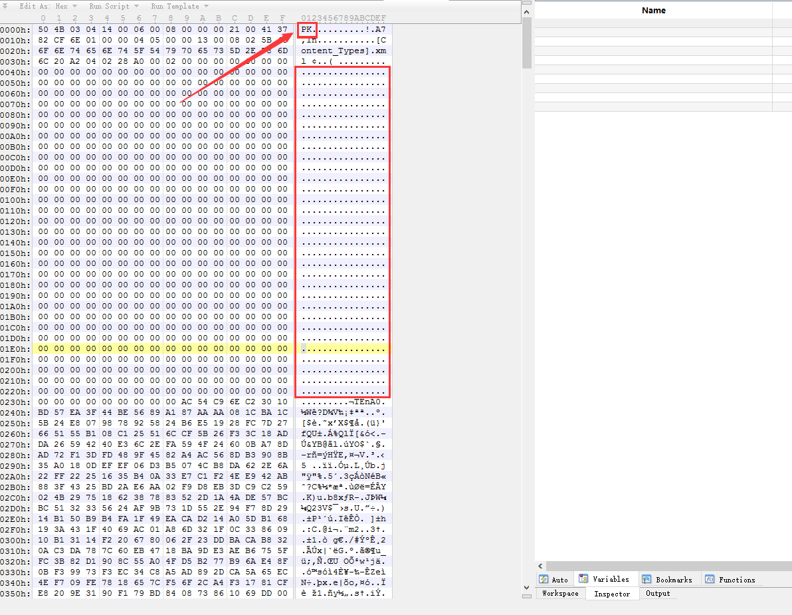
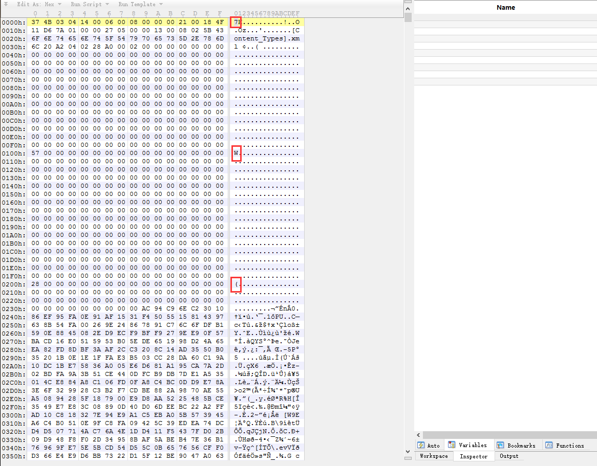
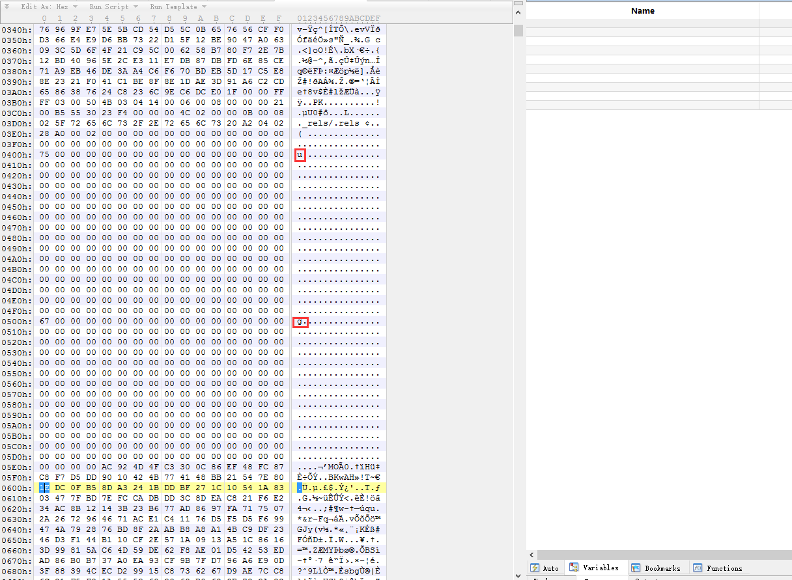
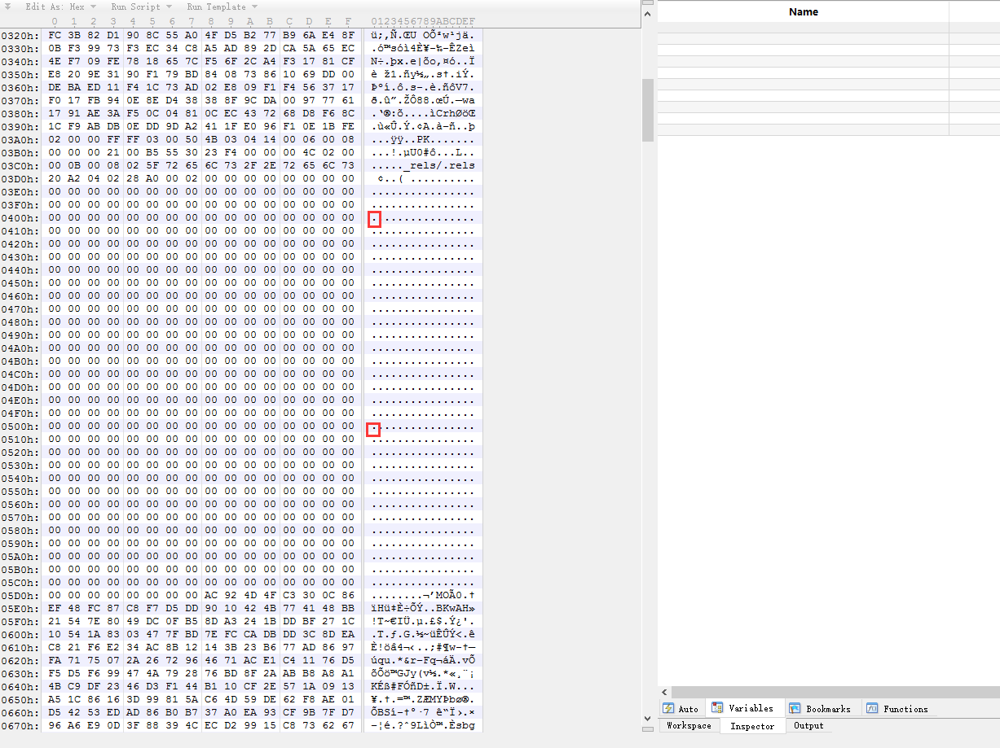
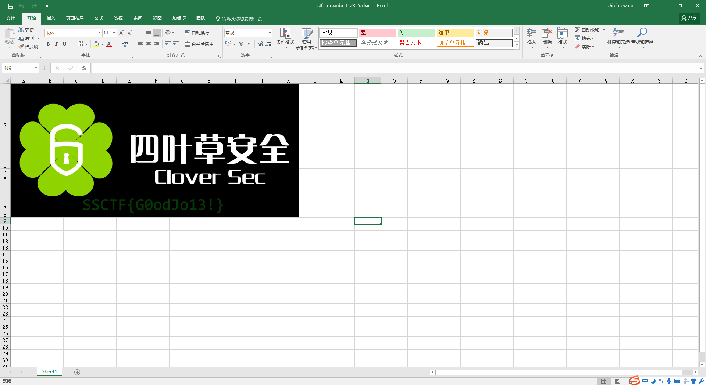

# 2017SSCTF-加密勒索软件

**Author：wnagzihxain
Mail：tudouboom@163.com**

## 0x01 前言
感谢沐师傅在赛后提供题目

## 0x01 分析
压缩包内有一个Excel表格文件，打开显示损坏，猜测可能加密了，JEB载入APK样本，发现仅仅是Java层做处理，第一次打开应用的时候，会读取`Sharedpreferences`文件的`isEncryptrd`字段，第一次读取该字段，该字段为0，所以会要求用户输入6位数字作为密码


在输入密码后，除了把`isEncrypted`改为1之外，就没有其它的操作了

当第二次输入密码，会调用`check2()`进行处理
```
Main.this.check2(Main.this.flagView.getText().toString())
```

`check2()`函数在判断密码是否为空以及长度是否为6之后，调用了`verify2()`函数
```
private boolean check2(String arg5) {
    boolean v0 = false;
    if(arg5 == null || (arg5.isEmpty()) || arg5.length() != 6) {
        Toast.makeText(((Context)this), 2131034115, 0).show();
    }
    else {
        this.getSign(((Context)this));
        v0 = this.verify2(this.getSign(((Context)this)), this.SIGN_MD5);
    }

    return v0;
}
```

`verify2()`函数有两个参数，第一个参数通过函数调用的返回值来确定
```
private String getSign(Context arg2) {
    return ToolsUtils.getSignInfo(arg2, "com.seclover.ctf1");
}
```

`ToolsUtils.getSignInfo()`获取该应用签名的32位MD5值
```
public static String getSignInfo(Context arg3, String arg4) {
    String v1;
    try {
        v1 = ToolsUtils.md5(Integer.toString(arg3.getPackageManager().getPackageInfo(arg4, 64).signatures[0].hashCode(), 16));
    }
    catch(Exception v0) {
        v0.printStackTrace();
        v1 = "invalid";
    }

    return v1;
}
```

`verify2()`函数第二个参数是一个写死的MD5值
```
this.SIGN_MD5 = "a056d5ab1fa5c250c293a5b7588d0749";
```

`verify2()`函数的校验过程看上去比较复杂
```
private boolean verify2(String arg11, String arg12) {
    boolean v6 = false;
    byte[] v3 = ToolsUtils.SHA(arg11).getBytes();
    byte[] v4 = ToolsUtils.SHA(arg12).getBytes();
    int v0;
    for(v0 = 0; v0 < v3.length; ++v0) {
        int v2;
        for(v2 = 0; v2 < v4.length; ++v2) {
            v3[(v0 * v2 * 7 + 9) % v3.length] = ((byte)((v3[v0] ^ v2 * 5) % 127));
            v4[(v0 * v2 * 7 + 9) % v4.length] = ((byte)((v4[v0] ^ v2 * 5) % 127));
        }
    }

    int v1 = 0;
    int v5 = v3.length > v4.length ? v4.length : v3.length;
    v0 = 0;
    while(v0 < v5) {
        if((v3[v0] ^ v4[v0] ^ v3[v0]) != v3[v0]) {
            v1 = 1;
        }
        else {
            ++v0;
            continue;
        }

        break;
    }

    if(v1 == 0) {
        v6 = true;
    }

    return v6;
}
```

在这里纠结了一会儿，感觉乱糟糟的

后来实现想不下去了，于是决定看一下后面的代码，发现了这是一个坑

在前面的代码中，`check2()`调用`verify2()`，但是在校验通过后，并没有对Excel表格文件的解密处理等操作，也没有读取文件相关的代码

这就尴尬了。。。。。。

在上下翻看代码的过程中，发现有读取文件的操作函数，通过`k1`数组跟`ctf1_encode.xlsx`进行异或，相隔`256`个字节异或一次
```
private boolean encode(Context arg12) {
    boolean v7 = false;
    File v2 = new File(Environment.getExternalStorageDirectory(), "ctf1.xlsx");
    if(v2.exists()) {
        try {
            FileOutputStream v5 = new FileOutputStream(new File(Environment.getExternalStorageDirectory(), "ctf1_encode.xlsx"));
            FileInputStream v4 = new FileInputStream(v2);
            byte[] v0 = new byte[v4.available()];
            v4.read(v0);
            int v6;
            for(v6 = 0; v6 < v0.length; v6 += 256) {
                v0[v6] = ((byte)(v0[v6] ^ this.k1[v6 % this.k1.length]));
            }

            v5.write(v0);
            v5.close();
            v4.close();
            v2.delete();
            return true;
        }
        catch(Exception v1) {
            goto label_40;
        }
    }

    return v7;
label_40:
    v1.printStackTrace();
    return true;
}
```

找到`k1`的定义，并没有进行初始化
```
private byte[] k1;
```

发现`k1`的初始化是在一个函数里进行的，这里的`arg11`应该就是输入的6位密码
```
private boolean check(String arg11) {
    int v9 = 100;
    boolean v2 = false;
    if(this.verify(this.getSign(((Context)this)), this.SIGN_MD5)) {
        int v0;
        for(v0 = 0; v0 < v9; ++v0) {
            int v1;
            for(v1 = 0; v1 < v9; ++v1) {
                this.k1[(v0 + 17) * (v1 + 5) % this.k1.length] = ((byte)((this.k1[v0 * v1 % this.k1.length] ^ arg11.charAt(v0 * v1 % arg11.length()) * 7) % 127));
            }
        }

        this.encode(((Context)this));
        v2 = true;
    }

    return v2;
}
```

6位的数字，爆破一下应该是可以的。。。。。。

应该是。。。。。。可以。。。。。。的。。。。。。

6位数爆破出来的样本仿佛有点多。。。。。。

有点。。。。。。多。。。。。。

研究一下文件格式，看一下有没有固定的数据可以直接确定

确定的位置为`0x00`，`0x100`，`0x200`，`0x300`，`0x400`，`0x500`

首先是Magic Number，然后中间一片`00`



再查看`ctf1_encode.xlsx`



那么就可以确定前三个数字了

再往下翻，发现两处



正常的Excel是空的



现在可以大概的确定出来的数据
```
0x00  : y : 0x37
0x100 : y : 0x57
0x200 : y : 0x28
0x300 : ? : ?
0x400 : y : 0x75
0x500 : y : 0x67
```

接下来计算一下，强行写的很渣的代码，获取签名MD5这一步可以直接使用代码里的MD5值，反正是一样的，然后生成`k1`数组，接下来进行计算，判断五个已确定的数据，因为是异或计算，可以再次异或，只要还原为正常Excel的数据即可
```
import java.io.File;
import java.io.FileInputStream;
import java.io.FileOutputStream;
import java.security.MessageDigest;

public class MyClass {

	static byte[] k1;
	static String MD5_KEY = "a056d5ab1fa5c250c293a5b7588d0749";
	
	public static void main(String[] args) throws Exception {
		for(int i = 100000; i < 999999; i++) {
			verify(MD5_KEY);
			//printByteHex(k1);
			if(check(String.valueOf(i), i)) {
				System.out.println("Find it : ctf1_decode_" + i + ".xlsx");
			}
		}
	}
	
	private static void printByteHex(byte[] Data) {
		int len = Data.length;
		for (int i = 0; i < len; i++) {
			String temp = Integer.toHexString(Data[i] & 0xFF);
			if (temp.length() == 1) {
				temp = "0" + temp;
			}
			System.out.print(", 0x" + temp);
		}
		System.out.println("");
	}
	
	private static void verify(String key) {
        k1 = SHA(key).getBytes();
        for(int i = 0; i < k1.length; i++) {
            for(int j = 0; j < k1.length; j++) {
                k1[(i * j * 7 + 9) % k1.length] = ((byte)((k1[i] ^ j * 5) % 127));
            }
        }
    }
	
	private static String SHA(String decript) {
        int i = 0;
        try {
            MessageDigest messageDigest = MessageDigest.getInstance("SHA");
            messageDigest.update(decript.getBytes("utf-8"));
            byte[] sourceData = messageDigest.digest();
            StringBuffer stringBuffer = new StringBuffer();
            int len = sourceData.length;
            while(i < len) {
                String temp = Integer.toHexString(sourceData[i] & 0xFF);
                if(temp.length() < 2) {
                    stringBuffer.append(0);
                }
                stringBuffer.append(temp);
                ++i;
            }
            String result = stringBuffer.toString();
            return result;
        }
        catch(Exception v2) {
            v2.printStackTrace();
            return "";
        }
    }
	
	private static boolean check(String key, int index) {
        for(int i = 0; i < 100; i++) {
            for(int j = 0; j < 100; j++) {
                k1[(i + 17) * (j + 5) % k1.length] = ((byte)((k1[i * j % k1.length] ^ key.charAt(i * j % key.length()) * 7) % 127));
            }
        }
        if(MyClass.encode(k1, index)) {
        	return true;
        }
        return false;
    }
	
	private static boolean encode(byte[] key, int index) {
        try {
        	//printByteHex(key);
            File file = new File("ctf1_encode.xlsx");
            if (!file.exists()) {
            	System.out.println("ctf1_encode.xlsx does not exist");
        		return false;
            }
            FileInputStream fileInputStream = new FileInputStream(file);
            byte[] temp = new byte[fileInputStream.available()];
            fileInputStream.read(temp);
            for(int i = 0; i < temp.length; i += 256) {
                temp[i] = ((byte)(temp[i] ^ key[i % key.length]));
            }
            if ((temp[0x00] != 'P') || (temp[0x100] != 0x00) || (temp[0x200] != 0x00) || (temp[0x400] != 0x00) || (temp[0x500] != 0x00)) {
	            fileInputStream.close();
				return false;
			}
            File output = new File("ctf1_decode_" + index + ".xlsx");
        	FileOutputStream fileOutputStream = new FileOutputStream(output);
            fileOutputStream.write(temp);
            fileOutputStream.close();
            fileInputStream.close();
        }
        catch(Exception e) {
            e.printStackTrace();
        }
        return true;
    }
}
```

最后输出
```
Find it : ctf1_decode_111355.xlsx
Find it : ctf1_decode_112355.xlsx
Find it : ctf1_decode_121359.xlsx
Find it : ctf1_decode_125352.xlsx
Find it : ctf1_decode_151359.xlsx
Find it : ctf1_decode_155352.xlsx
Find it : ctf1_decode_159357.xlsx
Find it : ctf1_decode_162357.xlsx
Find it : ctf1_decode_179351.xlsx
```

同时生成9个文件，`ctf1_decode_112355.xlsx`是可以打开的

打开后有一张图片



Flag : SSCTF{G0odJo13!}

## 0x02 小结
再次感谢沐师傅在赛后提供题目