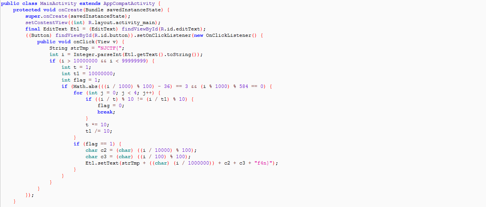
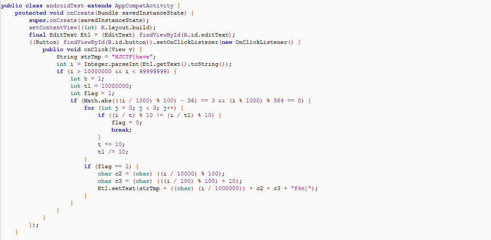

# 2017XCTF&NJCTF-SafeBox

**Author：wnagzihxain
Mail：wnagzihxa1n@gmail.com**

## 0x00 前言
2017XCTF&NJCTF线上赛的Mobile题，纯Java层，分值100，可以在XCTF OJ上找到
- http://oj.xctf.org.cn/practice/defensetrain/f9579c8bc29141228376918b10ba4b89/

## 0x01 分析
大概的意思就是说，输入一个数字，然后结果一系列的判断，输出Flag



鉴于数字的判断范围已经知道，写个代码遍历一下就行了，然而比较懒，直接用反编译出来的Java代码
```
package test;

public class Main {
	
	public static void main(String[] args) throws Exception{
		
        for(int v4 = 10000001; v4 < 99999999; v4++) {
        	String v6 = "NJCTF{";
            
            if(v4 > 10000000 && v4 < 99999999) {
                int v7 = 1;
                int v8 = 10000000;
                int v3 = 1;
                if(Math.abs(v4 / 1000 % 100 - 36) == 3 && v4 % 1000 % 584 == 0) {
                    int v5 = 0;
                    while(v5 < 4) {
                        if(v4 / v7 % 10 != v4 / v8 % 10) {
                            v3 = 0;
                        }
                        else {
                            v7 *= 10;
                            v8 /= 10;
                            ++v5;
                            continue;
                        }

                        break;
                    }

                    if(v3 != 1) {
                        continue;
                    }

                    System.out.println(v6 + (((char)(v4 / 1000000))) + (((char)(v4 / 10000 % 100))) + (((char)(v4 / 100 % 100))) + "f4n}");
                }
            }
        }
	}
}
```

输出
```
NJCTF{05#f4n}
```

然而Problem Description是这样描述的
```
Don't believe what you saw.

The flag's format is NJCTF{xxx} and xxx only include [a-z][A-Z][0-9].
```

那这个`#`肯定是不对的，继续思考，发现还有一个类`androidTest`



和之前的Activity内容类似，尝试遍历这个类的代码
```
package test;

public class Main {
	
	public static void main(String[] args) throws Exception{
		
        for(int v4 = 10000001; v4 < 99999999; v4++){
        	int v11 = 3;
            String v6 = "NJCTF{have";
            if(v4 > 10000000 && v4 < 99999999) {
                int v7 = 1;
                int v8 = 10000000;
                int v3 = 1;
                if(Math.abs(v4 / 1000 % 100 - 36) == v11 && v4 % 1000 % 584 == 0) {
                    int v5 = 0;
                    while(v5 < v11) {
                        if(v4 / v7 % 10 != v4 / v8 % 10) {
                            v3 = 0;
                        }
                        else {
                            v7 *= 10;
                            v8 /= 10;
                            ++v5;
                            continue;
                        }

                        break;
                    }

                    if(v3 != 1) {
                        continue;
                    }

                    System.out.println(v6 + (((char)(v4 / 1000000))) + (((char)(v4 / 10000 % 100))) + (((char)(v4 / 100 % 100 + 10))) + "f4n}");
                }
            }
        }
	}
}
```

输出
```
NJCTF{have05-f4n}
NJCTF{have05if4n}
```

那么Flag就有了

## 0x02 小结
这么简单的题目还要换Flag？

扎心不，老铁？