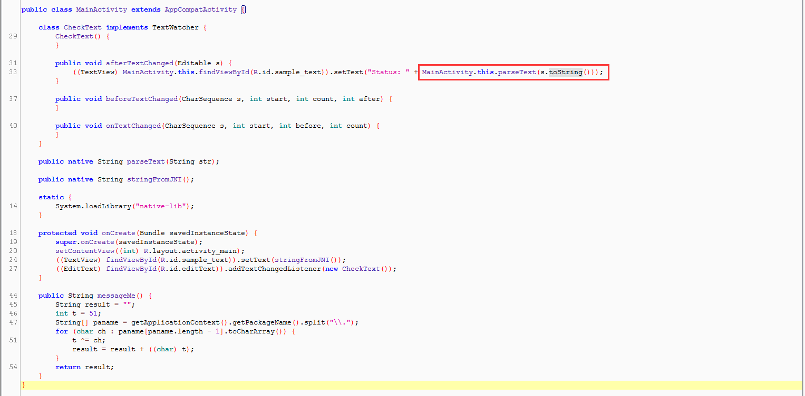
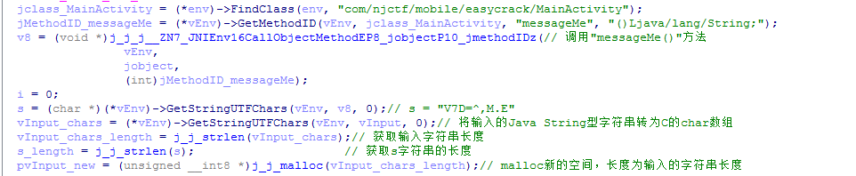
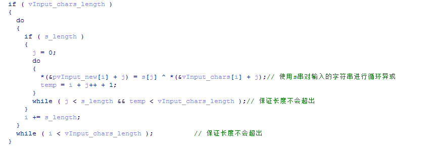
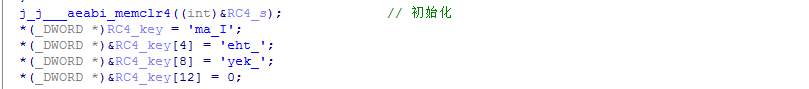
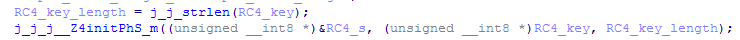
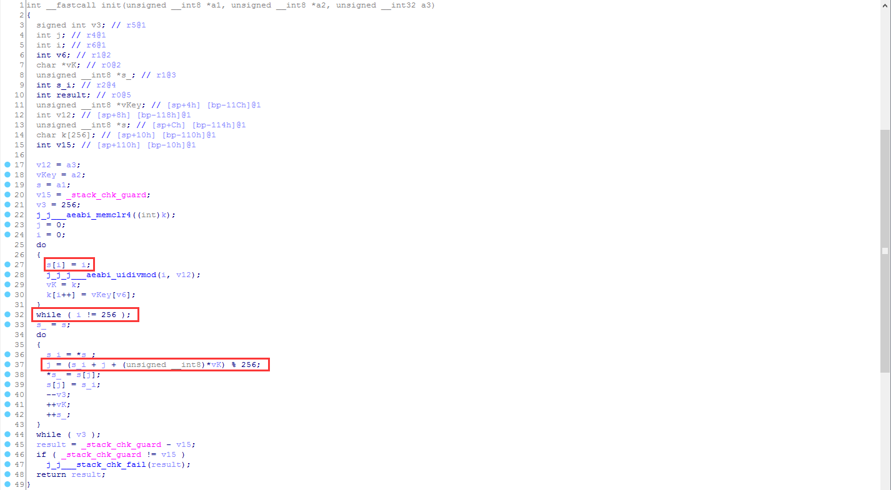
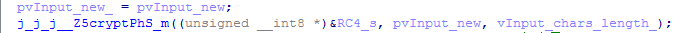
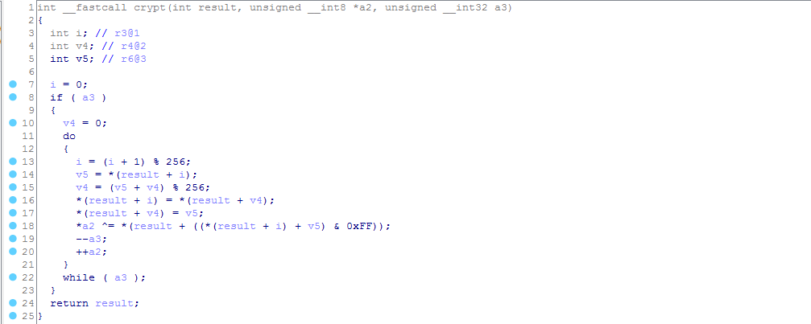
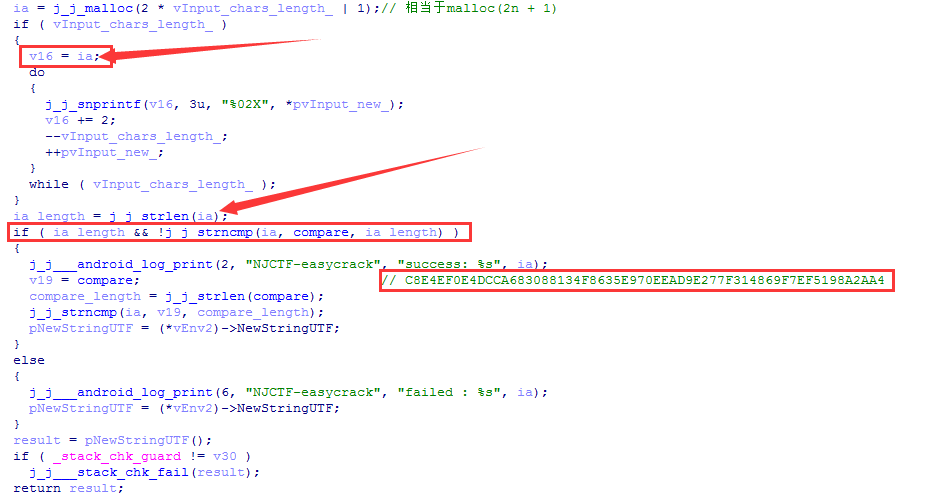

# 2017XCTF&NJCTF-easycrack

**Author: wnagzihxa1n
E-Mail: wnagzihxa1n@gmail.com**

## 0x00 前言
2017XCTF南京站线上赛的题目，同时也是2017NJCTF的题目，可以在XCTF OJ上面找到，分值100
- http://oj.xctf.org.cn/practice/defensetrain/6e65e388244c434ca9b6d7c3f1e5aa81/

## 0x01 分析
在Java层没有太多逻辑，对输入框进行监听，当有输入的时候调用native层的函数进行校验



IDA载入so，没有动态注册，直接分析`parseText()`函数

前面会调用Java层的`meaasgeMe()`函数



而`messageMe"()`函数的功能是获取包名的最后一个串
```
public String messageMe() {
    String result = "";
    int t = 51;
    String[] paname = getApplicationContext().getPackageName().split("\\.");
    for (char ch : paname[paname.length - 1].toCharArray()) {
        t ^= ch;
        result = result + ((char) t);
    }
    return result;
}
```

写个代码跑
```
public class Main {
	
	public static void main(String[] args) throws Exception{
		String result = "";
        int t = 51;
        String[] paname = "com.njctf.mobile.easycrack".split("\\.");
        for (char ch : paname[paname.length - 1].toCharArray()) {
        	//System.out.println(ch);
            t ^= ch;
            result = result + ((char) t);
        }
        System.out.println(result);
	}
}
```

结果输出
```
V7D=^,M.E
```

然后这个传入native层，转为char数组

接着利用这个字符串对输入的字符串进行循环异或，就是把这个串循环复制自己，一个接一个，然后跟输入串长度一样，进行异或



异或后存在新malloc出来的空间，首地址指针`pvInput_new`

然后是一个key，这里有的同学如果没有经验的话可能会看不出来这是RC4加密的key

我看出这里是RC4加密的思路可以分享一下：

首先是这个key，如果你那里是三个很奇怪的数字，可以右键然后看`R`，就会和我这里一样的显示了



加下来有两个`j_j_j__`开头的函数，如果没有看出这里是RC4加密的秘钥初始化的话可以跟进去



跟到最里面的实现，RC4的秘钥初始化有比较明显的特征



然后是后面的加密过程



跟进去，到最里面的实现过程，很明显的RC4加密



最后的逻辑非常清楚，就是拷贝RC4加密后的数据然后跟一个字符串对比



所以到这里我们整理出流程：
- 先输入数据，传入native层
- native层获取Java层`messageMe()`函数，根据包名获取到一个异或后的9字节字符串
- 循环使用异或后的字符串跟输入的字符串进行异或
- 将异或后的数据进行RC4加密，然后跟`compare`字符串对比，一样则校验通过

写个Python脚本来还原
```
# coding = utf-8

import binascii

def main():
	key_rc4 = "I_am_the_key"
	rc4_encrypted = binascii.a2b_hex("C8E4EF0E4DCCA683088134F8635E970EEAD9E277F314869F7EF5198A2AA4")
	
	# Init rc4_key
	j = 0;
	s = range(256)
	for i in range(256):
		j = (j + s[i] + ord(key_rc4[i % len(key_rc4)])) % 256
		s[i], s[j] = s[j], s[i]
	i = 0
	j = 0
	
	# Rc4 decryption
	rc4_decrypted = []
	for data in rc4_encrypted:
		i = (i + 1) % 256
		j = (j + s[i]) % 256
		s[i], s[j] = s[j], s[i]
		rc4_decrypted.append(chr(ord(data) ^ s[(s[i] + s[j]) % 256]))
	rc4_decrypted =  "".join(rc4_decrypted)
	#print rc4_decrypted

	key_xor = "V7D=^,M.E"
	key_xor_len = len(key_xor)
	Flag = []
	for i in range(len(rc4_decrypted)):
		 Flag.append(chr(ord(rc4_decrypted[i]) ^ ord(key_xor[i % key_xor_len])))
	print "".join(Flag)

if __name__ == '__main__':
	main()
```

运行结果
```
It_s_a_easyCrack_for_beginners
```

这也是Flag，直接提交就行了

## 0x02 小结
难度一般，就是有一点不好，SDK要求24，尼玛这是7.0啊！！！！！！还好不运行可以搞出来，不然真的要吊打出题人:)

另，今天pwn2own超级精彩，目前中国的战绩：
- 数字：攻破Adobe Reader
- 鹅场：攻破Microsoft Edge
- 鹅场：攻破Adobe Reader
- 长亭：攻破Linux
- 长亭：攻破Safari

期待有生之年能去现场围观膜拜各位大佬