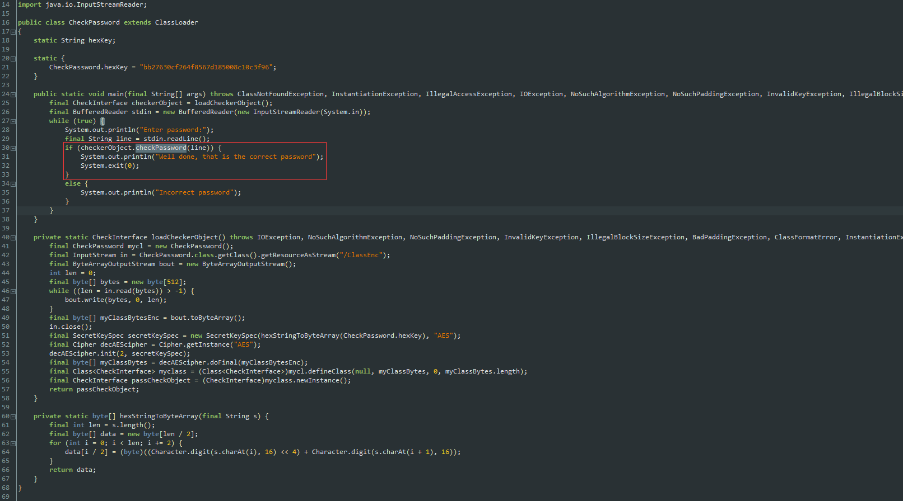
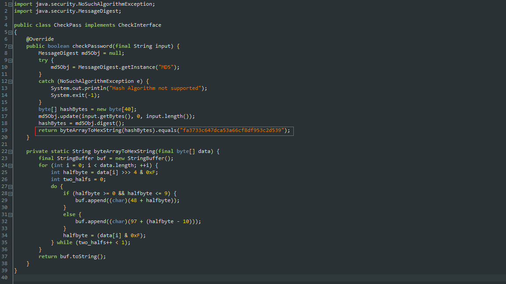
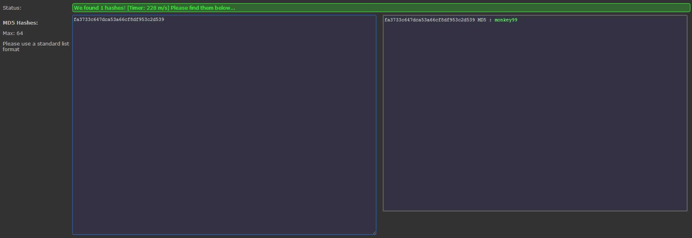

# 2017陕西省网络安全大赛Mobile第四题

**Author：wnagzihxain
Mail：tudouboom@163.com**

## 0x00 前言
在翻翻翻的时候发现这题可以秒~

## 0x01 分析
这题是Jar包的形式，不要使用Jar2Dex工具，会丢失部分数据

找到入口函数，中间有一个读入对比判断，跟入判断



这个判断函数将输入的数据做MD5计算



真的没有其它操作了。。。。。。

前面看到什么读取文件，AES加密什么的，都是浮云。。。。。。

将这个MD5字符串拿去解密



最后验证一下
```
C:\Users\wangz\Desktop>java -jar exercise1.jar
Enter password:
monkey99
Well done, that is the correct password
```

## 0x01 小结
都是假的，都是假的，都是假的~~~

