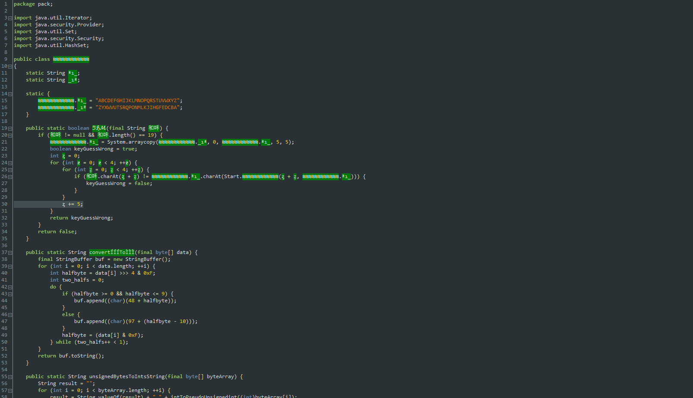
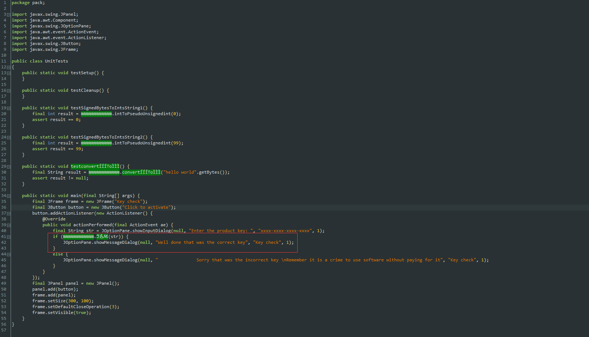
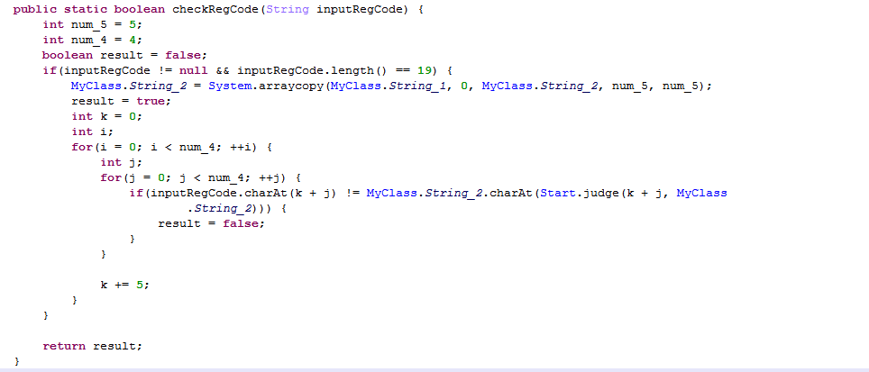
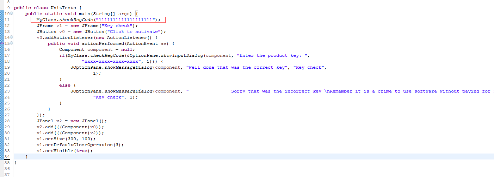
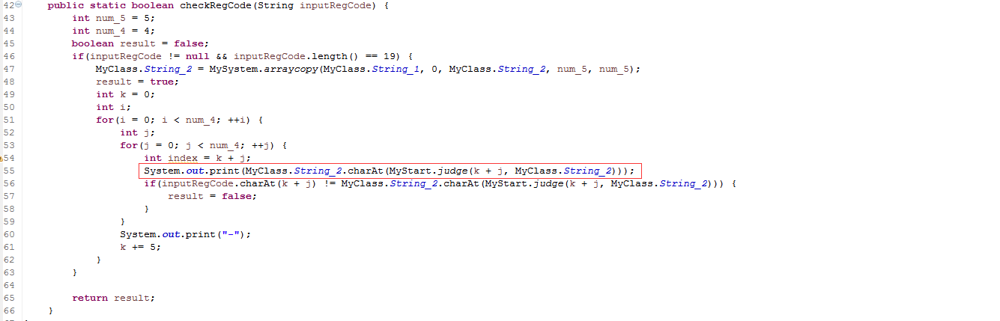
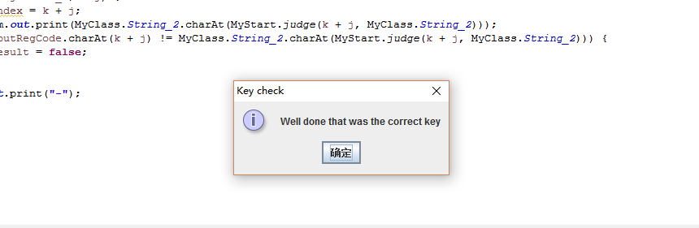
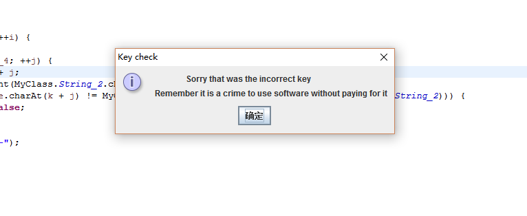

# 2017陕西省网络安全大赛Mobile第五题

**Author：wnagzihxain
Mail：wnagzihxa1n@gmail.com**

## 0x00 前言
先来感受下混淆



不过这个混淆还是蛮一般的

找到入口

这个很奇怪的方法目测就是校验函数，跳过去，发现就是上面那个截图里的函数



这尼玛怎么看，使用Jar2Dex工具转为Dex文件

然后就是一个个函数改啊改



发现又是一个可以使用Console输出RegCode的题目

上Eclipse

把四个类全都拷贝进Demo工程，把那些乱七八糟报错的直接去掉，不影响的，为了方便，直接在入口调用校验函数，然后在校验的地方把数据输出来



如果校验函数没有修改条件的话，要默认输入19位字符

要注意的是，每隔4位有一个随意的字符填充，这个一般默认的是`-`，所以我们默认填充`-`



当然最后会多一个`-`，到时去掉即可

运行输出
```
sssn-trtk-tcea-akJr-
```

我们校验一下



有意思的是



凑巧的是：我都不是。。。。。。

## 0x02 小结
~~~


