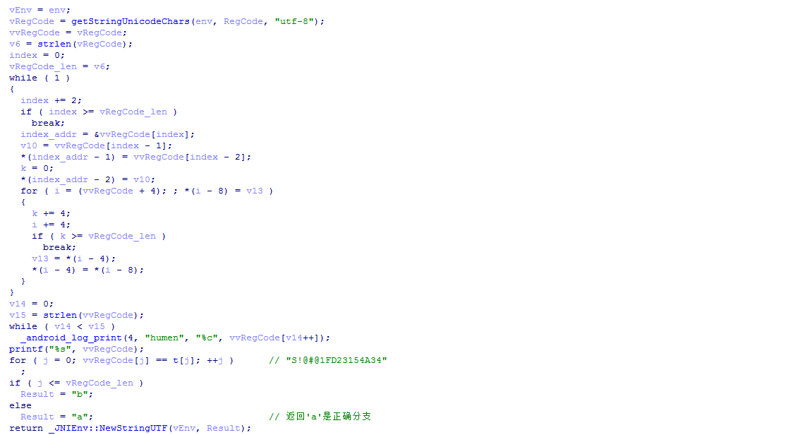
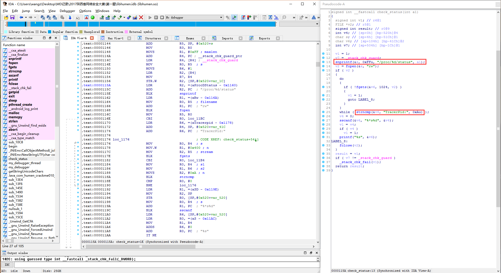
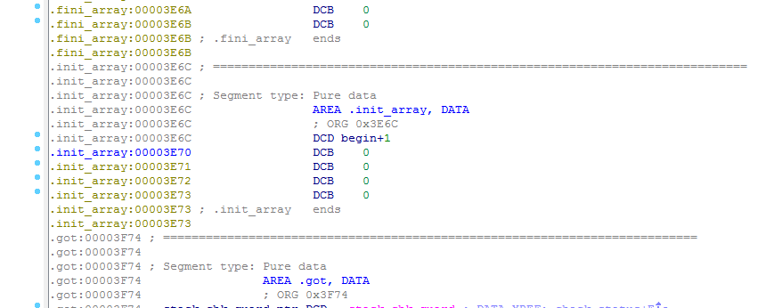

# 2017陕西省网络安全大赛Mobile第一题

**Author：wnagzihxain
Mail：tudouboom@163.com**

## 0x00 前言
这代码乱的。。。。。。

## 0x01 分析
纯靠猜，就是下标的问题控制一下就好



写代码还原，如果逻辑还原不了，可以根据给的`t`数组手动算
```
#include <iostream>
#include <cstdio>
#include <cstring>
using namespace std;

int main()
{
	char temp;
	char Key[] = "S!@#@1FD23154A34";
	int len = strlen(Key);
	for (int i = len - 3; i - 2 >= -1; i -= 2)
	{
		for (int j = len - 4; j - 4 >= -3; j -= 4)
		{
			temp = Key[j];
			Key[j] = Key[j - 4];
			Key[j - 4] = temp;
		}
		temp = Key[i];
		Key[i] = Key[i - 1];
		Key[i - 1] = temp;
	}
	printf("%s\n", Key);
	return 0;
}
```

结果：
```
!@#@ASDF34511234
```

中间有个反调试，不过我纯静态分析也没有过多的注意它，只是无意中看了一眼，大概是TracerPid字段检测



最开始在`.init_array`段进行调用



## 0x02 小结
猜猜猜~~~
